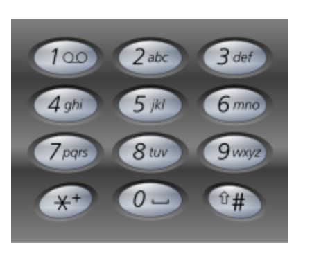

# 17.Letter Combinations of a Phone Number

## LeetCode 链接

[17.电话号码的字母组合](https://leetcode.cn/problems/letter-combinations-of-a-phone-number/)

## 题目大意

给定一个仅包含数字 `2-9` 的字符串，返回所有它能表示的字母组合，答案可以按`任意顺序`返回

给出数字到字母的映射如下（与电话按键相同），注意 `1` 不对应任何字母



```js
Example 1:
Input: digits = "23"
Output: ["ad","ae","af","bd","be","bf","cd","ce","cf"]

Example 2:
Input: digits = ""
Output: []

Example 3:
Input: digits = "2"
Output: ["a","b","c"]
```

限制：
- 0 <= digits.length <= 4
- digits[i] is a digit in the range ['2', '9'].

## 解题

```js
var letterCombinations = function(digits) {
    // 每个数字到字母的映射
    const mapping = [
        "", "", "abc", "def", "ghi", "jkl", "mno", "pqrs", "tuv", "wxyz"
    ];
    let res = [], str = "";
    if (digits === "") return res;

    const backtrack = function(digits, start) {
        if (str.length === digits.length) {
            res.push(str);
            return;
        }

        let digit = digits.charCodeAt(start) - '0'.charCodeAt(0);
        for (let c of mapping[digit].split("")) {
            str += c;
            backtrack(digits, start + 1);
            str = str.slice(0, -1);
        }
    };

    backtrack(digits, 0);
    return res;
};
```
```python
# 写法 1
class Solution:
    # 每个数字到字母的映射
    mapping = [
        "", "", "abc", "def", "ghi", "jkl", "mno", "pqrs", "tuv", "wxyz"
    ]

    def __init__(self):
        self.res = []
        self.str = []

    def letterCombinations(self, digits: str) -> List[str]:
        if not digits:
            return self.res
        
        # 从 digits[0] 开始进行回溯
        self.backtrack(digits, 0)
        return self.res
    
    def backtrack(self, digits: str, start: int) -> None:
        if len(self.str) == len(digits):
            # 到达回溯树的底部，即当前组合长度等于输入数字的长度
            self.res.append(''.join(self.str))
            return
        
        # 回溯算法框架
        # 获取当前数字对应的字母列表
        # 将数字字符 '2' ~ '9' 转换成整数 2 ~ 9，然后从 mapping 数组中找到该数字对应的字母列表
        digit = ord(digits[start]) - ord('0')
        # 遍历当前数字对应的所有字母，如数字 2 对应的字母是 ['a', 'b', 'c']
        for c in self.mapping[digit]:
            # 做选择
            self.str.append(c)
            # 递归下一层回溯树
            self.backtrack(digits, start + 1)
            # 撤销选择
            self.str.pop()

# 写法 2
class Solution:
    def __init__(self):
        self.mapping = [
            "",     # 0
            "",     # 1
            "abc",  # 2
            "def",  # 3
            "ghi",  # 4
            "jkl",  # 5
            "mno",  # 6
            "pqrs", # 7
            "tuv",  # 8
            "wxyz"  # 9
        ]

        self.res = []

    def letterCombinations(self, digits: str) -> List[str]:
        if len(digits) == 0:
            return self.res
        self.backtracking(digits, 0, "")
        return self.res
    
    def backtracking(self, digits, index, str):
        if index == len(digits):
            self.res.append(str)
            return

        digit = int(digits[index])
        letters = self.mapping[digit]
        for letter in letters:
            self.backtracking(digits, index + 1, str + letter) 
```

- 时间复杂度：`O(3^m * 4^n)`
  - 其中 `m` 是 `digits` 中对应 `3` 个字母的数字个数，`n` 是 `digits` 中对应 `4` 个字母的数字个数
  - 每个解长度 `O(L)`，存储 `O(3^m * 4^n)` 个解，时间复杂度乘 `O(L)`；但 `L` 是常数级（`≤ 4`），所以常省略
- 空间复杂度：`O(m + n)`
  - 若仅考虑递归栈：`O(m + n)`
  - 完整分析包含 `res` 存储，需 `O(L * 3^m * 4^n)`