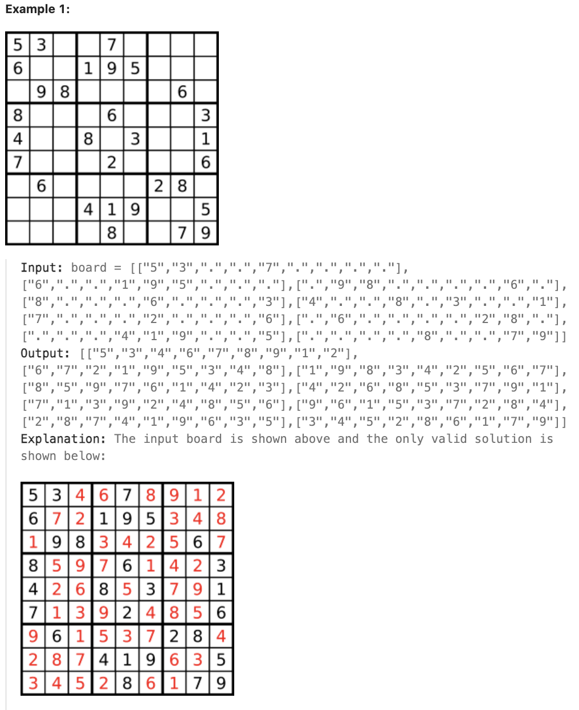

# 37.Sudoku Solver

## LeetCode 题目链接

[37.解数独](https://leetcode.cn/problems/sudoku-solver/)

## 题目大意

编写一个程序，通过填充空格来解决数独问题

数独的解法需遵循如下规则：
- 数字 `1-9` 在每行只能出现一次
- 数字 `1-9` 在每列只能出现一次
- 数字 `1-9` 在每个以粗实线分隔的 `3x3` 宫内只能出现一次（请参考示例图）
  
数独部分空格内已填入了数字，空白格用 `'.'` 表示



限制:
- board.length == 9
- board[i].length == 9
- board[i][j] is a digit or '.'.
- It is guaranteed that the input board has only one solution.

## 解题

算法的核心思路非常非常的简单，即`穷举`：对每一个空着的格子穷举 `1` 到 `9`，若遇到不合法的数字（在同一行或同一列或同一个 `3×3` 的区域中存在相同的数字）则跳过，若找到一个合法的数字，则继续穷举下一个空格子

```js
var solveSudoku = function(board) {
    backtrack(board, 0, 0);
};

var backtrack = function(board, i, j) {
    const m = 9, n = 9;
    if (j == n) return backtrack(board, i + 1, 0);
    if (i == m) return true;
    if (board[i][j] != '.') return backtrack(board, i, j + 1);
    for (let num = 1; num <= 9; num++) {
        const candidate = num.toString();
        // 如果遇到不合法的数字，就跳过
        if (!isValid(board, i, j, candidate)) continue;
        board[i][j] = candidate;
        // 如果找到一个可行解，立即结束
        if (backtrack(board, i, j + 1)) return true;
        board[i][j] = '.';
    }
    // 穷举完 1~9，依然没有找到可行解，此路不通
    return false;
};

// 判断 board[i][j] 是否可以填入 n
var isValid = function(board, row, col, n) {
    for (let i = 0; i < 9; i++) {
        // 判断行是否存在重复
        if (board[row][i] == n) return false;
        // 判断列是否存在重复
        if (board[i][col] == n) return false;
        // 判断 3 x 3 方框是否存在重复
        if (board[Math.floor(row / 3) * 3 + Math.floor(i / 3)][Math.floor(col / 3) * 3 + i % 3] == n) return false;
    }
    return true;
};
```
```python
class Solution:
    def solveSudoku(self, board: List[List[str]]) -> None:
        # 从左上角 (0, 0) 开始填充数独
        self.backtrack(board, 0, 0)
    
    def backtrack(self, board, i, j):
        # board 是一个 9x9 的二维列表，代表数独棋盘，"." 表示空格
        m, n = 9, 9
        if j == n:
            # 表示这一行已经遍历完成，则继续下一行
            return self.backtrack(board, i + 1, 0)
        
        # base case
        # 行数 i 达到 9，表示整个数独已成功填满，触发递归终止条件，返回 True
        if i == m:
            return True
        
        # 若有预设数字，不用穷举
        # 跳过该位置，直接递归到该列下个位置
        if board[i][j] != ".":
            return self.backtrack(board, i, j + 1)
        
        # 对于空白格，用 '1' 到 '9' 进行穷举
        for ch in "123456789":
            # 若遇到不合法的数字，则跳过
            if not self.isValid(board, i, j, ch):
                continue
            
            board[i][j] = ch
            # 若找到一个可行解，立即结束
            if self.backtrack(board, i, j + 1):
                return True
                
            board[i][j] = "."
        
        # 穷举完 1~9，依然没有找到可行解，此路不通
        return False
    
    # 判断 board[i][j] 是否可以填入 n
    def isValid(self, board, row, col, n):
        for i in range(9):
            # 判断行是否存在重复
            if board[row][i] == n:
                return False
            
            # 判断列是否存在重复
            if board[i][col] == n:
                return False
            
            # 判断 3 x 3 方框是否存在重复
            # row // 3 * 3 和 col // 3 * 3 分别是当前位置所在的 3x3 子方块的起始行和列
            # i // 3 和 i % 3 用来遍历该子方块的每一个位置
            # 若在子方块内找到重复的 n，则返回 False
            if board[(row // 3) * 3 + i // 3][(col // 3) * 3 + i % 3] == n:
                return False
        
        return True
```

- 时间复杂度：`O(9^n)`，`n` 是空白格子的数量，每个空格都有 `9` 种可能数字（从 `'1'` 到 `'9'`）
- 空间复杂度：递归深度等同于空白格子的数量，递归深度最多为 `81`，空间复杂度为 `O(81)`，可以认为是 `O(1)`