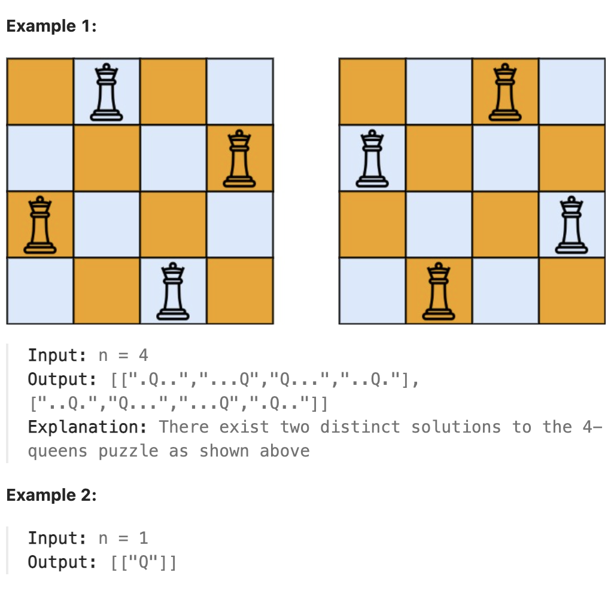

# 51.N-Queens

## LeetCode 题目链接

[51.N 皇后](https://leetcode.cn/problems/n-queens/)

## 题目大意

按照国际象棋的规则，皇后可以攻击与之处在同一行或同一列或同一斜线上的棋子

`n` 皇后问题研究的是如何将 `N` 个皇后放置在 `n×n` 的棋盘上，且使皇后彼此之间不能相互攻击

给一个整数 `n`，返回所有不同的 `n` 皇后问题的解决方案

每种解法包含一个不同的 `n` 皇后问题的棋子放置方案，该方案中 `'Q'` 和 `'.'` 分别代表了皇后和空位



限制:
- 1 <= n <= 9

## 解题

`N` 皇后问题是一个决策问题：对于每一行，应该选择在哪一列防止皇后呢？

这里棋盘的宽度就是 `for` 循环的长度，递归的深度就是棋盘的高度，这样就可以套进回溯法的模板里

```js
var solveNQueens = function(n) {
    let res = [];
    let board = Array.from({length: n}, () => '.'.repeat(n));

    const isValid = function(board, row, col) {
        // 检查列是否有皇后互相冲突
        for (let i = 0; i <= row; i++) {
            if (board[i][col] === 'Q') return false;
        }

        // 检查右上方是否有皇后互相冲突
        for (let i = row - 1, j = col + 1; i >= 0 && j < n; i--, j++) {
            if (board[i][j] === 'Q') return false;
        }

        // 检查左上方是否有皇后互相冲突
        for (let i = row - 1, j = col - 1; i >= 0 && j >= 0; i--, j--) {
            if (board[i][j] === 'Q') return false;
        }

        return true;
    };

    const backtrack = function(board, row) {
        // 触发结束条件
        if (row == board.length) {
            res.push(board.slice());
            return;
        }

        for (let col = 0; col < n; col++) {
            if (!isValid(board, row, col)) continue;
            board[row] = board[row].slice(0, col) + "Q" + board[row].slice(col + 1);
            backtrack(board, row + 1);
            board[row] = board[row].slice(0, col) + '.' + board[row].slice(col + 1);
        }
    };
    backtrack(board, 0);
    return res;
};
```
```python
class Solution:
    def solveNQueens(self, n: int) -> List[List[str]]:
        self.res = []
        board = [["." for _ in range(n)] for _ in range(n)]
        self.backtrack(board, 0)
        return self.res
    
    def backtrack(self, board: List[List[str]], row: int) -> None:
        if row == len(board):
            self.res.append(["".join(row) for row in board])
            return 
        
        for col in range(len(board[row])):
            if not self.isValid(board, row, col):
                continue
            
            board[row][col] = "Q"
            self.backtrack(board, row + 1)
            board[row][col] = "."
        
    def isValid(self, board: List[List[str]], row: int, col: int) -> bool:
        n = len(board)
        # 检查列是否有皇后互相冲突
        for i in range(row + 1):
            if board[i][col] == "Q":
                return False
        
        # 假设正在第 row 行放置皇后，当前行以下的行还没有放置皇后，所以不可能与当前皇后冲突
        # 这是为什么在检查对角线时，只需检查上方的对角线即可，即左上对角线和右上对角线
        # 检查右上方是否有皇后互相冲突
        for i, j in zip(range(row - 1, -1, -1), range(col + 1, n)):
            if board[i][j] == "Q":
                return False
        
        # 检查左上方是否有皇后互相冲突
        for i, j in zip(range(row - 1, -1, -1), range(col - 1, -1, -1)):
            if board[i][j] == "Q":
                return False
        
        return True
```

- 时间复杂度：`O(n!)`
  - 主要的时间消耗来自于回溯过程（`backtrack` 函数）
  - 在最坏情况下，算法需要尝试所有可能的放置方式
    ```js
    第一行有 n 种选择
    第二行最多有 n-1 种选择
    第三行最多有 n-2 种选择
    ... 以此类推
    ```
  - 这形成了一个决策树，其中每个节点最多有 `n` 个子节点，树的深度为 `n`
  - 对于每次尝试，`isValid` 函数需 `O(n)` 的时间来检查是否有冲突，因为需检查当前列、左上方和右上方的三个方向，最多需要扫描 `n` 个元素
  - 因此，总体的时间复杂度是：`O(n!×n)`，由于 `n!` 已经是一个非常快增长的函数，因此通常将时间复杂度简化为 `O(n!)`
- 空间复杂度：`O(n^2)`
  - 递归调用栈的深度为 `n`，每层递归中使用的额外空间是常数级的
  - `board` 数组占用 `O(n^2)` 的空间
  - 结果列表 `self.res` 在最坏情况下可能存储所有可能的解，但这不影响渐进空间复杂度
  - 因此，主要的空间消耗来自于 `board` 和递归调用栈

**优化**

- 位运算优化
  - 时间复杂度仍为 `O(n!)`，但实际运行时间会显著减少
  - 空间复杂度降至 `O(n)`，因为只使用几个整数来表示棋盘状态

```python
class Solution:
    def solveNQueens(self, n: int) -> List[List[str]]:
        self.res = []
        self.n = n
        self.backtrack(0, 0, 0, 0, [])
        return self.res
    
    def backtrack(self, row: int, cols: int, diag1: int, diag2: int, queens: list):
        if row == self.n:
            self.res.append(["." * col + "Q" + "." * (self.n - col - 1) for col in queens])
            return
        
        available_positions = ((1 << self.n) - 1) & ~(cols | diag1 | diag2)  # 计算当前行可以放置皇后的位置
        while available_positions:
            position = available_positions & -available_positions  # 取最低位的 1（即找到可用的列）
            col = bin(position - 1).count("1")  # 计算当前皇后的列索引
            
            self.backtrack(row + 1, cols | position, (diag1 | position) << 1, (diag2 | position) >> 1, queens + [col])
            available_positions &= available_positions - 1  # 去掉最低位的 1
```

- 非递归回溯：可以使用迭代方法代替递归，这可以略微提高效率并减少栈空间的使用
  - 时间复杂度仍为 `O(n!)`
  - 空间复杂度为 `O(n)`，但避免了递归调用栈的开销

```python
class Solution:
    def solveNQueens(self, n: int) -> List[List[str]]:
        res = []
        stack = [(0, 0, 0, 0, [])]  # (row, cols, diag1, diag2, queens)
        
        while stack:
            row, cols, diag1, diag2, queens = stack.pop()
            if row == n:
                res.append(["." * c + "Q" + "." * (n - c - 1) for c in queens])
                continue
            
            available_positions = ((1 << n) - 1) & ~(cols | diag1 | diag2)
            while available_positions:
                position = available_positions & -available_positions
                col = bin(position - 1).count("1")
                
                stack.append((row + 1, cols | position, (diag1 | position) << 1, (diag2 | position) >> 1, queens + [col]))
                available_positions &= available_positions - 1  # 去掉最低位的 1
        
        return res
```

- 启发式搜索：对于非常大的 `n`，可以考虑使用启发式方法，如遗传算法或模拟退火。这些方法可能不会找到所有解，但可以在合理的时间内找到一些有效解
- 对称性优化：利用棋盘的对称性，可以将搜索空间减少一半。这种方法通过只搜索棋盘的左半部分（对于奇数 n 还包括中间列），然后通过对称性生成右半部分的解，可以显著减少搜索空间：
  - 时间复杂度降至约 `O(n! / 2)`
  - 空间复杂度仍为 `O(n)`
  
这些优化方法各有特点，可以根据具体需求选择使用
- 位运算优化通常是最有效的，因为它既提高了速度又减少了内存使用
- 对于非常大的 n，启发式方法可能是唯一可行的选择
- 对称性优化则在不增加复杂度的情况下有效减少了搜索空间