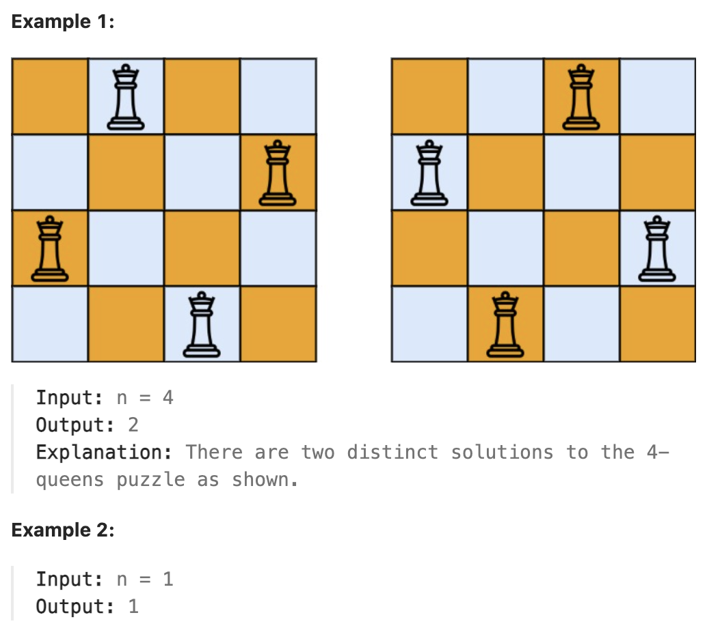

# 52.N-Queens II

## LeetCode 题目链接

[52.N 皇后 II](https://leetcode.cn/problems/n-queens-ii/)

## 题目大意

`n` 皇后问题研究的是如何将 `n` 个皇后放置在 `n × n` 的棋盘上，且使皇后彼此之间不能相互攻击

给一个整数 `n`，返回 `n` 皇后问题不同的解决方案的数量



限制:
- 1 <= n <= 9

## 解题

```js
var totalNQueens = function(n) {
    let res = 0;
    let board = Array.from({length: n}, () => '.'.repeat(n));

    const backtrack = function(board, row) {
        if (row == n) {
            res++;
            return;
        }

        for(let col = 0; col < n; col++) {
            if (!isValue(board, row, col)) continue;
            board[row] = board[row].slice(0, col) + "Q" + board[row].slice(col + 1);
            backtrack(board, row + 1);
            board[row] = board[row].slice(0, col) + '.' + board[row].slice(col + 1);
        }
    };

    const isValue = function(board, row, col) {
        for (let i = 0; i <= row; i++) {
            if (board[i][col] === 'Q') return false;
        }

        for (let i = row - 1, j = col + 1; i >= 0 && j < n; i--, j++) {
            if (board[i][j] == "Q") return false;
        }

        for (let i = row - 1, j = col - 1; i >= 0 && j >= 0; i--, j--) {
            if(board[i][j] == "Q") return false;
        }

        return true;
    };
    
    backtrack(board, 0);
    return res;
};
```
```python
class Solution:
    def totalNQueens(self, n: int) -> int:
        self.res = 0
        board = [["." for _ in range(n)] for _ in range(n)]
        self.backtrack(board, 0)
        return self.res
    
    def backtrack(self, board, row):
        if row == len(board):
            self.res += 1
            return 
        
        for col in range(len(board[row])):
            if not self.isValid(board, row, col):
                continue
            
            board[row][col] = "Q"
            self.backtrack(board, row + 1)
            board[row][col] = "."
        
    def isValid(self, board, row, col):
        for i in range(row + 1):
            if board[i][col] == "Q":
                return False
        
        # 假设正在第 row 行放置皇后，当前行以下的行还没有放置皇后，所以不可能与当前皇后冲突
        # 这是为什么在检查对角线时，只需检查上方的对角线即可，即左上对角线和右上对角线
        # 检查右上方是否有皇后互相冲突
        for i, j in zip(range(row - 1, -1, -1), range(col + 1, len(board))):
            if board[i][j] == "Q":
                return False
        
        # 检查左上方是否有皇后互相冲突
        for i, j in zip(range(row - 1, -1, -1), range(col - 1, -1, -1)):
            if board[i][j] == "Q":
                return False
        
        return True
```

- 时间复杂度：`O(n!)`，其中 `n` 是皇后数量
- 空间复杂度：`O(n)`，其中 `n` 是皇后数量，递归调用层数不会超过 `n`，每个棋盘的空间复杂度为 `O(n^2)`

**位运算优化**

```python
class Solution:
    def totalNQueens(self, n: int) -> int:
        def solve(row: int, columns: int, diagonals1: int, diagonals2: int) -> int:
            if row == n:
                return 1
            else:
                count = 0
                availablePositions = ((1 << n) - 1) & (~(columns | diagonals1 | diagonals2))
                while availablePositions:
                    position = availablePositions & (-availablePositions)
                    availablePositions = availablePositions & (availablePositions - 1)
                    count += solve(row + 1, columns | position, (diagonals1 | position) << 1, (diagonals2 | position) >> 1)
                return count

        return solve(0, 0, 0, 0)
```