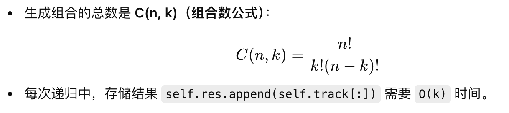

# 77.Combinations

## LeetCode 题目链接

[77.组合](https://leetcode.cn/problems/combinations/)

## 题目大意

给定两个整数 `n` 和 `k`，返回范围 `[1, n]` 中所有可能的 `k` 个数的组合

可以按`任何顺序`返回答案

```js
Example 1:
Input: n = 4, k = 2
Output: [[1,2],[1,3],[1,4],[2,3],[2,4],[3,4]]
Explanation: There are 4 choose 2 = 6 total combinations.
Note that combinations are unordered, i.e., [1,2] and [2,1] are considered to be the same combination.

Example 2:
Input: n = 1, k = 1
Output: [[1]]
Explanation: There is 1 choose 1 = 1 total combination.
```

限制:
- 1 <= n <= 20
- 1 <= k <= n

## 解题

典型的回溯算法，`k` 限制了树的高度，`n` 限制了树的宽度

```js
var combine = function(n, k) {
    let res = [];
    if (k <= 0 || n <= 0) return res;
    let track = [];

    const backtrack = function(n, k, start, track) {
        if (track.length == k) {
            res.push([...track]);
            return;
        }

        for (let i = start; i <= n; i++) {
            track.push(i);
            backtrack(n, k, i+1, track);
            track.pop();
        }
    };

    backtrack(n, k, 1, track);
    return res;
};
```
```python
class Solution:
    def combine(self, n: int, k: int) -> List[List[int]]:
        self.track = []
        self.res = []
        if k <= 0 or n <= 0:
            return self.res
        
        self.backtrack(n, k, 1)
        return self.res
    
    def backtrack(self, n, k, start):
        # 到达树的底部
        if len(self.track) == k:
            self.res.append(self.track[:])
            return
        
        # 注意 i 从 start 开始递增
        # i 是从 start 到 n 的范围，表示在构建组合时，保证每次递归调用中数字是递增的，避免重复选择或选择顺序颠倒
        for i in range(start, n+1):
            self.track.append(i)
            self.backtrack(n, k, i+1)
            self.track.pop()
```

- 时间复杂度：`O(C(n, k) * k)`，即生成所有组合的时间，`k` 是每次生成一个组合的复杂度，因为每次都要将组合存储到结果中
- 空间复杂度：`O(C(n, k) * k)`，主要是结果存储空间的复杂度，递归栈空间为 `O(k)`

