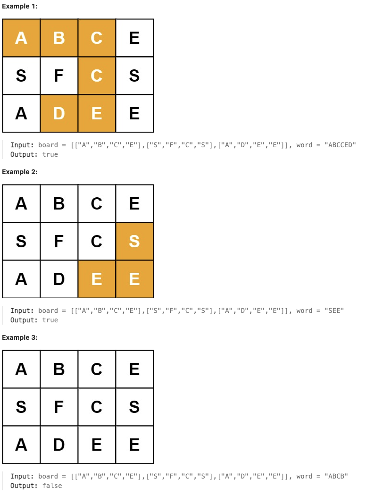

# 79.Word Search

## LeetCode 题目链接

[79.单词搜索](https://leetcode.cn/problems/word-search/)

## 题目大意

给定一个 `m x n` 二维字符网格 `board` 和一个字符串单词 `word`。如果 `word` 存在于网格中，返回 `true`；否则，返回 `false`

单词必须按照字母顺序，通过相邻的单元格内的字母构成，其中“相邻”单元格是那些水平相邻或垂直相邻的单元格。同一个单元格内的字母不允许被重复使用



限制:
- m == board.length
- n = board[i].length
- 1 <= m, n <= 6
- 1 <= word.length <= 15
- board and word consists of only lowercase and uppercase English letters.

## 解题

```js
var exist = function(board, word) {
    if (!board || board.length === 0 || board[0].length === 0) return false;
    const rows = board.length, cols = board[0].length;

    const backtrack = (r, c, index) => {
        // 如果当前匹配的字符索引等于单词长度，表示找到该单词
        if (index === word.length) return true;

        // 检查是否越界或字符不匹配
        if(r < 0 || c < 0 || r >= rows || c >= cols || board[r][c] !== word[index]) return false;

        // 标记该单元格已被访问
        let tmp = board[r][c];
        board[r][c] = '#';

        // 向四个方向探索
        let found = (backtrack(r + 1, c, index + 1) || // 向下
                     backtrack(r - 1, c, index + 1) || // 向上
                     backtrack(r, c + 1, index + 1) || // 向右
                     backtrack(r, c - 1, index + 1));  // 向左
                     
        // 恢复当前单元格的值（撤销标记）
        board[r][c] = tmp;
        return found;
    };

    // 遍历网格寻找起点
    for (let i = 0; i < rows; i++) {
        for (let j = 0; j < cols; j++) {
            if (backtrack(i, j, 0)) return true;
        }
    }
    return false;
};
```
```python
# 写法 1
class Solution:
    def exist(self, board: List[List[str]], word: str) -> bool:
        if not board or not board[0]:
            return False
        # 网格的行数和列数
        self.rows, self.cols = len(board), len(board[0])
        # 递归回溯方法：查找是否能从 (r, c) 位置出发匹配单词
        def backtrack(r, c, index):
            # 如果当前匹配到的字符索引等于单词的长度，说明找到匹配单词
            if index == len(word):
                return True
            
            # 检查是否越界或字符不匹配
            if r < 0 or c < 0 or r >= self.rows or c >= self.cols or board[r][c] != word[index]:
                return False

            # 暂时标记该单元格，表示它已被访问过（防止重复访问）
            tmp, board[r][c] = board[r][c], '#'

            # 朝四个方向探索
            result = (backtrack(r + 1, c, index + 1) or  # 向下
                      backtrack(r - 1, c, index + 1) or  # 向上
                      backtrack(r, c + 1, index + 1) or  # 向右
                      backtrack(r, c - 1, index + 1))    # 向左
            
            # 恢复当前单元格的原始值（撤销标记）
            # 因为要恢复原网格的状态。对于每一个起始点的探索，需要一个全新的、未被修改的原始网格
            board[r][c] = tmp

            return result

        # 遍历每个网格单元格，寻找起点
        for i in range(self.rows):
            for j in range(self.cols):
                # 从当前网格单元格开始查找
                if backtrack(i, j, 0):
                    return True

        return False

# 写法 2
class Solution:
    def exist(self, board: List[List[str]], word: str) -> bool:
        m, n = len(board), len(board[0])
        directions = [(0, 1), (1, 0), (0, -1), (-1, 0)]

        def dfs(i: int, j: int, k: int) -> bool:
            if k == len(word):
                return True
                
            if i < 0 or i >= m or j < 0 or j >= n or board[i][j] != word[k]:
                return False

            temp = board[i][j]
            board[i][j] = '#'  # Mark as visited

            for dx, dy in directions:
                if dfs(i + dx, j + dy, k + 1):
                    return True

            board[i][j] = temp  # Restore the original character
            return False
        
        return any(dfs(i, j, 0) for i in range(m) for j in range(n))
```

- 时间复杂度：`O(m * n * 4^L)`
  - 假设二维字符网格的行数和列数分别为 `m` 和 `n`，单词 `word` 的长度为 `L`
  - 在最坏情况下，需要遍历网格中的每个单元格作为起始点，且从该起始点进行 `L` 级深度的搜索
  - 在每次搜索时，最多有 `4` 个方向可以探索
  - 因此，总的时间复杂度为：`O(m * n * 4^L)`，即每个起始点的搜索复杂度为 `4^L`，总共有 `m * n` 个起始点
- 空间复杂度：
  - 主要取决于递归调用栈的深度，最大深度为 `L`（单词的长度）
  - 每个递归调用中，使用了一个额外的标记变量，因此空间复杂度为：`O(L)`
  - 如果考虑修改 `board` 使用额外空间标记访问，可以认为额外的空间消耗是常数级别的 `O(1)`