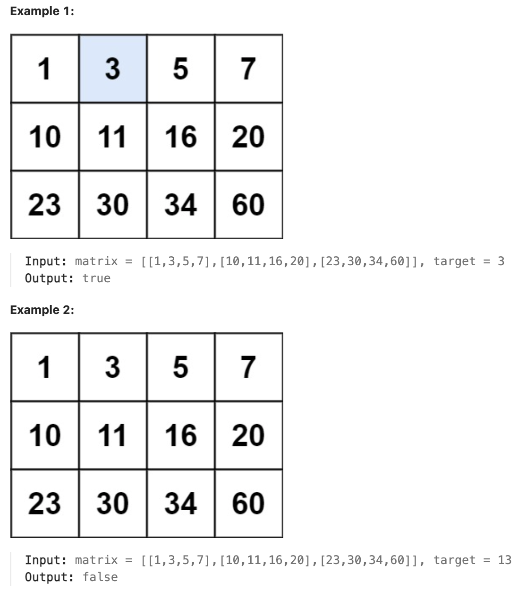

# 74.Search a 2D Matrix

## LeetCode 题目链接

[74.搜索二维矩阵](https://leetcode.cn/problems/search-a-2d-matrix/)

## 题目大意

给一个满足下述两条属性的 `m x n` 整数矩阵：
- 每行中的整数从左到右按非严格递增顺序排列
- 每行的第一个整数大于前一行的最后一个整数

给一个整数 `target`，若 `target` 在矩阵中，返回 `true`；否则，返回 `false` 



限制:
- m == matrix.length
- n == matrix[i].length
- 1 <= m, n <= 100
- -10^4 <= matrix[i][j], target <= 10^4

## 解题

二维矩阵是`有序`的，就可考虑使用二分搜索来进行查找

只要知道二维数组的的行数 `m` 和列数 `n`，二维数组的坐标 `(i, j)` 可以映射成一维的 `index = i * n + j`；反过来也可以通过一维 `index` 反解出二维坐标 `i = index / n`，`j = index % n`

```js
var searchMatrix = function(matrix, target) {
    let m = matrix.length, n = matrix[0].length;
    let left = 0, right = m * n - 1;
    while (left <= right) {
        let mid = left + Math.floor((right - left) / 2);
        if (get(matrix, mid) == target) {
            return true;
        } else if (get(matrix, mid) < target) {
            left = mid + 1;
        } else if (get(matrix, mid) > target) {
            right = mid - 1;
        }
    }
    return false;
};

var get = function(matrix, index) {
    let m = matrix.length, n = matrix[0].length;
    let i = Math.floor(index / n), j = index % n;
    return matrix[i][j];
}
```
```python
class Solution:
    def searchMatrix(self, matrix: List[List[int]], target: int) -> bool:
        m, n = len(matrix), len(matrix[0])
        left, right = 0, m * n - 1
        while left <= right:
            mid = left + (right - left) // 2
            if self.get(matrix, mid) == target:
                return True
            elif self.get(matrix, mid) < target:
                left = mid + 1
            elif self.get(matrix, mid) > target:
                right = mid - 1
        
        return False
    
    def get(self, matrix, index):
        m, n = len(matrix), len(matrix[0])
        i = index // n
        j = index % n
        return matrix[i][j]
```

- 时间复杂度：`O(log(m * n))`，矩阵被平铺成一个长度为 `m * n` 的一维数组
- 空间复杂度：`O(1)`