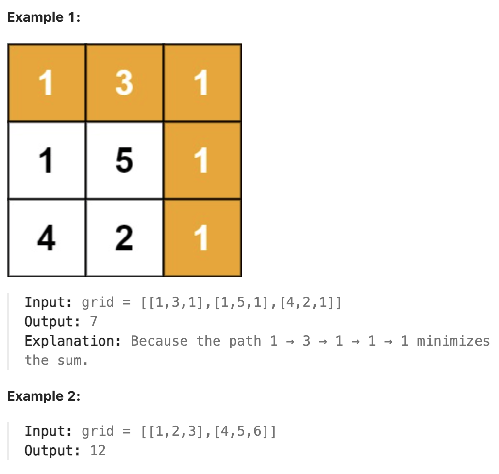

# 64.Minimum Path Sum

## LeetCode 题目链接

[64.最小路径和](https://leetcode.cn/problems/minimum-path-sum/)

## 题目大意

给定一个包含非负整数的 `m x n` 网格 `grid`，请找出一条从左上角到右下角的路径，使得路径上的数字总和为最小

说明：每次只能向下或者向右移动一步



限制:
- m == grid.length
- n == grid[i].length
- 1 <= m, n <= 200
- 0 <= grid[i][j] <= 200

## 解题

### 思路 1：递归 + 备忘录

一般来说，让在二维矩阵中求最优化问题（最大值或最小值），可以想到`递归 + 备忘录`，即动态规划技巧

通过递归地计算到达每个格子的最小路径和，并使用备忘录来避免重复计算，从而提升效率

```python
class Solution:
    def __init__(self):
        # memo 是一个二维数组，用来存储计算过的最小路径和，以避免重复计算
        self.memo = None

    def minPathSum(self, grid: List[List[int]]) -> int:
        m = len(grid)
        n = len(grid[0])
        # 构造备忘录，初始值全部设为 -1
        # memo[i][j] 表示到达位置 (i, j) 的最小路径和
        # 如果 memo[i][j] != -1，表示这个位置的最小路径和已经计算过，可以直接使用
        self.memo = [[-1 for _ in range(n)] for _ in range(m)]

        # 计算到达右下角位置 (m - 1, n - 1) 的最小路径和
        return self.dp(grid, m - 1, n - 1)
    
    def dp(self, grid: List[List[int]], i: int, j: int) -> int:
        # base case
        # 如果 i == 0 且 j == 0，表示到达左上角起点 (0, 0)，直接返回 grid[0][0]
        if i == 0 and j == 0:
            return grid[0][0]
        
         # 如果 i < 0 或 j < 0，表示越界，返回 inf，表示这是无效路径
        if i < 0 or j < 0:
            return float('inf')

        # 如果 memo[i][j] 不等于 -1，表示已经计算过该位置的最小路径和，直接返回 memo[i][j]，避免重复计算
        if self.memo[i][j] != -1:
            return self.memo[i][j]
        
        # 将计算结果记入备忘录
        # self.dp(grid, i - 1, j) 表示从上方的格子到达当前格子的最小路径和
        # self.dp(grid, i, j - 1) 表示从左方的格子到达当前格子的最小路径和
        # 两者取最小值，然后加上当前格子的值 grid[i][j]，得到到达 (i, j) 的最小路径和
        # 将结果存入 memo[i][j]，以便后续直接使用
        self.memo[i][j] = min(
            self.dp(grid, i - 1, j),
            self.dp(grid, i, j - 1)
        ) + grid[i][j]
        
        return self.memo[i][j]  
```

- 时间复杂度：`O(m×n)`，`m` 和 `n` 是 `grid` 的行数和列数。每个位置的最小路径和只会被计算一次，因此总的计算量为 `O(m×n)`
- 空间复杂度：`O(m×n)`，由于使用了 `memo` 备忘录，存储每个位置的最小路径和，因此空间复杂度为 `O(m×n)`

### 思路 2：动态规划+原地修改

思路：
- 定义状态：使用一个二维数组 `dp`，`dp[i][j]` 表示到达位置 `(i, j)` 时的最小路径和
- 状态转移方程：
  - 对于位置 `(i, j)`，可以从上方 `(i-1, j)` 或左方 `(i, j-1)` 到达。因此，`dp[i][j]` 的值为当前网格的值加上其上方或左方的最小路径和，即：`dp[i][j] = grid[i][j] + min(dp[i−1][j], dp[i][j−1])`
  - 如果在第一行，只能从左边过来：`dp[0][j] = dp[0][j-1] + grid[0][j]`
  - 如果在第一列，只能从上面过来：`dp[i][0] = dp[i-1][0] + grid[i][0]`
- 初始化：`dp[0][0] = grid[0][0]`，表示起点的路径和就是起点的值
- 结果：最终答案为 `dp[m-1][n-1]`，即到达右下角的最小路径和

```js
var minPathSum = function(grid) {
    const m = grid.length, n = grid[0].length;
    // 初始化第一列
    for (let i = 1; i < m; i++) {
        grid[i][0] += grid[i - 1][0];
    }

    // 初始化第一行
    for (let j = 1; j < n; j++) {
        grid[0][j] += grid[0][j - 1];
    }

    // 填充dp数组
    for (let i = 1; i < m; i++) {
        for (let j = 1; j < n; j++) {
            grid[i][j] += Math.min(grid[i - 1][j], grid[i][j - 1]);
        }
    }

    return grid[m - 1][n - 1];
};
```
```python
class Solution:

    def minPathSum(self, grid: List[List[int]]) -> int:
        m, n = len(grid), len(grid[0])
        
        # 初始化第一列
        for i in range(1, m):
            grid[i][0] += grid[i - 1][0]

        # 初始化第一行
        for j in range(1, n):
            grid[0][j] += grid[0][j - 1]

        # 填充dp数组
        for i in range(1, m):
            for j in range(1, n):
                grid[i][j] += min(grid[i - 1][j], grid[i][j - 1])
        
        return grid[m - 1][n - 1]
```

- 时间复杂度：`O(m * n)`，`m` 是网格的行数，`n` 是网格的列数，需遍历整个网格一次，每个单元格只被访问一次
- 空间复杂度：`O(1)`
  - 直接在原网格上修改，不需要额外空间
  - 如果不允许修改原数组，空间复杂度会是 `O(m * n)`