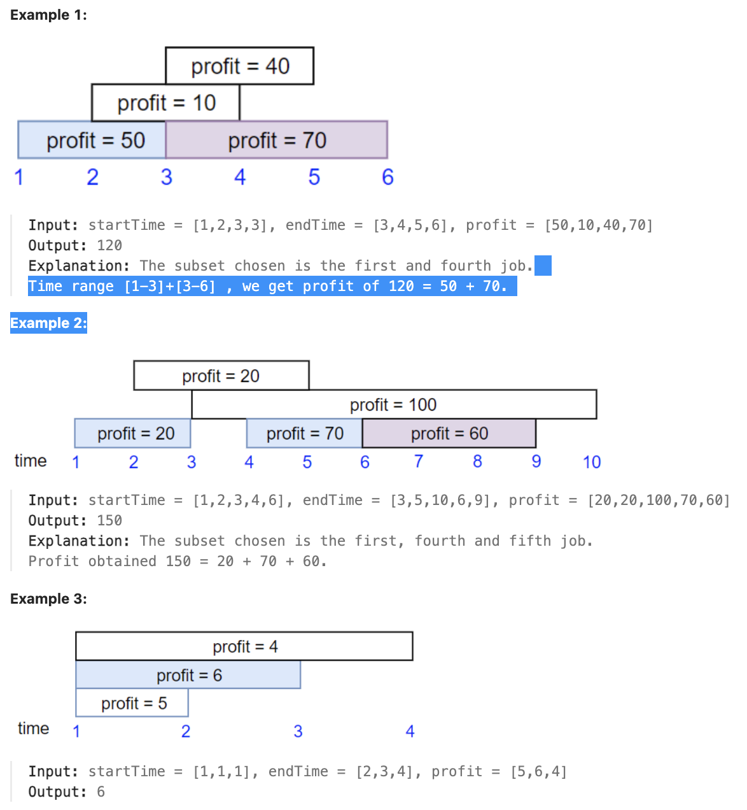

# 1235.Maximum Profit in Job Scheduling

## LeetCode 题目链接

[1235.规划兼职工作](https://leetcode.cn/problems/maximum-profit-in-job-scheduling/)

## 题目大意

你打算利用空闲时间来做兼职工作赚些零花钱

这里有 `n` 份兼职工作，每份工作预计从 `startTime[i]` 开始到 `endTime[i]` 结束，报酬为 `profit[i]`

给你一份兼职工作表，包含开始时间 `startTime`，结束时间 `endTime` 和预计报酬 `profit` 三个数组，请计算并返回可获得的最大报酬

注意，时间上出现重叠的 `2` 份工作不能同时进行

如果选择的工作在时间 `X` 结束，则可以立刻进行在时间 `X` 开始的下一份工作



限制:
- 1 <= startTime.length == endTime.length == profit.length <= 5 * 10^4
- 1 <= startTime[i] < endTime[i] <= 10^9
- 1 <= profit[i] <= 10^4

## 解题

这道题是典型的`区间调度问题`，且每个区间（工作）有一定的报酬。在选择工作时，要求时间段不重叠且要获得最大的收益

类似的问题通常可以使用动态规划和二分查找来解决，题目目标是找到最大化的收益

```js
var jobScheduling = function(startTime, endTime, profit) {
    const jobs = startTime.map((start, i) => [start, endTime[i], profit[i]])
        .sort((a, b) => a[1] - b[1]);
    
    const n = jobs.length;
    const dp = new Array(n).fill(0);

    for (let i = 0; i < n; i++) {
        const [start, end, profit] = jobs[i];
        const prevProfit = i > 0 ? dp[i-1] : 0;
        let nonConflictJobProfit = 0;
        
        let low = 0, high = i - 1;
        while (low <= high) {
            const mid = Math.floor((low + high) / 2);
            if (jobs[mid][1] <= start) {
                nonConflictJobProfit = dp[mid];
                low = mid + 1;
            } else {
                high = mid - 1;
            }
        }
        
        dp[i] = Math.max(prevProfit, nonConflictJobProfit + profit);
    }
    
    return dp[n-1];
};
```
```python
# 写法 1
class Solution:
    def jobScheduling(self, startTime: List[int], endTime: List[int], profit: List[int]) -> int:
        # 将 startTime、endTime 和 profit 三个数组组合成一个三元组，并按结束时间进行排序
        # 目的是为了保证在处理某个工作时，可以更方便地找到之前的、不与当前工作冲突的工作
        jobs = sorted(zip(startTime, endTime, profit), key=lambda x: x[1])

        n = len(jobs)
        # dp[i] 表示在考虑第 i 个工作（按结束时间排序）时能获得的最大收益
        dp = [0] * n

        for i in range(n):
            start, end, profit = jobs[i]
            # prev_profit 表示不选当前工作的最大收益，即 dp[i-1]
            prev_profit = dp[i-1] if i > 0 else 0
            non_conflict_job_profit = 0
            
            # 使用二分查找在 jobs 中找到最后一个不与当前工作冲突的工作
            low, high = 0, i - 1
            while low <= high:
                mid = (low + high) // 2
                # 判断条件是 jobs[mid][1] <= start，即第 mid 个工作的结束时间必须小于等于当前工作的开始时间
                if jobs[mid][1] <= start:
                    # non_conflict_job_profit 存储了与当前工作不冲突的最大利润值
                    non_conflict_job_profit = dp[mid]
                    low = mid + 1
                else:
                    high = mid - 1
            
            # 更新 dp[i] 为选或不选当前工作的最大收益
            # - 不选当前工作时，最大收益为 prev_profit
            # - 选当前工作时，最大收益为 non_conflict_job_profit + profit
            dp[i] = max(prev_profit, non_conflict_job_profit + profit)
        
        # 最终 dp 数组中最后一个元素表示能获得的最大收益，返回它即可
        return dp[-1]

# 写法 2
class Solution:
    def jobScheduling(self, startTime: List[int], endTime: List[int], profit: List[int]) -> int:
        # 将 startTime, endTime 和 profit 组合成三元组，并按照结束时间 endTime 进行排序
        jobs = sorted(zip(startTime, endTime, profit), key=lambda v: v[1])

        # dp 是一个二维列表，dp[i] 表示在 0 到第 i 个工作（按结束时间排序）区间内能获得的最大利润
        # dp[i] = [endTime, max_profit]，表示截止到 endTime 时能够获得的最大收益为 max_profit
        # dp[0] = [0, 0] 表示在时间 0 时的最大利润为 0
        dp = [[0, 0]]

        # 遍历所有的工作
        for s, e, p in jobs:
            # 使用二分查找在 dp 中找到第一个结束时间小于等于当前工作开始时间的位置
            # 目标是找到最接近的、且不冲突的工作，以此获取其最大利润
            # s + 1 表示在 dp 数组中查找第一个 endTime 大于 s 的位置
            # 返回值 i 表示在 dp 中最后一个 endTime <= s 的位置，即不与当前工作 s, e 冲突的最大利润位置
            i = bisect.bisect(dp, [s + 1]) - 1
            
            # dp[i][1] 是与当前工作 s, e 不冲突的最大利润
            # 如果当前工作加上之前的最大利润 dp[i][1] + p 比当前 dp 数组中存储的最大利润 dp[-1][1] 大，则将当前工作 e, dp[i][1] + p 添加到 dp 中
            if dp[i][1] + p > dp[-1][1]:
                dp.append([e, dp[i][1] + p])

        # dp[-1][1] 中存储的是所有工作中能获得的最大利润
        return dp[-1][1]
```

- 时间复杂度：`O(n log n)`
  - 对 `jobs` 按结束时间排序，时间复杂度为 `O(nlogn)`，`n` 是工作数量
  - 外层循环 `for i in range(n)` 遍历每个工作，共执行 `n` 次；对于每个工作，需使用二分查找找到不冲突的工作，二分查找的时间复杂度为 `O(log n)` -> 遍历和二分查找的总时间复杂度为 `O(n * log n)`
  - 每次更新 `dp[i]` 的时间复杂度为 `O(1)`，共执行 `n` 次，因此总复杂度为 `O(n)`
  - 由于排序和二分查找都是 `O(nlogn)` 级别，因此总时间复杂度为 `O(nlogn)`
- 空间复杂度：`O(n)`，`jobs` 和 `dp` 都是 `O(n)`，`start`、`end`、`profit` 等为常数级空间，空间复杂度为 `O(1)`