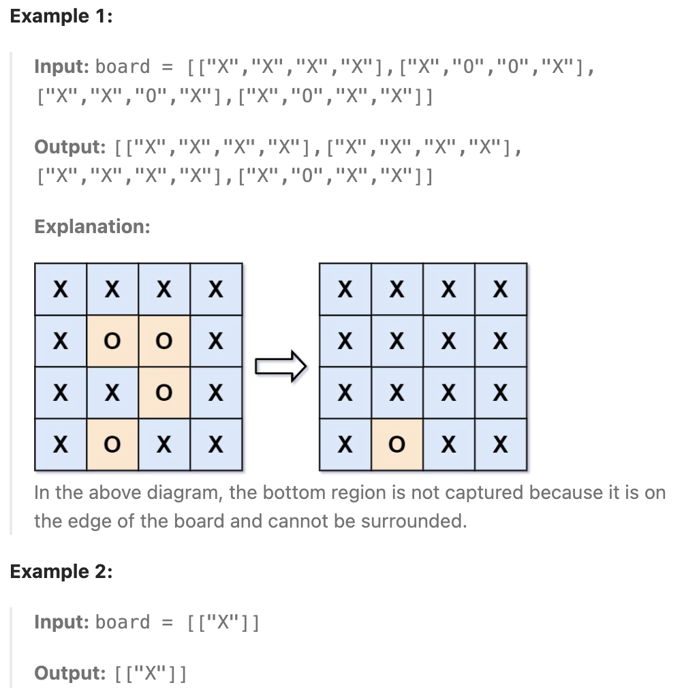

# 130.Surrounded Regions

## LeetCode 题目链接

[130.被围绕的区域](https://leetcode.cn/problems/surrounded-regions/)

## 题目大意

给一个 `m x n` 的矩阵 `board`，由若干字符 `'X'` 和 `'O'` 组成，捕获所有被围绕的区域：
- 连接：一个单元格与水平或垂直方向上相邻的单元格连接
- 区域：连接所有 `'O'` 的单元格来形成一个区域
- 围绕：如果您可以用 `'X'` 单元格 连接这个区域，且区域中没有任何单元格位于 `board` 边缘，则该区域被 `'X'` 单元格围绕

通过 原地 将输入矩阵中的所有 `'O'` 替换为 `'X'` 来 捕获被围绕的区域，不需要返回任何值



限制：
- m == board.length
- n == board[i].length
- 1 <= m, n <= 200
- board[i][j] is 'X' or 'O'.

## 解题

### 思路 1: DFS

可以使用深度优先搜索实现标记操作

```js
var solve = function(board) {
    let n = board.length;
    if (n === 0) return;
    let m = board[0].length;

    // 深度优先搜索 (DFS)
    const dfs = (x, y) => {
        if (x < 0 || x >= n || y < 0 || y >= m || board[x][y] !== 'O') {
            return;
        }
        board[x][y] = 'A'; // 标记为 'A' 以防止重复访问
        dfs(x + 1, y);
        dfs(x - 1, y);
        dfs(x, y + 1);
        dfs(x, y - 1);
    };

    // 遍历边界，将边界上的 'O' 进行 DFS 标记
    for (let i = 0; i < n; i++) {
        dfs(i, 0);
        dfs(i, m - 1);
    }
    
    for (let i = 1; i < m - 1; i++) {
        dfs(0, i);
        dfs(n - 1, i);
    }

    // 遍历整个棋盘，将标记的 'A' 还原为 'O'，其余的 'O' 变成 'X'
    for (let i = 0; i < n; i++) {
        for (let j = 0; j < m; j++) {
            if (board[i][j] === 'A') {
                board[i][j] = 'O';
            } else if (board[i][j] === 'O') {
                board[i][j] = 'X';
            }
        }
    }    
};
```
```python
class Solution:
    def solve(self, board: List[List[str]]) -> None:
        if not board:
            return
        
        m, n = len(board), len(board[0])

        def dfs(x, y):
            if not 0 <= x < m or not 0 <= y < n or board[x][y] != 'O':
                return
            
            board[x][y] = "A"
            dfs(x + 1, y)
            dfs(x - 1, y)
            dfs(x, y + 1)
            dfs(x, y - 1)
        
        for i in range(m):
            dfs(i, 0)
            dfs(i, n - 1)
        
        for i in range(n - 1):
            dfs(0, i)
            dfs(m - 1, i)
        
        for i in range(m):
            for j in range(n):
                if board[i][j] == "A":
                    board[i][j] = "O"
                elif board[i][j] == "O":
                    board[i][j] = "X"
```

- 时间复杂度：`O(n×m)`，其中 `n` 和 `m` 分别为矩阵的行数和列数，深度优先搜索过程中，每一个点至多只会被标记一次
- 空间复杂度：`O(n×m)`，其中 `n` 和 `m` 分别为矩阵的行数和列数，主要为深度优先搜索的栈的开销

### 思路 2: BFS

```js
var solve = function(board) {
    if (!board || board.length === 0) return;
    
    let m = board.length, n = board[0].length;
    let que = [];

    // 遍历边界，将边界上的 'O' 加入队列，并标记为 'A'
    for (let i = 0; i < m; i++) {
        if (board[i][0] === 'O') {
            que.push([i, 0]);
            board[i][0] = 'A';
        }

        if (board[i][n - 1] === 'O') {
            que.push([i, n - 1]);
            board[i][n - 1] = 'A';
        }
    }
    for (let i = 0; i < n; i++) {
        if (board[0][i] === 'O') {
            que.push([0, i]);
            board[0][i] = 'A';
        }
        if (board[m - 1][i] === 'O') {
            que.push([m - 1, i]);
            board[m - 1][i] = 'A';
        }
    }

    // 定义四个方向
    const directions = [[-1, 0], [1, 0], [0, -1], [0, 1]];

    // BFS 处理队列中的所有元素
    while (que.length > 0) {
        let [x, y] = que.shift();
        for (let [dx, dy] of directions) {
            let mx = x + dx, my = y + dy;
            if (mx >= 0 && mx < m && my >= 0 && my < n && board[mx][my] === 'O') {
                que.push([mx, my]);
                board[mx][my] = 'A';  // 标记为 'A'
            }
        }
    }

    // 遍历整个棋盘，将 'A' 变回 'O'，未被标记的 'O' 变为 'X'
    for (let i = 0; i < m; i++) {
        for (let j = 0; j < n; j++) {
            if (board[i][j] === 'A') {
                board[i][j] = 'O';
            } else if (board[i][j] === 'O') {
                board[i][j] = 'X';
            }
        }
    }
};
```
```python
class Solution:
    def solve(self, board: List[List[str]]) -> None:
        if not board:
            return
        
        m, n = len(board), len(board[0])
        que = collections.deque()
        for i in range(m):
            if board[i][0] == "O":
                que.append((i, 0))
                board[i][0] = "A"
            if board[i][n - 1] == "O":
                que.append((i, m - 1))
                board[i][n - 1] = "A"
                
        for i in range(n - 1):
            if board[0][i] == "O":
                que.append((0, i))
                board[0][i] = "A"
            if board[m - 1][i] == "O":
                que.append((m - 1, i))
                board[m - 1][i] = "A"
        
        while que:
            x, y = que.popleft()
            for mx, my in [(x - 1, y), (x + 1, y), (x, y - 1), (x, y + 1)]:
                if 0 <= mx < m and 0 <= my < n and board[mx][my] == "O":
                    que.append((mx, my))
                    board[mx][my] = "A"
        
        for i in range(m):
            for j in range(n):
                if board[i][j] == "A":
                    board[i][j] = "O"
                elif board[i][j] == "O":
                    board[i][j] = "X"
```

- 时间复杂度：`O(n×m)`，其中 `n` 和 `m` 分别为矩阵的行数和列数，广度优先搜索过程中，每一个点至多只会被标记一次
- 空间复杂度：`O(n×m)`，其中 `n` 和 `m` 分别为矩阵的行数和列数，主要为广度优先搜索的队列的开销
