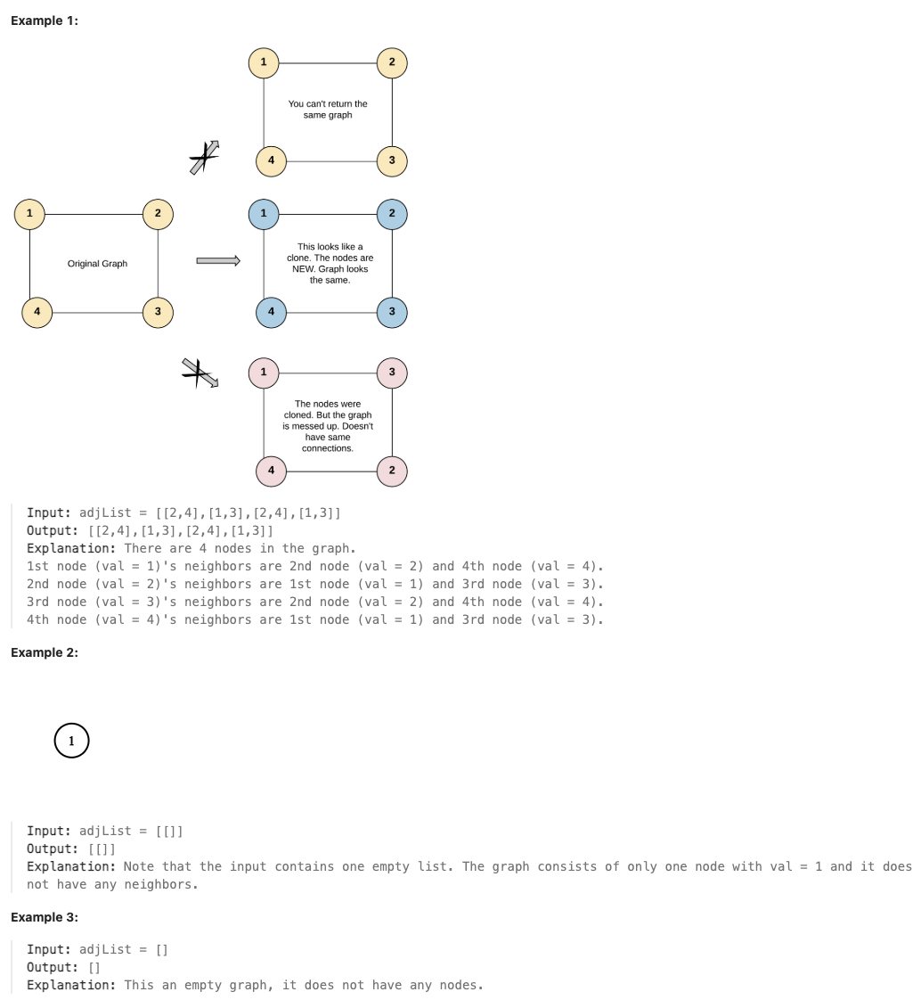

# 133.Clone Graph

## LeetCode 题目链接

[133.克隆图](https://leetcode.cn/problems/clone-graph/)

## 题目大意

给你无向 连通 图中一个节点的引用，请你返回该图的 深拷贝（克隆）

图中的每个节点都包含它的值 `val（int）` 和其邻居的列表（`list[Node]`）

```js
class Node {
    public int val;
    public List<Node> neighbors;
}
```
 
测试用例格式：

简单起见，每个节点的值都和它的索引相同。例如，第一个节点值为 1（val = 1），第二个节点值为 2（val = 2），以此类推。该图在测试用例中使用邻接列表表示。

邻接列表是用于表示有限图的无序列表的集合，每个列表都描述了图中节点的邻居集

给定节点将始终是图中的第一个节点（值为 `1`），必须将给定节点的拷贝作为对克隆图的引用返回



限制:
- The number of nodes in the graph is in the range [0, 100].
- 1 <= Node.val <= 100
- Node.val is unique for each node.
- There are no repeated edges and no self-loops in the graph.
- The Graph is connected and all nodes can be visited starting from the given node.

## 解题

> 所谓深拷贝，就是构建一张与原图结构、值均一样的图，但所用的节点不再是原图节点的引用，即每个节点都要新建

这种递归数据结构的克隆问题，一般套路就是要用一个`哈希表`把原节点和克隆节点映射起来，剩下的就是遍历，把克隆节点组装起来

### 思路 1: DFS

使用哈希表 `visited` 来存储原图中被访问过的节点和克隆图中对应节点，键值对为`原图被访问过的节点：克隆图中对应节点`
- 从给定节点开始，以深度优先搜索的方式遍历原图
- 若当前节点被访问过，则返克回隆图中对应节点
- 若当前节点没有被访问过，则创建一个新的节点，并保存在哈希表中
- 遍历当前节点的邻接节点列表，递归调用当前节点的邻接节点，并将其放入克隆图中对应节点
- 递归结束，返回克隆节点

```js
var cloneGraph = function(node) {
    // 如果节点为空，则直接返回空节点
    if (!node) return node;  
    // 记录原节点到克隆节点的映射
    let visited = new Map();

    const dfs = function(node) {
        // 如果该节点已被访问，返回其克隆节点
        if (visited.has(node)) {  
            return visited.get(node);
        }

        // 创建当前节点的克隆节点
        const cloneNode = new Node(node.val);
        visited.set(node, cloneNode);  // 记录该节点及其克隆节点

        // 遍历当前节点的邻居，并将克隆的邻居添加到克隆节点的 neighbors 列表中
        for (const neighbor of node.neighbors) {
            cloneNode.neighbors.push(dfs(neighbor));
        }
        return cloneNode;  // 返回克隆的节点
    };

    return dfs(node);  // 从传入节点开始进行 DFS 并返回克隆图的起始节点
};
```
```python
"""
# Definition for a Node.
class Node:
    def __init__(self, val = 0, neighbors = None):
        self.val = val
        self.neighbors = neighbors if neighbors is not None else []
"""

class Solution:
    def cloneGraph(self, node: Optional['Node']) -> Optional['Node']:
        if not node:
            return node
        # 创建一个字典，用于记录已经访问过的节点及其对应的克隆节点
        visited = dict()
    
        def dfs(node: 'Node') -> 'Node':
            # 如果当前节点已经被访问过，直接返回它的克隆节点
            if node in visited:
                return visited[node]
            
            # 创建当前节点的克隆节点，并将其记录到 visited 字典中
            clone_node = Node(node.val)
            visited[node] = clone_node

            # 遍历当前节点的所有邻居节点并将每个邻居节点递归调用 dfs 克隆，将克隆结果添加到 clone_node.neighbors 中
            for neighbor in node.neighbors:
                clone_node.neighbors.append(dfs(neighbor))

            # 返回当前节点的克隆节点
            return clone_node
        
        # 从传入的节点开始进行 DFS
        return dfs(node)
```

- 时间复杂度：`O(n)`，其中 `n` 表示节点数量，深度优先搜索遍历图的过程中每个节点只会被访问一次
- 空间复杂度：`O(n)`。存储克隆节点和原节点的哈希表需要 `O(n)` 的空间，递归调用栈需要 `O(h)` 的空间，其中 `h` 是图的深度，经过放缩可以得到 `O(h)=O(n)`，因此总体空间复杂度为 `O(n)`

### 思路 2: BFS

使用哈希表 `visited` 来存储原图中被访问过的节点和克隆图中对应节点，键值对为`原图被访问过的节点：克隆图中对应节点`，使用队列 `que` 存放节点

```js
var cloneGraph = function(node) {
    if (!node) return node;  // 如果节点为空，直接返回

    const visited = new Map();  // 使用 Map 存储原节点与克隆节点的对应关系
    const que = [node];       // 使用数组模拟队列，进行 BFS 遍历

    // 创建第一个节点的克隆节点，并存入 visited 中
    visited.set(node, new Node(node.val));

    // 开始 BFS 遍历
    while (que.length) {
        const node_u = que.shift();  // 从队列中取出当前节点

        // 遍历当前节点的所有邻居
        for (const node_v of node_u.neighbors) {
            if (!visited.has(node_v)) {  // 如果邻居节点还没有被访问
                // 克隆邻居节点，并将其存入 visited 中
                visited.set(node_v, new Node(node_v.val));
                que.push(node_v);  // 将未访问的邻居节点放入队列中
            }

            // 将克隆的邻居节点添加到当前节点克隆节点的邻居列表中
            visited.get(node_u).neighbors.push(visited.get(node_v));
        }
    }

    // 返回克隆图的起始节点
    return visited.get(node);
};
```
```python
class Solution:
    def cloneGraph(self, node: Optional['Node']) -> Optional['Node']:
        # 如果传入的节点为空，直接返回空节点
        if not node:
            return node
        # 创建一个字典，用于存储已访问的节点及其对应的克隆节点
        visited = dict()
        visited[node] = Node(node.val)
        # 创建一个队列，用于 BFS 遍历节点
        que = collections.deque([node])

        while que:
            # 从队列中取出当前节点
            node_u = que.popleft()
            # 遍历当前节点的所有邻居
            for node_v in node_u.neighbors:
                # 如果邻居节点还没有被访问过
                # 如果邻居节点 node_v 还未被克隆，则创建该邻居的克隆节点，并将其放入 visited 字典中，记录原节点和克隆节点的对应关系
                if node_v not in visited:
                    visited[node_v] = Node(node_v.val)
                    # 将未访问的邻居节点放入队列中
                    que.append(node_v)
                
                # 将邻居节点的克隆节点添加到当前节点克隆节点的 neighbors 列表中
                visited[node_u].neighbors.append(visited[node_v])
        
        # 返回克隆图的起始节点
        return visited[node]
```

- 时间复杂度：`O(n)`，其中 `n` 表示节点数量，广度优先搜索遍历图的过程中每个节点只会被访问一次
- 空间复杂度：`O(n)`
  哈希表使用 `O(n)` 的空间
  广度优先搜索中的队列在最坏情况下会达到 `O(n)` 的空间复杂度，因此总体空间复杂度为 `O(n)`