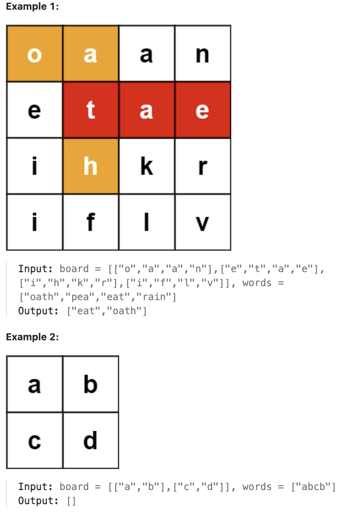

# 212.Word Search II

## LeetCode 题目链接

[212.单词搜索 II](https://leetcode.cn/problems/word-search-ii/)

## 题目大意

给定一个 `m x n` 二维字符网格 `board` 和一个单词（字符串）列表 `words`，返回所有二维网格上的单词 

单词必须按照字母顺序，通过相邻的单元格内的字母构成，其中“相邻”单元格是那些水平相邻或垂直相邻的单元格。同一个单元格内的字母在一个单词中不允许被重复使用 



限制：
- m == board.length
- n == board[i].length
- 1 <= m, n <= 12
- board[i][j] is a lowercase English letter.
- 1 <= words.length <= 3 * 10^4
- 1 <= words[i].length <= 10
- words[i] consists of lowercase English letters.
- All the strings of words are unique.

## 解题

这道题是典型的`二维字符网格搜索问题`，要求在一个二维网格 `board` 中找到一个单词列表 `words` 中的所有单词

使用`字典树（Trie） + 深度优先搜索（DFS）`是解决这类问题的最优方法
- 字典树：将 `words` 列表中的所有单词插入字典树。这样可以通过前缀快速判断某条路径是否可能是某个单词的组成部分
- `DFS` 搜索：从二维网格的每个位置开始深度优先搜索，同时在字典树中匹配单词路径
- 剪枝：如果某条路径在字典树中不再有对应的前缀，则立即停止搜索，从而提高效率

```js
class TrieNode {
    constructor() {
        this.children = {};
        this.isEnd = false;
        this.word = null;
    }
}

class Trie {
    constructor() {
        this.root = new TrieNode();
    }

    insert(word) {
        let node = this.root;
        for (let char of word) {
            if (!node.children[char]) node.children[char] = new TrieNode();
            node = node.children[char];
        }
        node.isEnd = true;
        node.word = word;
    }
}

/**
 * @param {character[][]} board
 * @param {string[]} words
 * @return {string[]}
 */
var findWords = function(board, words) {
    const trie = new Trie();
    for (let word of words) {
        trie.insert(word);
    }

    const rows = board.length, cols = board[0].length;
    const res = new Set();

    const dfs = function(row, col, node) {
        const char = board[row][col];
        const child = node.children[char];
        if (!child) return;
        if (child.isEnd) res.add(child.word);
        // 标记当前单元格为已访问
        board[row][col] = '#';
        // 遍历上下左右四个方向
        for (let [dx, dy] of [[-1, 0], [1, 0], [0, -1], [0, 1]]) {
            const newRow = row + dx;
            const newCol = col + dy;
            if (newRow >= 0 && newRow < rows && newCol >= 0 && newCol < cols && board[newRow][newCol] !== '#') {
                dfs(newRow, newCol, child);
            }
        }
        // 恢复当前单元格的原始值
        board[row][col] = char;
    };

    for (let row = 0; row < rows; row++) {
        for (let col = 0; col < cols; col++) {
            if (trie.root.children[board[row][col]]) {
                dfs(row, col, trie.root);
            }
        }
    }

    return Array.from(res);
};
```
```python
from typing import List

class TrieNode:
    def __init__(self):
        self.children = {}
        self.is_end = False
        self.word = None  # 用于存储单词，方便在找到完整单词时直接记录

class Trie:
    def __init__(self):
        self.root = TrieNode()
    
    def insert(self, word: str):
        node = self.root
        for char in word:
            if char not in node.children:
                node.children[char] = TrieNode()
            node = node.children[char]
        node.is_end = True
        node.word = word

class Solution:
    def findWords(self, board: List[List[str]], words: List[str]) -> List[str]:
        # 构建字典树
        trie = Trie()
        for word in words:
            trie.insert(word)
        
        rows, cols = len(board), len(board[0])
        res = set()

        def dfs(row, col, node):
            char = board[row][col]
            child = node.children.get(char)
            if not child:
                return
            if child.is_end:
                res.add(child.word)
            
            # 标记当前单元格为已访问
            board[row][col] = '#'
            # 遍历上下左右四个方向
            for dx, dy in [(-1, 0), (1, 0), (0, -1), (0, 1)]:
                new_row, new_col = row + dx, col + dy
                if 0 <= new_row < rows and 0 <= new_col < cols and board[new_row][new_col] != '#':
                    dfs(new_row, new_col, child)
            
            # 恢复当前单元格的原始值
            board[row][col] = char

        # 从网格的每个位置出发，进行 DFS
        for row in range(rows):
            for col in range(cols):
                if board[row][col] in trie.root.children:
                    dfs(row, col, trie.root)
        
        return list(res)
```

- 时间复杂度：`O(wxl + m×n×4^l)`
  - 构建字典树：
    - 将每个平均长度为 `l` 的单词插入字典树 `Trie` 需要 `O(l)` 时间
    - 如果有 `w` 个单词，则构建字典树的总时间复杂度为 `O(w×l)`
  - `DFS`：
    - 对于网格中的每个单元格，启动 `DFS` 来搜索字典树中的单词
    - 每次 `DFS` 可以最多探索四个方向（上下左右），但由于回溯，确保每个单元格在每条路径中只被访问一次
    - `DFS` 的最大深度由最长的单词长度 `l` 限制，因为超过任何有效前缀后，`DFS` 将停止
    - 因此，每个单元格的 `DFS` 时间复杂度为 `O(4^l)`
    - 对于一个 `m×n` 的网格，总的搜索时间是 `O(m×n×4^l)`
- 空间复杂度：`O(w×l + l)`
  - 字典树存储：字典树的存储空间为 `O(w×l)`，因为每个节点存储一个字符，而每个单词最多有 `l` 个字符
  - DFS 调用栈：在最坏情况下，DFS 的递归深度可能达到 `l`(最深为单词最大长度 `l`)，因此调用栈需 `O(l)` 的额外空间

