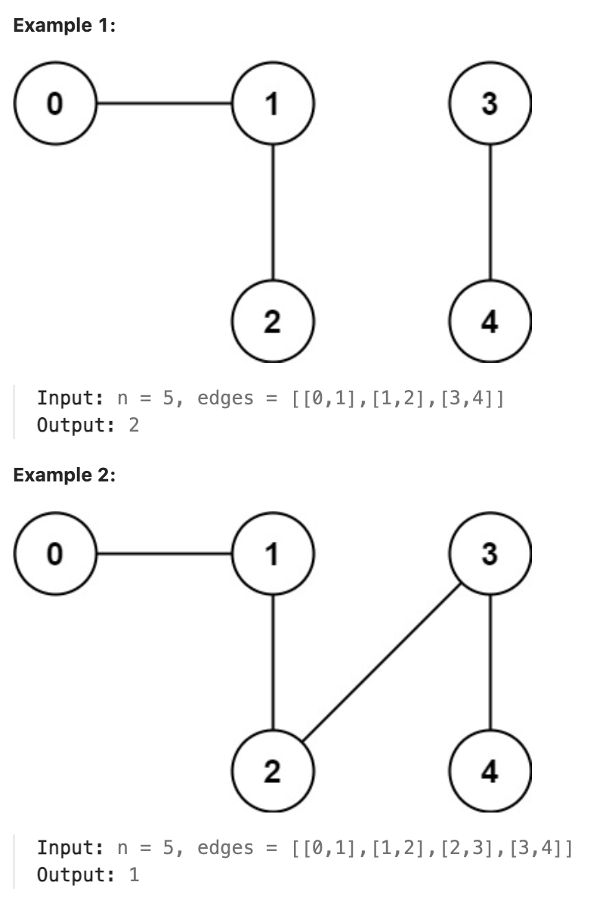

# 323.Number of Connected Components in an Undirected Graph

## LeetCode 题目链接

[323.无向图中连通分量的数目](https://leetcode.cn/problems/number-of-connected-components-in-an-undirected-graph/)

## 题目大意

有一个包含 `n` 个节点的图。给定一个整数 `n` 和一个数组 `edges`，其中 `edges[i] = [a_i, b_i]` 表示图中 `a_i` 和 `b_i` 之间有一条边

返回 图中已连接分量的数目 



限制:
- 1 <= n <= 2000
- 1 <= edges.length <= 5000
- edges[i].length == 2
- 0 <= a_i <= b_i < n
- a_i != b_i
- There are no repeated edges.

## 解题

### 思路 1: BFS

- 使用变量 `count` 记录连通分量个数，使用集合变量 `visited` 记录访问过的节点，使用邻接表 `graph` 记录图结构
- 从 `0` 开始，依次遍历 `n` 个节点
- 如果第 `i` 个节点未访问过：
  - 将其添加到 `visited` 中
  - 且连通分量个数累加，即 `count += 1`
  - 定义一个队列 `que`，将第 `i` 个节点加入到队列中
  - 从队列中取出第一个节点，遍历与其链接的节点，并将未遍历过的节点加入到队列 `que` 和 `visited` 中
  - 直到队列为空，则继续向后遍历
- 最后输出连通分量数目 `count`

```js
var countComponents = function(n, edges) {
    let count = 0;
    let visited = new Set();
    let graph = Array.from({ length: n }, () => []);

    // 建图，构造无向图
    for (let [x, y] of edges) {
        graph[x].push(y);
        graph[y].push(x);
    }

    // 遍历每个节点，判断是否已访问过
    for (let i = 0; i < n; i++) {
        if (!visited.has(i)) {
            visited.add(i);
            count += 1;
            // 广度优先搜索（BFS）探索整个连通分量
            let que = [i];
            while (que.length) {
                let node_u = que.shift();
                for (let node_v of graph[node_u]) {
                    if (!visited.has(node_v)) {
                        visited.add(node_v);
                        que.push(node_v);
                    }
                }
            }
        }
    }
    return count;
};
```
```python
class Solution:
    def countComponents(self, n: int, edges: List[List[int]]) -> int:
        count = 0
        visited = set()
        graph = [[] for _ in range(n)]
        for x, y in edges:
            graph[x].append(y)
            graph[y].append(x)

        for i in range(n):
            if i not in visited:
                visited.add(i)
                count += 1
                que = deque([i])
                
                while que:
                    node_u = que.popleft()
                    for node_v in graph[node_u]:
                        if node_v not in visited:
                            visited.add(node_v)
                            que.append(node_v)
        return count
```

- 时间复杂度：`O(V+E)`，`V` 是节点数，`E` 是边数
  - 构建图的时间复杂度：需遍历 `edges` 列表中的每一条边，且对每条边的两个顶点分别进行操作，将其加入到邻接列表中。这样操作的总时间复杂度为 `O(E)`，`E` 是边的数量
  - 遍历图的时间复杂度：对每个未访问的节点进行 `BFS`，`BFS` 的时间复杂度是 `O(V+E)`，`V` 是节点的数量，`E` 是边的数量，因为每条边在 `BFS` 中最多被访问两次（一次是从每个端点访问）
- 空间复杂度：`O(V+E)`
  - 使用邻接列表来存储图，其中每个节点的邻接列表最多存储所有相邻节点。因此，存储图的空间复杂度为 `O(V+E)`
  - `visited` 集合的空间复杂度为 `O(V)`，因为最多标记 `V` 个节点为访问过
  - `que` 队列在 `BFS` 中最多可以容纳所有节点，因此其空间复杂度也是 `O(V)`
  - 邻接列表、访问记录以及 `BFS` 队列的空间总复杂度为 `O(V+E)`

### 思路 2: DFS

- 使用 `visited` 数组标记遍历过的节点，使用 `count` 记录连通分量数量
- 从未遍历过的节点 `u` 出发，连通分量数量加 `1`。然后遍历与 `u` 节点构成无向边，且为遍历过的的节点 `v`
- 再从 `v` 出发继续深度遍历
- 直到遍历完与 `u` 直接相关、间接相关的节点后，再遍历另一个未遍历过的节点，继续上述操作
- 最后输出连通分量数目

```js
var countComponents = function(n, edges) {
    let count = 0; // 用于记录连通分量的数量
    let visited = Array(n).fill(false); // 初始化访问数组，记录每个节点是否被访问过
    let graph = Array.from({ length: n }, () => []); // 构建图的邻接列表
    // 构建图
    for (let [x, y] of edges) {
        graph[x].push(y);
        graph[y].push(x); // 无向图，所以需要双向添加
    }

    // 定义DFS函数，用于遍历每个连通分量
    const dfs = function(visited, i, graph) {
        visited[i] = true; // 标记当前节点已访问
        for (let j of graph[i]) {
            if (!visited[j]) dfs(visited, j, graph); // 递归遍历所有未访问的相邻节点
        }
    };

    // 遍历所有节点，寻找未访问的节点
    for (let i = 0; i < n; i++) {
        if (!visited[i]) {
            count++; // 每找到一个未访问的节点，连通分量计数+1
            dfs(visited, i, graph); // 深度优先搜索，遍历整个连通分量
        }
    }

    return count; // 返回连通分量的数量
};
```
```python
class Solution:
    def countComponents(self, n: int, edges: List[List[int]]) -> int:
        count = 0
        visited = [False for _ in range(n)]
        graph = [[] for _ in range(n)]

        for x, y in edges:
            graph[x].append(y)
            graph[y].append(x)
        
        for i in range(n):
            if not visited[i]:
                count += 1
                self.dfs(visited, i, graph)
        return count
    
    def dfs(self, visited, i, graph):
        visited[i] = True
        for j in graph[i]:
            if not visited[j]:
                self.dfs(visited, j, graph)
```

- 时间复杂度和空间复杂度同上