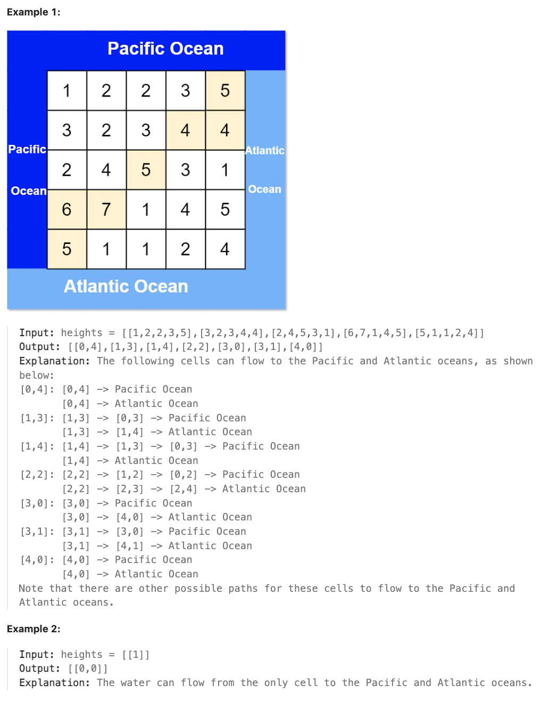

# 417.Pacific Atlantic Water Flow

## LeetCode 题目链接

[417.太平洋大西洋水流问题](https://leetcode.cn/problems/pacific-atlantic-water-flow/)

## 题目大意

有一个 `m × n` 的矩形岛屿，与太平洋和大西洋相邻，“太平洋” 处于大陆的左边界和上边界，而 “大西洋” 处于大陆的右边界和下边界

这个岛被分割成一个由若干方形单元格组成的网格。给定一个 `m x n` 的整数矩阵 `heights`，`heights[r][c]` 表示坐标 `(r, c)` 上单元格高于海平面的高度 

岛上雨水较多，如果相邻单元格的高度小于或等于当前单元格的高度，雨水可直接向北、南、东、西流向相邻单元，水可以从海洋附近的任何单元格流入海洋

返回网格坐标 `result` 的 `2D` 列表 ，其中 `result[i] = [r_i, c_i]` 表示雨水从单元格 `(r_i, c_i)` 流动既可流向太平洋也可流向大西洋



限制:
- m == heights.length
- n == heights[r].length
- 1 <= m, n <= 200
- 0 <= heights[r][c] <= 10^5

## 解题

`DFS/BFS`：可以使用深度优先搜索（`DFS`）或广度优先搜索（`BFS`）来从边界向内部遍历，标记哪些单元格的水能够流向太平洋和大西洋

逆流法：分别从太平洋和大西洋的边界出发，找出水能够逆流到的所有单元格。具体方法是：
- 从左边和上边出发，找能流到太平洋的单元格
- 从右边和下边出发，找能流到大西洋的单元格

最终结果：同时能够流向太平洋和大西洋的单元格，就是既能从太平洋边界逆流回去，又能从大西洋边界逆流回去的那些单元格

### 思路 1: DFS

核心思想是使用深度优先搜索（`DFS`）从海洋边界开始，反向追踪水流。分别对太平洋和大西洋进行搜索，然后找出两者都可达的格子
- 创建两个布尔矩阵 `pacific` 和 `atlantic`，用于标记从各自海洋可达的格子
- 定义 `DFS` 函数，从给定的起点开始搜索，标记所有可达的格子
- 从太平洋的边界（左边和上边）开始 `DFS`
- 从大西洋的边界（右边和下边）开始 `DFS`
- 遍历整个矩阵，找出同时被两个海洋标记的格子，这些就是答案

```js
var pacificAtlantic = function(heights) {
    if (heights.length === 0 || heights[0].length === 0) return [];
    const rows = heights.length, cols = heights[0].length;
    const pacific = Array.from({ length: rows }, () => new Array(cols).fill(false));
    const atlantic = Array.from({ length: rows }, () => new Array(cols).fill(false));
    const res = [];
    const dirs = [[1, 0], [-1, 0], [0, 1], [0, -1]];

    const dfs = function(r, c, ocean, prevHeight) {
        if (r < 0 || c < 0 || r >= rows || c >= cols || ocean[r][c] || heights[r][c] < prevHeight) return;
        ocean[r][c] = true;
        for (let [dr, dc] of dirs) {
            dfs(r + dr, c + dc, ocean, heights[r][c]);
        }
    };

    for (let r = 0; r < rows; r++) {
        dfs(r, 0, pacific, heights[r][0]); // Left edge (Pacific)
        dfs(r, cols - 1, atlantic, heights[r][cols - 1]); // Right edge (Atlantic)
    }

    for (let c = 0; c < cols; c++) {
        dfs(0, c, pacific, heights[0][c]); // Top edge (Pacific)
        dfs(rows - 1, c, atlantic, heights[rows - 1][c]); // Bottom edge (Atlantic)
    }

    for (let r = 0; r < rows; r++) {
        for (let c = 0; c < cols; c++) {
            if (pacific[r][c] && atlantic[r][c]) {
                res.push([r, c]);
            }
        }
    }

    return res;
};
```
```python
class Solution:
    def pacificAtlantic(self, heights: List[List[int]]) -> List[List[int]]:
        if not len(heights) or not len(heights[0]):
            return []
        
        m, n = len(heights), len(heights[0])
        pacific = [[False] * n for _ in range(m)]
        atlantic = [[False] * n for _ in range(m)]

        res = []
        dirs = [(1, 0), (-1, 0), (0, 1), (0, -1)]

        # r, c：当前单元格的行号和列号
        # ocean：要更新的目标海洋（pacific 或 atlantic）
        # prevHeight：上一单元格的高度，用于判断水是否能够从当前单元格流向相邻单元格
        def dfs(r, c, ocean, prevHeight):
            # r < 0 or c < 0 or r >= m or c >= n：当前单元格超出矩阵边界时，直接返回
            # ocean[r][c]：如果当前单元格已经被标记为可流向海洋，也直接返回，避免重复访问
            # heights[r][c] < prevHeight：如果当前单元格的高度小于上一单元格的高度，水不能从前一个单元格流到当前单元格，直接返回
            if r < 0 or c < 0 or r >= m or c >= n or ocean[r][c] or heights[r][c] < prevHeight:
                return
            
            # 通过 ocean[r][c] = True 标记当前单元格为可流向目标海洋
            ocean[r][c] = True
            # 用 dirs 数组表示四个方向（上、下、左、右），分别递归调用 dfs，探索相邻的四个单元格
            for dr, dc in dirs:
                dfs(r + dr, c + dc, ocean, heights[r][c])
        
        for r in range(m):
            # 左边界流向太平洋
            dfs(r, 0, pacific, heights[r][0]) 
            # 右边界流向大西洋
            dfs(r, n-1, atlantic, heights[r][n-1]) 
        
        for c in range(n):
            # 上边界流向太平洋
            dfs(0, c, pacific, heights[0][c])  
            # 下边界流向大西洋
            dfs(m-1, c, atlantic, heights[m-1][c]) 
        
        for r in range(m):
            for c in range(n):
                # 如果一个单元格在 pacific 和 atlantic 两个矩阵中都被标记为 True，将该单元格的坐标加入结果 res 中
                if pacific[r][c] and atlantic[r][c]:
                    res.append([r, c])
        
        return res
```

- 时间复杂度：`O(m * n)`，`m` 是矩阵的行数，`n` 是列数，对每个格子最多进行一次 `DFS`，每次 `DFS` 最多访问四个相邻格子
- 空间复杂度：`O(m * n)`，因为需要存储两个布尔矩阵来标记哪些单元格可以流到太平洋或大西洋
  - 使用了两个 `m * n` 的布尔矩阵来存储可达性信息
  - `DFS` 的递归调用栈深度最大为 `m * n`

### 思路 2: BFS

使用 `BFS` 的方式可以避免递归调用带来的栈溢出问题，同时能够清晰地按层次进行遍历。与 `DFS` 相比，`BFS` 在这种情况下的效果是类似的，都是逐步标记从边界开始能流入两个海洋的单元格

```js
var pacificAtlantic = function(heights) {
    if (heights.length === 0 || heights[0].length === 0) return [];
    const m = heights.length, n = heights[0].length;
    const pacific = Array.from({ length: m }, () => Array(n).fill(false));
    const atlantic = Array.from({ length: m }, () => Array(n).fill(false));
    const dirs = [[1, 0], [-1, 0], [0, 1], [0, -1]];

    const bfs = function(starts, ocean) {
        const que = [...starts];
        while (que.length) {
            const [r, c] = que.shift();
            ocean[r][c] = true;
            for (const [dr, dc] of dirs) {
                const nr = r + dr, nc = c + dc;
                if (nr >= 0 && nc >= 0 && nr < m && nc < n && !ocean[nr][nc] && heights[nr][nc] >= heights[r][c]) {
                    que.push([nr, nc]);
                }
            }
        }
    };

    const pacificStarts = [], atlanticStarts = [];
    for (let r = 0; r < m; r++) {
        pacificStarts.push([r, 0]); // Left edge (Pacific)
        atlanticStarts.push([r, n - 1]); // Right edge (Atlantic)
    }

    for (let c = 0; c < n; c++) {
        pacificStarts.push([0, c]); // Top edge (Pacific)
        atlanticStarts.push([m - 1, c]); // Bottom edge (Atlantic)
    }

    bfs(pacificStarts, pacific);
    bfs(atlanticStarts, atlantic);

    const res = [];
    for (let r = 0; r < m; r++) {
        for(let c = 0; c < n; c++) {
            if (pacific[r][c] && atlantic[r][c]) res.push([r, c]);
        }
    }
    
    return res;
};
```
```python
class Solution:
    def pacificAtlantic(self, heights: List[List[int]]) -> List[List[int]]:
        if not len(heights) or not len(heights[0]):
            return []
        
        m, n = len(heights), len(heights[0])
        pacific = [[False] * n for _ in range(m)]
        atlantic = [[False] * n for _ in range(m)]
        dirs = [[1, 0], [-1, 0], [0, 1], [0, -1]]

        # bfs(starts, ocean) 接收一个起始点列表 
        # starts（这些是从太平洋或大西洋的边界出发的起始点）
        # ocean（目标海洋的布尔矩阵，用于标记可流入的单元格）
        def bfs(starts, ocean):
            que = deque(starts)
            while que:
                # 每次从队列中取出一个单元格 (r, c)，标记它为可以流入目标海洋，然后访问其四个方向的邻居单元格
                r, c = que.popleft()
                ocean[r][c] = True
                for dr, dc in dirs:
                    nr, nc = r + dr, c + dc
                    # 如果邻居单元格的高度大于等于当前单元格的高度，且尚未访问过，就将其加入队列中进行下一轮遍历
                    if 0 <= nr < m and 0 <= nc < n and not ocean[nr][nc] and heights[nr][nc] >= heights[r][c]:
                        que.append((nr, nc))
        
        # 从太平洋边界出发的点
        # 太平洋的起始点包括矩阵的左边界和上边界的所有单元格
        pacific_starts = [(r, 0) for r in range(m)] + [(0, c) for c in range(n)]
        # 从大西洋边界出发的点
        # 大西洋的起始点包括矩阵的右边界和下边界的所有单元格
        atlantic_starts = [(r, n-1) for r in range(m)] + [(m-1, c) for c in range(n)]
        
        bfs(pacific_starts, pacific)
        bfs(atlantic_starts, atlantic)

        res = []
        for r in range(m):
            for c in range(n):
                if pacific[r][c] and atlantic[r][c]:
                    res.append([r, c])
                    
        return res
```

- 时间和空间复杂度同 `DFS`


