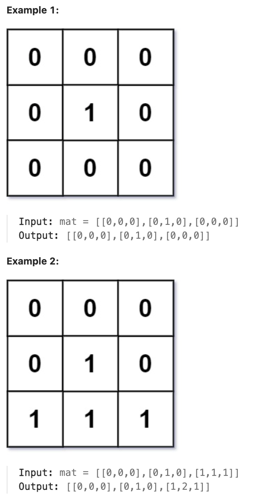

# 542.01 Matrix

## LeetCode 题目链接

[542.01 矩阵](https://leetcode.cn/problems/01-matrix/)

## 题目大意

给定一个由 `0` 和 `1` 组成的矩阵 `mat`，请输出一个大小相同的矩阵，其中每一个格子是 `mat` 中对应位置元素到最近的 `0` 的距离

两个相邻元素间的距离为 `1` 



限制：
- m == mat.length
- n == mat[i].length
- 1 <= m, n <= 10^4
- 1 <= m * n <= 10^4
- mat[i][j] is either 0 or 1.
- There is at least one 0 in mat.

## 解题

这题描述的场景容易让人想到`111.二叉树的最小深度`这类在二叉树中计算`最小距离`的题目，以及像`1091.二进制矩阵中的最短路径`这种计算二维矩阵从左上角到右下角`最短距离`的题目，所以这道题目本质上是一个`最短路径搜索`问题

> 求每个 `0` 到 `1` 的最短曼哈顿距离（和求每个 `1` 到 `0` 是等价的）

将所有值为 `0` 的元素位置保存到队列中，然后对所有值为 `0` 的元素开始进行广度优先搜索，每搜一步距离加 `1`，当每次搜索到 `1` 时，就可以得到 `0` 到这个 `1` 的最短距离，即当前离这个 `1` 最近的 `0` 的距离

这样对于所有节点来说，总共需要进行一次广度优先搜索即可，时间复杂度为 `O(m * n)`

将所有值为 `0` 的元素视为起点，然后同时向外扩展，计算每个 `1` 到最近的 `0` 的距离

使用 `BFS` 从这些起点（`0` 元素）出发，层层遍历矩阵中的 `1`，记录每个 `1` 到 `0` 的最短距离

由于 `BFS` 的特性（先遍历离起点近的节点），可确保第一次访问到 `1` 时距离是`最短`的

```js
var updateMatrix = function(mat) {
    let m = mat.length, n = mat[0].length;
    let res = Array.from({length: m}, () => Array(n).fill(-1));
    let que = [];
    // 初始化队列，把那些值为 0 的坐标放到队列里
    for (let i = 0; i < m; i++) {
        for (let j = 0; j < n; j++) {
            if (mat[i][j] == 0) {
                que.push([i, j]);
                res[i][j] = 0;
            }
        }
    }

    // 执行 BFS 算法框架，从值为 0 的坐标开始向四周扩散
    let dirs = [[0, 1], [0, -1], [1, 0], [-1, 0]];

    while (que.length) {
        let [x, y] = que.shift();
        // 向四周扩散
        for (let i = 0; i < 4; i++) {
            let nextX = x + dirs[i][0];
            let nextY = y + dirs[i][1];
            // 确保相邻的这个坐标没有越界且之前未被计算过
            if (nextX >= 0 && nextX < m && nextY >= 0 && nextY < n && res[nextX][nextY] == -1) {
                que.push([nextX, nextY]);
                // 从 mat[x][y] 走到 mat[nextX][nextY] 需要一步
                res[nextX][nextY] = res[x][y] + 1;
            }
        }
    }
    return res;
};
```
```python
class Solution:
    def updateMatrix(self, mat: List[List[int]]) -> List[List[int]]:
        m, n = len(mat), len(mat[0])
        # 记录答案的结果数组
        # 初始化全部填充特殊值 -1，代表未计算（未计算过最短距离）
        # 待会可以用来判断坐标是否已经计算过，避免重复遍历
        res = [[-1 for _ in range(n)] for _ in range(m)]
        que = collections.deque()
        # 初始化队列，用于存储所有 0 元素的位置作为 BFS 的起始点
        for i in range(m):
            for j in range(n):
                if mat[i][j] == 0:
                    que.append([i, j])
                    # 将 res 矩阵中对应位置的值设置为 0
                    # 所有 0 元素是最先访问的起始点，且它们到自己的距离是 0
                    res[i][j] = 0
        
        # 执行 BFS 算法框架，从值为 0 的坐标开始向四周扩散
        dirs = [(0, 1), (0, -1), (1, 0), (-1, 0)]
        while que:
            x, y = que.popleft()
            for dx, dy in dirs:
                nextX, nextY = x + dx, y + dy
                if 0 <= nextX < m and 0 <= nextY < n and res[nextX][nextY] == -1:
                    # 将邻居节点的坐标 nextX, nextY 加入 que 队列中，表示后续要继续处理这个位置
                    que.append([nextX, nextY])
                    # 从 mat[x][y] 走到 mat[nextX][nextY] 需要一步
                    # 更新 res 矩阵中 nextX, nextY 位置的距离值，nextX, nextY 是从 x, y 扩展过来的，它们之间的距离增加了 1
                    res[nextX][nextY] = res[x][y] + 1
        
        return res
```

- 时间复杂度：`O(m * n)`，`m` 是矩阵的行数，`n` 是矩阵的列数，每个元素最多会被访问两次（一次是初始访问，一次是通过 `BFS` 扩展访问）
- 空间复杂度：`O(m * n)`，队列中最多会包含 `m * n` 个元素