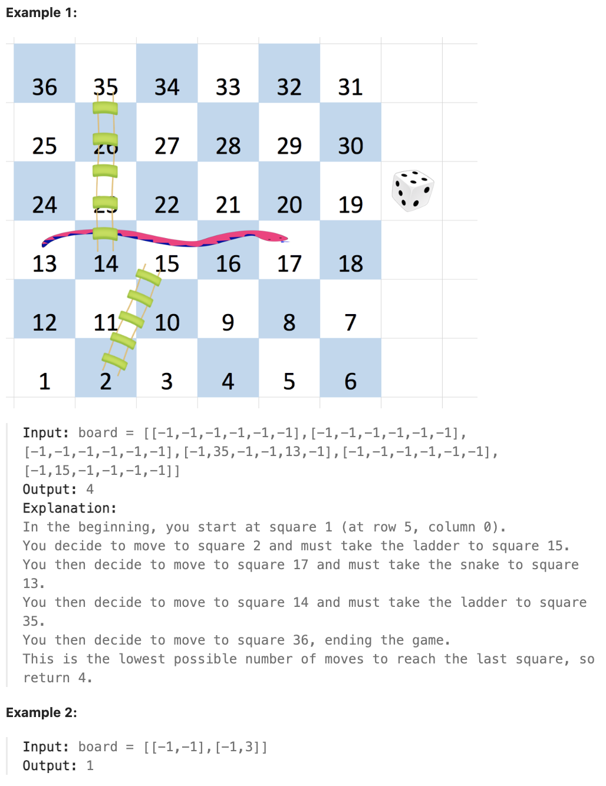

# 909.Snakes and Ladders

## LeetCode 题目链接

[909.蛇梯棋](https://leetcode.cn/problems/snakes-and-ladders/)

## 题目大意

给一个大小为 `n x n` 的整数矩阵 `board`，方格按从 `1` 到 `n^2` 编号，编号遵循转行交替方式，从左下角开始（即，从 `board[n - 1][0]` 开始）的每一行改变方向

一开始位于棋盘上的方格  `1`。每一回合，玩家需从当前方格 `curr` 开始出发，按下述要求前进：
- 选定目标方格 `next`，目标方格的编号在范围 `[curr + 1, min(curr + 6, n^2)]` 
  - 该选择模拟了掷六面体骰子的情景，无论棋盘大小如何，玩家最多只能有 `6` 个目的地
- 传送玩家：如果目标方格 `next` 处存在蛇或梯子，玩家会传送到蛇或梯子的目的地。否则，玩家传送到目标方格 `next` 
-  当玩家到达编号 `n^2` 的方格时，游戏结束
  
如果 `board[r][c] != -1`，位于 `r` 行 `c` 列的棋盘格中可能存在 “蛇” 或 “梯子”，那个蛇或梯子的目的地将会是 `board[r][c]`，编号为 `1` 和 `n^2` 的方格不是任何蛇或梯子的起点

注意，玩家在每次掷骰的前进过程中最多只能爬过蛇或梯子一次：就算目的地是另一条蛇或梯子的起点，玩家也不能继续移动

举个例子，假设棋盘是 `[[-1,4],[-1,3]]`，第一次移动，玩家的目标方格是 `2`。那么这个玩家将会顺着梯子到达方格 `3`，但不能顺着方格 `3` 上的梯子前往方格 `4`（简单来说，类似飞行棋，玩家掷出骰子点数后移动对应格数，遇到单向的路径（即梯子或蛇）可以直接跳到路径的终点，但如果多个路径首尾相连，也不能连续跳多个路径）

返回达到编号为 `n^2` 的方格所需的最少掷骰次数，如果不可能，则返回 `-1`



限制:
- n == board.length == board[i].length
- 2 <= n <= 20
- board[i][j] is either -1 or in the range [1, n^2].
- The squares labeled 1 and n2 are not the starting points of any snake or ladder.

## 解题

蛇梯棋的核心是`最短路径问题`，每次可以掷出 `1-6` 的点数移动棋子。因此，使用 `BFS` 是最优解，能够高效计算到达 `n^2` 需要的最少步数

关键步骤：
- 构造一维数组映射：
  - `board` 是二维数组，但蛇梯棋的编号是交替方向排列的
  - 需将二维索引 `(r, c)` 转换成 `1D` 数组的索引 `pos`
  - 注意: `board` 从左下角（`board[n-1][0]`）开始
  
- 使用 `BFS` 遍历：
  - 从 `1` 号格子开始，尝试掷 `1~6` 点，访问 `next` 位置
  - 如果 `board[next] == -1`，直接跳过去
  - 如果 `board[next] != -1`，说明是蛇或梯子，必须跳到指定的位置
  - 记录 `visited` 避免重复访问，防止死循环

```js
var snakesAndLadders = function(board) {
    const n = board.length;

    // 转换 (r, c) 到 1D 位置的索引
    const getPosition = (num) => {
        let row = Math.floor((num - 1) / n);
        let col = (num - 1) % n;
        row = n - 1 - row;  // 计算从底部开始的行号
        if ((n - 1 - row) % 2 === 1) col = n - 1 - col;  // 处理蛇梯棋交替方向
        return [row, col];
    };

    let que = [[1, 0]];  // (当前位置, 走的步数)
    let visited = new Set();

    while (que.length > 0) {
        let [pos, steps] = que.shift();
        if (pos === n * n) return steps;  // 到达终点

        // 尝试掷出 1~6
        for (let dice = 1; dice <= 6; dice++) {
            let nextPos = pos + dice;
            if (nextPos > n * n) continue;

            let [r, c] = getPosition(nextPos);
            if (board[r][c] !== -1) nextPos = board[r][c];  // 处理蛇或梯子

            if (!visited.has(nextPos)) {
                visited.add(nextPos);
                que.push([nextPos, steps + 1]);
            }
        }
    }

    return -1;  // 走不到终点
};
```
```python
class Solution:
    def snakesAndLadders(self, board: List[List[int]]) -> int:
        n = len(board)

        # 转换 (r, c) 到 1D 位置的索引
        def get_position(index):
            # row, col = divmod(num - 1, n)
            # row = n - 1 - row  # 计算从底部开始的 row 位置
            # col = col if (n - 1 - row) % 2 == 0 else (n - 1 - col)  # 处理蛇梯棋交替方向
            # return row, col

            # 另一种写法
            row, col = (index - 1) // n, (index - 1) % n
            if row % 2 == 1:
                col = n - 1 - col
            return n - 1 - row, col

        que = deque([(1, 0)])  # (当前位置, 走的步数)
        visited = set()

        while que:
            pos, steps = que.popleft()
            if pos == n * n:
                return steps  # 到达终点

            # 尝试掷出 1~6
            for dice in range(1, 7):
                next_pos = pos + dice
                if next_pos > n * n:
                    continue
                
                r, c = get_position(next_pos)
                if board[r][c] != -1:  # 处理蛇或梯子
                    next_pos = board[r][c]

                if next_pos not in visited:
                    visited.add(next_pos)
                    que.append((next_pos, steps + 1))

        return -1  # 走不到终点
```

- 时间复杂度：`O(n^2)`，`n` 为棋盘 `board` 的边长
  - 最多访问 `n^2` 个格子（所有棋盘格子）
  - `BFS` 遍历所有可达格子，最多尝试 `6` 次骰子，但 `BFS` 不会重复访问已遍历节点
  - 最坏情况：`BFS` 遍历所有 `n^2` 个格子，因此时间复杂度为 `O(n^2)`
- 空间复杂度：`O(n^2)`
  - visited 记录访问的格子 `O(n^2)`
  - `que` 最坏情况下可能存 `O(n^2)` 个节点