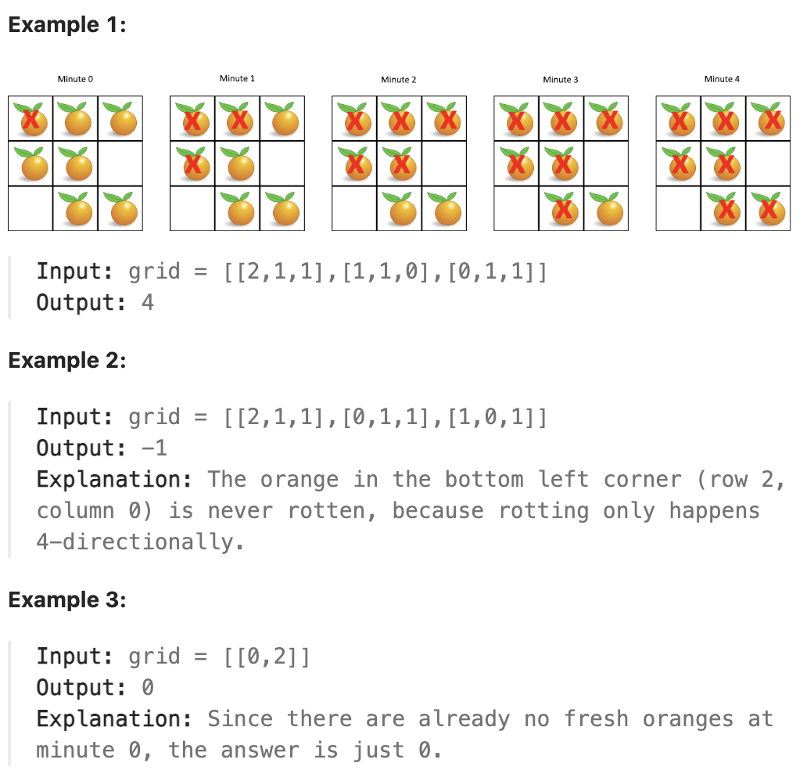

# 994.Rotting Oranges

## LeetCode 题目链接

[994.腐烂的橘子](https://leetcode.cn/problems/k-closest-points-to-origin/)

## 题目大意

在给定的 `m x n` 网格 `grid` 中，每个单元格可以有以下三个值之一：
- 值 `0` 代表空单元格
- 值 `1` 代表新鲜橘子
- 值 `2` 代表腐烂的橘子
  
每分钟，腐烂的橘子周围 `4` 个方向上相邻的新鲜橘子都会腐烂

返回直到单元格中没有新鲜橘子为止所必须经过的最小分钟，如果不可能则返回 `-1` 



限制:
- m == grid.length
- n == grid[i].length
- 1 <= m, n <= 10
- grid[i][j] is 0, 1, or 2

## 解题

这道题目可以使用广度优先搜索 `BFS`来解决，`BFS` 非常适合处理这种从多个源点（腐烂橘子）开始扩展到周围（新鲜橘子）的传播问题

具体步骤：
- 初始化队列：将所有腐烂的橘子的坐标加入队列（因为它们是初始的传播源），同时统计新鲜橘子的数量 `freshCount`
- `BFS` 遍历：从队列中取出当前所有腐烂的橘子，并尝试向四个方向扩展腐烂的范围：
  - 若邻近位置是新鲜橘子，则将该橘子腐烂，同时将其坐标加入队列，`freshCount` 减少 `1`
- 记录时间：每次遍历完成队列中的所有腐烂橘子时，时间 `minutes` 增加 `1`
- 结束条件：
  - 若 `freshCount` 为 `0`，则说明所有新鲜橘子都变成了腐烂橘子，返回 `minutes`
  - 若 `BFS` 结束时，`freshCount` 仍然大于 `0`，则说明还有无法被腐烂的橘子，返回 `-1`

```js
var orangesRotting = function(grid) {
    if (!grid || grid.length === 0) return -1;

    const m = grid.length, n = grid[0].length;
    const que = [];
    let freshCount = 0;

    // 将所有腐烂的橘子加入队列，并统计新鲜橘子的数量
    for (let r = 0; r < m; r++) {
        for (let c = 0; c < n; c++) {
            if (grid[r][c] === 2) {
                que.push([r, c]);
            } else if (grid[r][c] === 1) {
                freshCount += 1;
            }
        }
    }

    // 如果没有新鲜橘子，直接返回 0
    if (freshCount === 0) return 0;

    const directions = [[1, 0], [-1, 0], [0, 1], [0, -1]];
    let minutesPassed = 0;

    // 开始 BFS
    while (que.length > 0 && freshCount > 0) {
        minutesPassed += 1;
        const size = que.length;
        for (let i = 0; i < size; i++) {
            const [x, y] = que.shift();
            for (const [dx, dy] of directions) {
                const nx = x + dx, ny = y + dy;
                if (nx >= 0 && nx < m && ny >= 0 && ny < n && grid[nx][ny] === 1) {
                    // 将新鲜橘子变成腐烂
                    grid[nx][ny] = 2;
                    freshCount -= 1;
                    que.push([nx, ny]);
                }
            }
        }
    }

    // 检查是否还有新鲜橘子未腐烂
    return freshCount === 0 ? minutesPassed : -1;

};
```
```python
class Solution:
    def orangesRotting(self, grid: List[List[int]]) -> int:
        if not grid:
            return -1

        m, n = len(grid), len(grid[0])
        que = collections.deque()
        freshCount = 0

        # 将所有腐烂的橘子加入队列，并统计新鲜橘子的数量
        for r in range(m):
            for c in range(n):
                if grid[r][c] == 2:
                    que.append((r, c))
                elif grid[r][c] == 1:
                    freshCount += 1
        
        # 如果没有新鲜橘子，直接返回 0
        if freshCount == 0:
            return 0

        # 四个方向
        directions = [(1, 0), (-1, 0), (0, 1), (0, -1)]
        minutes = 0

        # 开始 BFS
        while que and freshCount > 0:
            # 每分钟扩展一次
            minutes += 1
            # 当前队列中的橘子是这一分钟会腐烂的橘子
            for _ in range(len(que)):
                x, y = que.popleft()
                for dx, dy in directions:
                    nx, ny = x + dx, y + dy
                    # 检查邻近橘子是否新鲜
                    if 0 <= nx < m and 0 <= ny < n and grid[nx][ny] == 1:
                        # 将新鲜橘子变成腐烂
                        grid[nx][ny] = 2
                        freshCount -= 1
                        que.append((nx, ny))
        
        # 检查是否还有新鲜橘子未腐烂
        return minutes if freshCount == 0 else -1
```

- 时间复杂度：`O(m * n)`，每个单元格最多被访问一次，因此时间复杂度为 `O(m * n)`，其中 `m` 和 `n` 分别是网格的行数和列数
- 空间复杂度：`O(m * n)`，队列中的最坏情况是所有橘子都变成腐烂橘子，因此空间复杂度也是 `O(m * n)`


