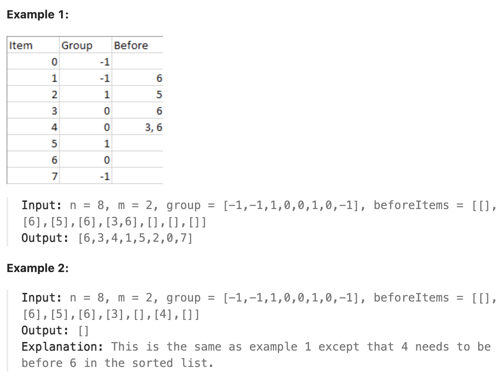

# 1203.Sort Items by Groups Respecting Dependencies

## LeetCode 题目链接

[1203.项目管理](https://leetcode.cn/problems/sort-items-by-groups-respecting-dependencies/)

## 题目大意

有 `n` 个项目，每个项目或不属于任何小组，或属于 `m` 个小组之一。`group[i]` 表示第 `i` 个项目所属的小组，如果第 `i` 个项目不属于任何小组，则 `group[i]` 等于 `-1`。项目和小组都是从零开始编号的，可能存在小组不负责任何项目，即没有任何项目属于这个小组

请帮忙按要求安排这些项目的进度，并返回排序后的项目列表：
- 同一小组的项目，排序后在列表中彼此相邻。
- 项目之间存在一定的依赖关系，用一个列表 `beforeItems` 来表示，其中 `beforeItems[i]` 表示在进行第 `i` 个项目前（位于第 `i` 个项目左侧）应该完成的所有项目

如果存在多个解决方案，只需返回其中任意一个即可；如果没有合适的解决方案，就请返回一个空列表



限制:
- 1 <= m <= n <= 3 * 10^4
- group.length == beforeItems.length == n
- -1 <= group[i] <= m - 1
- 0 <= beforeItems[i].length <= n - 1
- 0 <= beforeItems[i][j] <= n - 1
- i != beforeItems[i][j]
- beforeItems[i] does not contain duplicates elements.

## 解题

这道题是一个典型的`拓扑排序`问题，要求按照依赖关系对项目进行排序，并考虑组的优先级

思路：
- 构建项目和组的图：将所有项目按照依赖关系构建成一个有向图，每个项目指向依赖于它的项目。对于属于同一组的项目，也需对其进行排序
- 拓扑排序：
  - 对于每个组的项目，首先对组内部进行拓扑排序
  - 其次，对于所有的组，按照依赖关系进行排序
- 实现细节：
  - 对于独立的项目（`group[i] == -1`），将它们放入新的组中进行管理
  - 使用拓扑排序来检查是否存在依赖循环，若存在则返回空列表

```js
var sortItems = function(n, m, group, beforeItems) {
    // 处理无组别的项目，分配到新的组
    for (let i = 0; i < n; i++) {
        if (group[i] === -1) group[i] = m++;
    }

    // 构建组和项目的邻接图
    const groupGraph = Array.from({ length: m }, () => new Set());
    const itemGraph = Array.from({ length: n }, () => new Set());

    // 构建组和项目的入度
    const groupInDegree = new Array(m).fill(0);
    const itemInDegree = new Array(n).fill(0);

    // 构建依赖关系
    for (let i = 0; i < n; i++) {
        for (const before of beforeItems[i]) {
            // 项目间依赖
            if (!itemGraph[before].has(i)) {
                itemGraph[before].add(i);
                itemInDegree[i]++;
            }

            // 不同组间的依赖
            if (group[before] !== group[i] && !groupGraph[group[before]].has(group[i])) {
                groupGraph[group[before]].add(group[i]);
                groupInDegree[group[i]]++;
            }
        }
    }

    // 拓扑排序函数
    const topologicalSort = (graph, inDegree, n) => {
        const visited = [], que = [];
        // 找出入度为0的节点
        for (let i = 0; i < n; i++) {
            if(inDegree[i] === 0) que.push(i);
        }

        while (que.length) {
            const cur = que.shift();
            visited.push(cur);
            
            // 遍历当前节点的所有邻接节点
            for (const neighbor of graph[cur]) {
                inDegree[neighbor]--;
                if (inDegree[neighbor] === 0) {
                    que.push(neighbor);
                }
            }
        }

        return visited.length === n ? visited : [];
    };

    // 分别对组和项目进行拓扑排序
    const groupOrder = topologicalSort(groupGraph, [...groupInDegree], m);
    if (groupOrder.length === 0) return [];
    
    const itemOrder = topologicalSort(itemGraph, [...itemInDegree], n);
    if (itemOrder.length === 0) return [];
    
    // 按组重新组织项目
    const groupItems = Array.from({ length: m }, () => []);
    for (const item of itemOrder) {
        groupItems[group[item]].push(item);
    }

    // 合并结果
    const res = [];
    for (const groupIdx of groupOrder) {
        res.push(...groupItems[groupIdx]);
    }
    
    return res;
};

```
```python
class Solution:
    def sortItems(self, n: int, m: int, group: List[int], beforeItems: List[List[int]]) -> List[int]:
        # 遍历 group 列表，将所有没有分配组的项目即 group[i] == -1 分配一个新的组 ID，并将 m 自增以标记新的组数量
        # 这样做可以确保所有项目都有组，从而便于后续的组间依赖管理
        for i in range(n):
            if group[i] == -1:
                group[i] = m
                m += 1
        
        # 构建组和项目的邻接图
        # 用来存储组之间的依赖关系，groupGraph[i] 表示组 i 的后继组
        groupGraph = [set() for _ in range(m)]
        # 用来存储项目之间的依赖关系，itemGraph[i] 表示项目 i 的后继项目
        itemGraph = [set() for _ in range(n)]

        # 每个组的入度，即依赖于其他组的数量
        groupInDegree = [0] * m
        # itemInDegree：每个项目的入度，即依赖于其他项目的数量
        itemInDegree = [0] * n

        # 构建项目间的依赖关系
        for i in range(n):
            for before in beforeItems[i]:
                # 如果项目 i 依赖于 beforeItems[i] 中的项目 before，则在 itemGraph 中为 before 添加 i 为邻接节点，并增加 i 的入度
                if i not in itemGraph[before]:
                    itemGraph[before].add(i)
                    itemInDegree[i] += 1
                
                # 当两个项目之间存在依赖关系，且它们属于不同的组时，为这两个组之间添加依赖关系
                # 如果 before 和 i 属于不同组，则在 groupGraph 中添加组间依赖关系
                # 即 group[before] 指向 group[i]，并增加 group[i] 的入度
                if group[before] != group[i] and group[i] not in groupGraph[group[before]]:
                    groupGraph[group[before]].add(group[i])
                    groupInDegree[group[i]] += 1
        
        # 分别对组和项目进行拓扑排序
        # 在依赖关系中，如果项目或组之间存在循环依赖，就无法排序。拓扑排序可以检测出是否存在这种循环（即有向图中是否存在环），并返回排序结果
        # 如果拓扑排序结果为空，则表示存在环依赖，无法完成排序，直接返回空列表
        groupOrder = self.topologicalSort(groupGraph, groupInDegree[:], m)
        if not groupOrder:
            return []
        
        itemOrder = self.topologicalSort(itemGraph, itemInDegree[:], n)
        if not itemOrder:
            return []
        
        # 根据 itemOrder 将项目按照组重新组织
        # groupItems[group[item]] 中存储该组的项目
        # 这一部分代码的目的是将项目按组重新组织，以便在最终排序结果中按组的顺序排列项目
        # 用于存放每个组的项目
        groupItems = [[] for _ in range(m)]
        for item in itemOrder:
            # 因为 itemOrder 已经是拓扑排序的结果，所以项目内部的依赖顺序已经得到满足
            # 将项目 item 添加到其对应的组（group[item]）中
            groupItems[group[item]].append(item)
        
        # 合并结果
        # 根据 groupOrder 中的组顺序，按组将项目加入结果列表 res
        res = []
        for groupIdx in groupOrder:
            res.extend(groupItems[groupIdx])
        
        return res
            
    # 拓扑排序函数
    def topologicalSort(self, graph, inDegree, n):
        visited = []
        # 先将所有入度为 0 的节点加入队列
        que = deque([i for i in range(n) if inDegree[i] == 0])

        while que:
            cur = que.popleft()
            visited.append(cur)

            # 遍历当前节点的所有邻接节点
            # 每次取出队列的节点 cur，将其加入排序结果 visited，并将其邻接节点的入度减 1。若邻接节点入度为 0，则加入队列
            for neighbor in graph[cur]:
                inDegree[neighbor] -= 1
                if inDegree[neighbor] == 0:
                    que.append(neighbor)
        
        # 最后，如果排序结果的长度等于节点数量，则返回排序顺序；否则说明存在环，返回空列表
        return visited if len(visited) == n else []
```

- 时间复杂度：`O(v + e)`，`v` 是顶点数（`n`和`m`的总和），`e` 是边数（依赖关系总数）
- 空间复杂度：`O(v + e)`，用于存储图结构和辅助数组