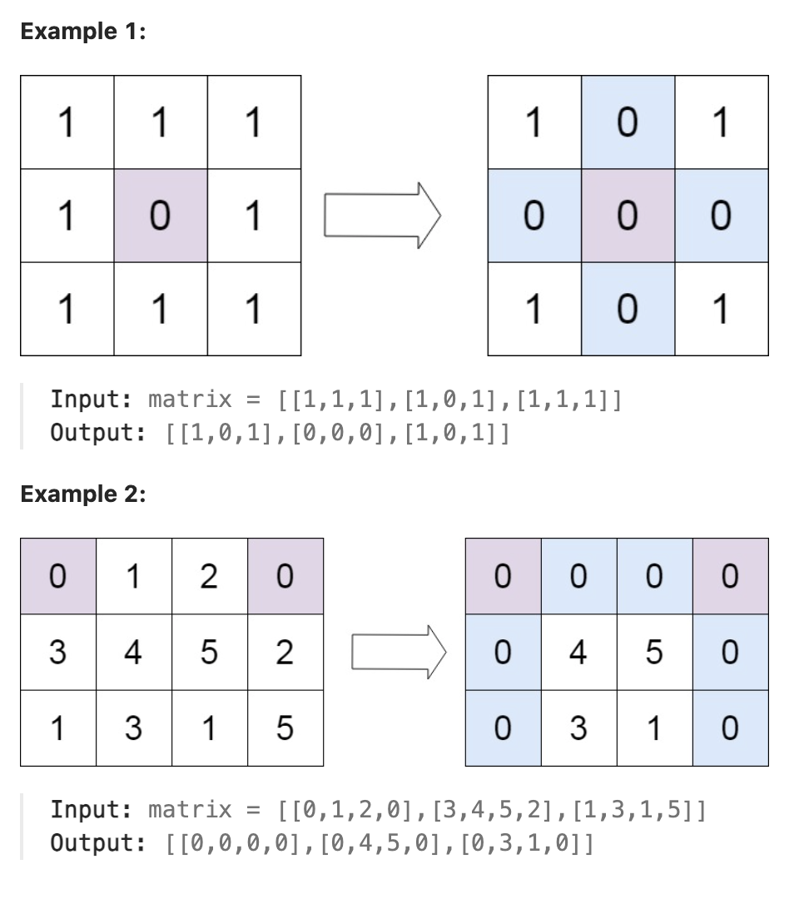

# 73.Set Matrix Zeroes

## LeetCode 链接

[73.矩阵置零](https://leetcode.cn/problems/set-matrix-zeroes/)

## 题目大意

给定一个 `m x n` 的矩阵，如果一个元素为 `0`，则将其所在行和列的所有元素都设为 `0`

请使用`原地`算法



限制：
- m == matrix.length
- n == matrix[0].length
- 1 <= m, n <= 200
- -2^31 <= matrix[i][j] <= 2^31 - 1

## 解题

### 思路 1

直观上可以使用两个数组来标记行和列出现 `0` 的情况，但这样空间复杂度就是 `O(m+n)`了，不符合题意

```python
class Solution:
    def setZeroes(self, matrix: List[List[int]]) -> None:
        m, n = len(matrix), len(matrix[0])
        zero_rows, zero_cols = set(), set()

        # Find zero positions
        for i in range(m):
            for j in range(n):
                if matrix[i][j] == 0:
                    zero_rows.add(i)
                    zero_cols.add(j)

        # Set zeros
        for i in range(m):
            for j in range(n):
                if i in zero_rows or j in zero_cols:
                    matrix[i][j] = 0

        return matrix
```

### 思路 2

考虑使用数组原本的元素进行记录出现 `0` 的情况
- 设定两个变量来标记第一行、第一列是否出现了 `0`
- 接下来使用数组第一行、第一列来标记 `0` 的情况
- 对数组除第一行、第一列之外的每个元素进行遍历，若某个元素出现 `0`，则使用数组的第一行、第一列对应位置来存储 `0` 的标记
- 再对数组除第一行、第一列之外的每个元素进行遍历，通过对第一行、第一列的标记 `0` 情况，进行置为 `0` 的操作
- 最后再根据 `2` 个变量的的标记情况，对第一行、第一列进行置为 `0` 的操作

```js
var setZeroes = function(matrix) {
    let m = matrix.length, n = matrix[0].length
    let firstRowZero = false;
    let firstColZero = false;

    // Check if the first row and column need to be zeroed
    for (let i = 0; i < m; i++) {
        if (matrix[i][0] === 0) firstColZero = true;
    }

    for (let j = 0; j < n; j++) {
        if (matrix[0][j] === 0) firstRowZero = true;
    }

    // Use the first row and column as markers
    for (let i = 1; i < m; i++) {
        for (let j = 1; j < n; j++) {
            if (matrix[i][j] === 0) {
                matrix[i][0] = 0;
                matrix[0][j] = 0;
            }
        }
    }

    // Set matrix cells to zero based on markers
    for (let i = 1; i < m; i++) {
        for (let j = 1; j < n; j++) {
            if (matrix[i][0] === 0 || matrix[0][j] === 0) {
                matrix[i][j] = 0;
            }
        }
    }

    // Zero out the first row if necessary
    if (firstRowZero) {
        for (let j = 0; j < n; j++) {
            matrix[0][j] = 0;
        }
    }

    // Zero out the first column if necessary
    if (firstColZero) {
        for (let i = 0; i < m; i++) {
            matrix[i][0] = 0;
        }
    }
};
```
```python
class Solution:
    def setZeroes(self, matrix: List[List[int]]) -> None:
        m, n = len(matrix), len(matrix[0])
        firstRowZero, firstColZero = False, False

        # 此循环遍历第一列（即matrix[i][0]从i到0）m-1
        # 如果第一列中的任何元素为0，则标志firstColZero设置为True
        # 这很重要，因为需要在算法结束时单独处理第一列
        for i in range(m):
            if matrix[i][0] == 0:
                firstColZero = True
        
        # 类似地，此循环遍历第一行（即matrix[0][i]从i到0）n-1
        # 如果第一行中的任何元素为0，则标志firstRowZero设置为True
        for i in range(n):
            if matrix[0][i] == 0:
                firstRowZero = True

        # 上面两个遍历的另个写法：
        # firstColZero = any(matrix[i][0] == 0 for i in range(m))
        # firstRowZero = any(matrix[0][j] == 0 for j in range(n))

        # 此嵌套循环遍历矩阵，但不包括第一行和第一列
        # 对于每个元素matrix[i][j]，如果为 0，则通过将 matrix[i][0] 和 matrix[0][j] 设置为 0 来标记整行和整列以进行归零0
        # 这实际上使用第一行和第一列作为“标记”，以指示哪些行和列应设置为零
        for i in range(1, len(matrix)):
            for j in range(1, len(matrix[0])):
                if matrix[i][j] == 0:
                    matrix[i][0] = 0
                    matrix[0][j] = 0
        
        # 此循环再次遍历矩阵，但不包括第一行和第一列
        # 如果行或列标有0，即如果matrix[i][0] == 0或matrix[0][j] == 0）
        # 则此处的元素matrix[i][j]设置为0
        # 此步骤使用上一步中的标记来实际修改矩阵
        for i in range(1, m):
            for j in range(1, n):
                if matrix[i][0] == 0 or matrix[0][j] == 0:
                    matrix[i][j]  = 0
        
        # 如果firstRowZero标志为 true，即如果第一行中最初True有一个，则此循环将第一行中的所有元素设置为 0
        if firstRowZero:
            for i in range(n):
                matrix[0][i] = 0
        
        # 如果firstColZero标志为 true，即如果第一列中最初 True 有一个），则此循环将第一列中的所有元素设置为 0
        if firstColZero:
            for i in range(m):
                matrix[i][0] = 0
```

- 时间复杂度：`O(m * n)`, 因为更新 `matrix` 2 次，一次设置标记， 一次更新 `matrix`
- 空间复杂度：`O(1)`, 没有使用额外的存储空间