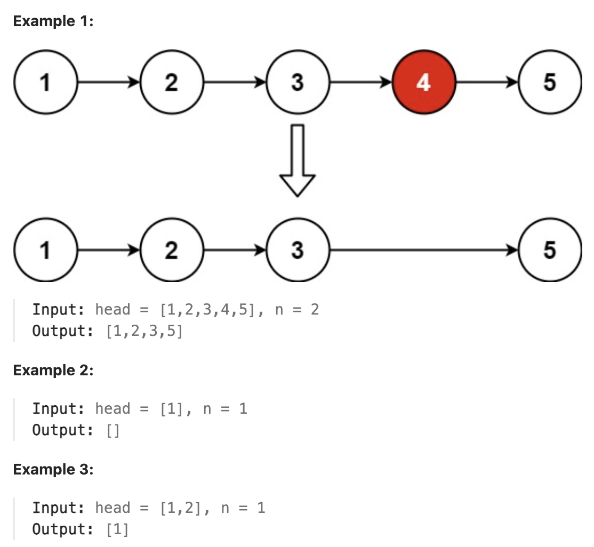

# 19.Remove Nth Node From End of List

## LeetCode 题目链接

[19.删除链表的倒数第 N 个结点](https://leetcode.cn/problems/remove-nth-node-from-end-of-list/)

## 题目大意

给一个链表，删除链表的倒数第 `n` 个结点，且返回链表的头结点



限制:
- The number of nodes in the list is sz.
- 1 <= sz <= 30
- 0 <= Node.val <= 100
- 1 <= n <= sz

## 解题

### 思路 1: 递归

它使用了递归的方式从链表的末尾开始回溯，并在回溯的过程中删除目标节点

创建一个虚拟节点 `dummy`，并将它指向链表的头节点 `head`。这样做的好处是可以避免删除头节点时特殊处理的麻烦，因为虚拟头节点确保了即使要删除头节点，也能通过 `dummy` 正常处理

```js
var removeNthFromEnd = function(head, n) {
    let dummy = new ListNode(-1);
    dummy.next = head;
    let cur = 0;

    const recur = function(node) {
        if (!node) return;
        recur(node.next);
        cur++;
        if (cur == n + 1) node.next = node.next.next;
    };

    recur(dummy);
    return dummy.next;
};
```
```python
class Solution:
    def removeNthFromEnd(self, head: Optional[ListNode], n: int) -> Optional[ListNode]:
        dummy = ListNode(-1)
        dummy.next = head
        # cur 是一个列表：这是一个长度为 1 的列表，用于在递归过程中跟踪当前遍历的节点的位置
        # 由于 Python 中嵌套函数中不能直接修改外部函数中的局部变量，使用列表来间接实现计数器的可变性
        # cur[0] 用于记录递归中已经遍历了多少个节点
        cur = [0]

        # 递归地遍历链表直到链表末尾，然后在回溯的过程中根据计数器的位置删除倒数第 n 个节点
        def recur(node):
            # 当 node 为 None（即到达链表的末尾）时，终止递归
            if not node:
                return
            
            # 递归地遍历链表的下一个节点 node.next，直到到达链表的末尾
            recur(node.next)
            # 当递归回溯时，每返回一个节点，计数器 cur[0] 增加 1
            # 这样，回溯到每个节点时，可通过 cur[0] 知道当前节点是从链表尾部倒数第几个节点
            cur[0] += 1
            # 当回溯到第 n+1 个节点时（即从倒数第 n 个节点的前一个节点），将它的 next 指针跳过目标节点，指向目标节点的下一个节点，从而完成删除操作
            if cur[0] == n + 1:
                node.next = node.next.next
                
        recur(dummy)
        return dummy.next
```

- 时间复杂度：`O(n)`，递归遍历了链表的每个节点一次，其中 `n` 是链表的节点数
- 空间复杂度：`O(n)`，由于使用递归，递归的栈深度等于链表的节点数

### 思路 2: 双指针

双指针的经典应用，若要删除倒数第 `n` 个节点，让 `fast` 移动 `n` 步，然后让 `fast` 和 `slow` 同时移动，直到 `fast` 指向链表末尾，删掉 `slow` 所指向的节点即可

- 定义 `fast` 和 `slow` 指针，初始值为 `dummy`  
- `fast` 首先走 `n + 1` 步，因为只有这样同时移动时 `slow` 才能指向删除节点的上一个节点（方便做删除操作）  
- `fast` 和 `slow` 同时移动，直到 `fast` 指向末尾  
- 删除 `slow` 指向的下一个节点

```js
var removeNthFromEnd = function(head, n) {
    let dummy = new ListNode(-1);
    dummy.next = head;
    let slow = fast = dummy;
    for (let i = 0; i < n + 1; i++) {
        fast = fast.next;
    }
    while (fast != null) {
        slow = slow.next;
        fast = fast.next;
    }
    slow.next = slow.next.next;
    return dummy.next;
};
```
```python
class Solution:
    def removeNthFromEnd(self, head: Optional[ListNode], n: int) -> Optional[ListNode]:
        dummy = ListNode(-1)
        dummy.next = head
        slow, fast = dummy, dummy
        for i in range(n+1):
            fast = fast.next
        
        while fast != None:
            slow = slow.next
            fast = fast.next
        
        slow.next = slow.next.next
        return dummy.next
```

- 时间复杂度：`O(n)`
- 空间复杂度：`O(1)`