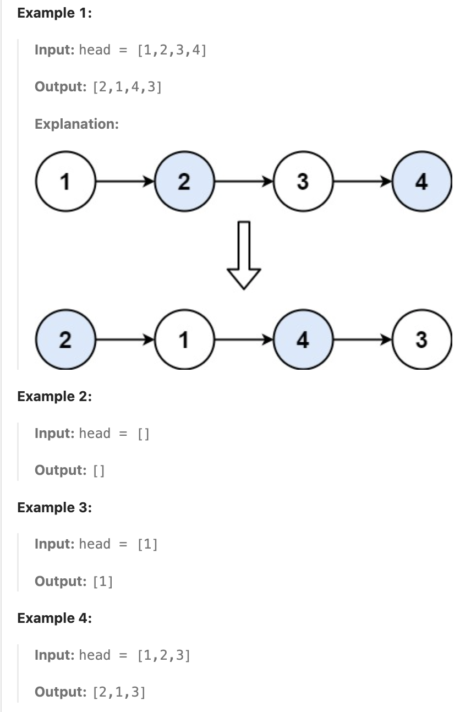

# 24.Swap Nodes in Pairs

## LeetCode 题目链接

[24.两两交换链表中的节点](https://leetcode.cn/problems/swap-nodes-in-pairs/)

## 题目大意

给一个链表，两两交换其中相邻的节点，并返回交换后链表的头节点

必须在不修改节点内部的值的情况下完成本题（即，只能进行节点交换）



限制:
- The number of nodes in the list is in the range [0, 100].
- 0 <= Node.val <= 100

## 解题

### 思路 1: 迭代

```js
var swapPairs = function(head) {
    let dummy = new ListNode(-1);
    dummy.next = head;
    let cur = dummy;
    let temp, first, second;
    while (cur.next != null && cur.next.next != null) {
        temp = cur.next.next.next;
        first = cur.next;
        second = cur.next.next;
        cur.next = second;
        second.next = first;
        first.next = temp;
        cur = first;
    }
    return dummy.next;
};
```
```python
class Solution:
    def swapPairs(self, head: Optional[ListNode]) -> Optional[ListNode]:
        dummy = ListNode(-1)
        dummy.next = head
        cur = dummy
        while cur.next and cur.next.next:
            # temp = cur.next.next.next：在开始交换前，首先保存当前这对节点之后的第三个节点的引用（即 cur.next.next.next）
            # 这一步是为了在交换完成后，能够正确链接后面的链表部分
            temp = cur.next.next.next
            first = cur.next
            second = cur.next.next
            cur.next = second
            second.next = first
            # 将 first 的 next 指向之前保存的 temp，即原本第二个节点之后的链表部分
            first.next = temp
            # cur 每次会跳过两对交换的节点，然后继续处理下一个未交换的节点对
            cur = first
        
        return dummy.next
```

- 时间复杂度：`O(n)`
- 空间复杂度：`O(1)`

### 思路 2: 递归

```js
// 写法 1
var swapPairs = function(head) {
    if (head == null || head.next == null) return head;
    let temp = head.next;
    let newNode = swapPairs(temp.next);
    temp.next = head;
    head.next = newNode;
    return temp;
};

// 写法 2
var swapPairs = function(head) {
    if (head == null || head.next == null) return head;
    let first = head;
    let second = head.next;
    let third = head.next.next;

    second.next = first;
    first.next = swapPairs(third);
    return second;
};
```
```python
# 写法 1
class Solution:
    def swapPairs(self, head: Optional[ListNode]) -> Optional[ListNode]:
        # 如果链表是空的 (head == None)，或者链表只有一个节点 (head.next == None)，那就没有足够的节点进行交换
        # 这时直接返回当前的 head，不需再进行递归或交换
        if head == None or head.next == None:
            return head
        
        # 获取当前节点的下一个节点
        # 获取第二个节点，交换后将成为新的头
        temp = head.next
        # 进行递归
        # 从第三个节点开始递归调用链表的 swapPairs
        # newNode 是递归调用后的结果，即交换后剩余链表的新的头节点
        newNode = self.swapPairs(temp.next)
        temp.next = head
        # 第一个节点现在指向递归调用的结果
        head.next = newNode
        # 返回第二个节点，它是交换对的新头
        return temp

# 写法 2
class Solution:
    def swapPairs(self, head: Optional[ListNode]) -> Optional[ListNode]:
        if head == None or head.next == None:
            return head
        
        first, second = head, head.next
        third = head.next.next
        second.next = first
        # 将从第三个节点开始的链表处理完后，将返回的新链表头连接到当前的第一个节点的 next，即递归处理后的部分接到交换对的后面
        first.next = self.swapPairs(third)

        return second
```

- 时间复杂度：`O(n)`
  - 每次递归调用都会将问题规模缩小两个节点，从而得到大约 `n/2` 递归调用，其中 `n` 是列表中节点的总数
  - 每次递归调用都执行恒定时间操作（在两个节点之间交换指针）
- 空间复杂度：`O(n)`
  - 对于每对节点，都会将一个新框架添加到堆栈中，由于递归每次进行两个节点，因此递归调用堆栈的最大深度为 `2/n`