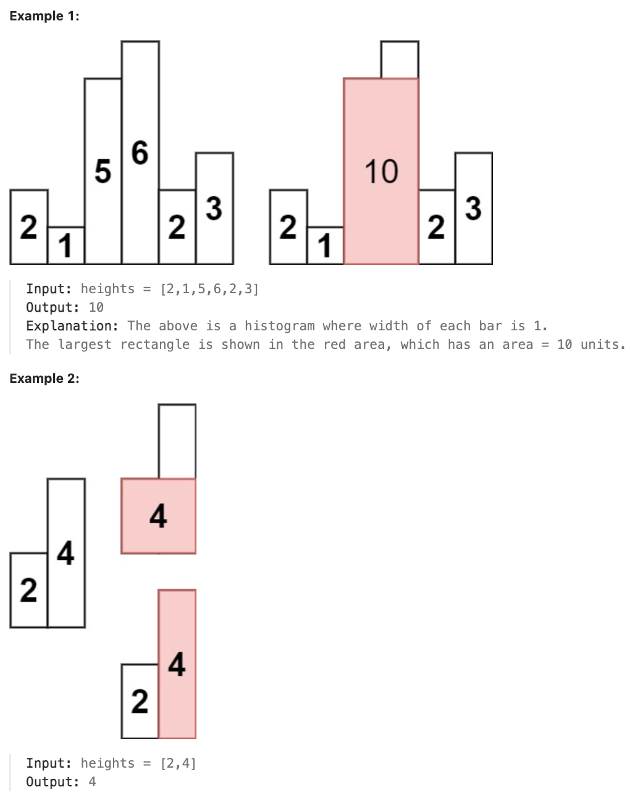

# 84.Largest Rectangle in Histogram

## LeetCode 题目链接

[84.柱状图中最大的矩形](https://leetcode.cn/problems/largest-rectangle-in-histogram/)

## 题目大意

给定 `n` 个非负整数，用来表示柱状图中各个柱子的高度，每个柱子彼此相邻且宽度为 `1`

求在该柱状图中，能够勾勒出来的矩形的最大面积



限制:
- 1 <= heights.length <= 10^5
- 0 <= heights[i] <= 10^4

## 解题

### 思路 1: 暴力解法

```python
class Solution:
    def largestRectangleArea(self, heights: List[int]) -> int:
        # 从左向右遍历：以每一根柱子为主心骨（当前轮最高的参照物），迭代直到找到左侧和右侧各第一个矮一级的柱子
        res = 0

        for i in range(len(heights)):
            left = i
            right = i

            # 向左侧遍历：寻找第一个矮一级的柱子
            for _ in range(left, -1, -1):
                if heights[left] < heights[i]:
                    break
                left -= 1
            
            # 向右侧遍历：寻找第一个矮一级的柱子
            for _ in range(right, len(heights)):
                if heights[right] < heights[i]:
                    break
                right += 1
        
            width = right - left - 1
            height = heights[i]
            res = max(res, width * height)
        
        return res
```

- 时间复杂度: `O(n^2)`，提交后超出时间限制了

### 思路 2: 动态规划

```js
var largestRectangleArea = function(heights) {
    const n = heights.length;
    const minLeftIndex = new Array(n);
    const maxRigthIndex = new Array(n);

    // 记录每个柱子 左边第一个小于该柱子的下标
    minLeftIndex[0] = -1; // 注意这里初始化，防止下面while死循环
    for (let i = 1; i < n; i++) {
        let t = i - 1;
        // 这里不是用 if，而是不断向左寻找的过程
        while (t >= 0 && heights[t] >= heights[i]) {
            t = minLeftIndex[t];
        }
        minLeftIndex[i] = t;
    }

    // 记录每个柱子 右边第一个小于该柱子的下标
    maxRigthIndex[n - 1] = n; // 注意这里初始化，防止下面while死循环
    for (let i = n - 2; i >= 0; i--){
        let t = i + 1;
        // 这里不是用if，而是不断向右寻找的过程
        while (t < n && heights[t] >= heights[i]) {
            t = maxRigthIndex[t];
        }
        maxRigthIndex[i] = t;
    }

    // 求和
    let res = 0;
    for (let i = 0; i < n; i++){
        let sum = heights[i] * (maxRigthIndex[i] - minLeftIndex[i] - 1);
        res = Math.max(res , sum);
    }
    return res;
};
```
```python
class Solution:
    def largestRectangleArea(self, heights: List[int]) -> int:
        size = len(heights)
        # 两个DP数列储存的均是下标index
        # 用于记录每个柱子向左第一个小于当前柱子高度的柱子下标。初始化为长度为 size 的全零数组
        min_left_index = [0] * size
        # 用于记录每个柱子向右第一个小于当前柱子高度的柱子下标。初始化为长度为 size 的全零数组
        min_right_index = [0] * size
        res = 0

        # 记录每个柱子的左侧第一个矮一级的柱子的下标
        # 初始化第一个柱子的左侧为 -1，因为没有更矮的柱子存在于最左侧
        min_left_index[0] = -1  # 初始化防止while死循环
        # 从第二根柱子开始遍历每个柱子 i
        for i in range(1, size):
            # 以当前柱子为主心骨，向左迭代寻找次级柱子
            t = i - 1
            # 如果 heights[t] 大于等于 heights[i]，继续向左迭代，直到找到一个比当前柱子矮的柱子
            while t >= 0 and heights[t] >= heights[i]:
                # 当左侧的柱子持续较高时，尝试这个高柱子自己的次级柱子
                # 使用 min_left_index[t] 来跳转到更左边的次级柱子，从而加速计算
                t = min_left_index[t]
            
            # 当找到比当前柱子矮的柱子时，记录其下标 t
            min_left_index[i] = t
        
        # 记录每个柱子的右侧第一个矮一级的柱子的下标
        # 初始化最后一根柱子的右侧为 size，表示右侧没有比它矮的柱子
        min_right_index[size - 1] = size  # 初始化防止while死循环
        # 从倒数第二根柱子开始向左遍历，直到最左边的柱子
        for i in range(size - 2, -1, -1):
            # 以当前柱子为主心骨，向右迭代寻找次级柱子
            # 从柱子 i 的右边柱子 i+1 开始向右寻找比当前柱子矮的柱子
            t = i + 1
            # 如果 heights[t] 大于等于 heights[i]，继续向右迭代，直到找到一个比当前柱子矮的柱子
            while t < size and heights[t] >= heights[i]:
                # 当右侧的柱子持续较高时，尝试这个高柱子自己的次级柱子
                # 使用 min_right_index[t] 来跳转到更右边的次级柱子，从而加速计算
                t = min_right_index[t]
            
            # 当找到比当前柱子矮的柱子时，记录其下标 t
            min_right_index[i] = t
        
        # 遍历每个柱子，计算该柱子作为最高柱子时，能够形成的矩形面积
        for i in range(size):
            # heights[i] 是当前柱子的高度。
            # min_right_index[i] - min_left_index[i] - 1 是当前柱子能够延展的宽度
            # min_right_index[i] 是右侧第一个比当前柱子矮的柱子的索引
            # min_left_index[i] 是左侧第一个比当前柱子矮的柱子的索引
            # 两者之间的距离就是可以形成矩形的宽度
            area = heights[i] * (min_right_index[i] - min_left_index[i] - 1)
            res = max(area, res)
        
        return res
```

- 时间复杂度：`O(n)`，因为每个柱子只会被遍历两次（分别向左和向右扫描），所以时间复杂度是线性的
- 空间复杂度：`O(n)`，因为需两个辅助数组 `min_left_index` 和 `min_right_index`，每个数组的大小都是 `n`

### 思路 3: 单调栈

本题是要找每个柱子左右两边第一个小于该柱子的柱子，所以从栈头（元素从栈头弹出）到栈底的顺序应该是从大到小的顺序！

> 栈顶和栈顶的下一个元素以及要入栈的三个元素组成了要求最大面积的高度和宽度

```js
// 写法 1
var largestRectangleArea = function(heights) {
    let res = 0;
    const stack = [];
    // 数组头部加入元素 0，数组尾部加入元素 0
    heights = [0, ...heights, 0]; 
    for (let i = 0; i < heights.length; i++) {
        // 当前 bar 比栈顶 bar 矮
        while (heights[i] < heights[stack[stack.length-1]]) {
            // 栈顶元素出栈，并保存栈顶bar的索引
            const top = stack.pop();
            let w = i - stack[stack.length -1] - 1;
            let h = heights[top];
            // 计算面积，并取最大面积
            res = Math.max(res, w * h);
        }
        // 当前 bar 比栈顶 bar 高了，入栈
        stack.push(i);
    }
    return res;
};

// 写法 2
var largestRectangleArea = function(heights) {
    const stack = []; 
    let maxArea = 0; 
    const n = heights.length;

    for (let i = 0; i < n; i++) {
        while (stack.length > 0 && heights[i] < heights[stack[stack.length - 1]]) {
            const h = heights[stack.pop()]; 
            const width = stack.length === 0 ? i : i - stack[stack.length - 1] - 1; 
            maxArea = Math.max(maxArea, h * width); 
        }
        stack.push(i);
    }

    while (stack.length > 0) {
        const h = heights[stack.pop()];
        const width = stack.length === 0 ? n : n - stack[stack.length - 1] - 1;
        maxArea = Math.max(maxArea, h * width);
    }
    
    return maxArea;
};
```
```python
# 写法 1
# 首位为什么加 `0`？
# - 简化边界处理：在不使用哨兵的情况下，需额外处理栈中剩余元素的情况，尤其是在数组遍历完成后。这是因为可能存在没有被完全处理（即没有找到右边界的柱子）的柱子。添加哨兵使得这些柱子能够在遍历过程中自然地被处理掉，从而简化了代码逻辑
# - 确保栈不为空：在算法的开始和结束时，哨兵保证了栈中始终有元素，这样就避免了栈为空时需要检查的额外条件。如当处理第一个元素时左边的哨兵（0）保证了栈不会为空
# - 统一处理所有柱子：通过添加哨兵，可以确保所有的柱子（包括第一个和最后一个）都能够以相同的方式处理。这意味着不需要为数组的开始和结束编写特殊的逻辑
class Solution:
    def largestRectangleArea(self, heights: List[int]) -> int:
        '''
        找每个柱子左右侧的第一个高度值小于该柱子的柱子
        单调栈：栈顶到栈底：从大到小（每插入一个新的小数值时，都要弹出先前的大数值）
        栈顶，栈顶的下一个元素，即将入栈的元素：这三个元素组成了最大面积的高度和宽度
        情况一：当前遍历的元素heights[i]大于栈顶元素的情况
        情况二：当前遍历的元素heights[i]等于栈顶元素的情况
        情况三：当前遍历的元素heights[i]小于栈顶元素的情况
        '''
        heights.insert(0, 0)
        heights.append(0)
        stack = [0]
        res = 0
        for i in range(1, len(heights)):
            while stack and heights[i] < heights[stack[-1]]:
                # 每当遇到一个新的小于栈顶的柱子时，就开始处理栈中较大的柱子，因为此时的较矮柱子将限制住这些较大的柱子的延展范围
                # 当遇到一个高度比栈顶柱子矮时，意味着以栈顶柱子为高度的矩形无法再扩展，需要开始计算该矩形的面积
                mid_height = heights[stack[-1]]
                stack.pop()
                if stack:
                    area = (i - stack[-1] - 1) * mid_height
                    res = max(area, res)
            stack.append(i)
        
        return res

# 写法 2
class Solution:
    def largestRectangleArea(self, heights: List[int]) -> int:
        n = len(heights)
        res = 0
        stack = []
        for i in range(n):
            while stack and heights[stack[-1]] > heights[i]:
                h = heights[stack.pop()]
                w = i if not stack else i - stack[-1] - 1
                res = max(res, h * w)
        
            stack.append(i)
        
        # 处理那些在遍历结束后，仍然在栈中的柱子，它们的右边界是数组的末尾
        # 因为遍历到最后时，有可能某些柱子没有遇到比它们更矮的柱子，因此我们需要手动将它们弹出并计算面积
        while stack:
            h = heights[stack.pop()]
            width = n if not stack else n - stack[-1] - 1
            res = max(res, h * width)
        return res
```

- 时间复杂度：`O(n)`，其中 `n` 是数组的长度 `heights`，每个条最多被推入和弹出堆栈一次
- 空间复杂度：`O(n)`