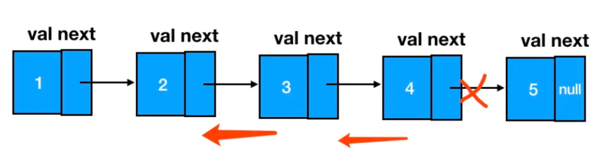
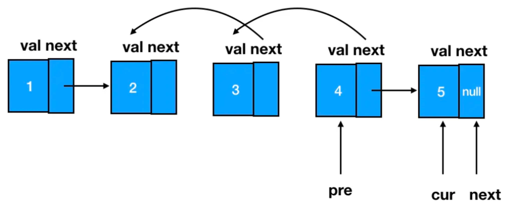

# 92.Reverse Linked List II

## LeetCode 题目链接

[92.反转链表 II](https://leetcode.cn/problems/reverse-linked-list-ii/)

## 题目大意

给个单链表的头指针 `head` 和两个整数 `left` 和 `right`，其中 `left <= right`

请反转从位置 `left` 到位置 `right` 的链表节点，返回`反转后的链表` 


限制:
- The number of nodes in the list is n.
- 1 <= n <= 500
- -500 <= Node.val <= 500
- 1 <= left <= right <= n

## 解题

### 思路 1: 递归

```js
var reverseBetween = function(head, left, right) {
    let successor = null;
    const reverse = function(head, right) {
        if (right == 1) {
            successor = head.next;
            return head;
        }
        const last = reverse(head.next, right - 1);
        head.next.next = head;
        head.next = successor;
        return last;
    };
    // base case
    if (left == 1) return reverse(head, right);
    head.next = reverseBetween(head.next, left - 1, right - 1);
    return head;
};
```
```python
class Solution:
    def reverseBetween(self, head: Optional[ListNode], left: int, right: int) -> Optional[ListNode]:
        # 当 left == 1 时，意味着已经到了需要反转的起始位置
        # left == 1 表示已经走过了 left - 1 个节点，达到了需要开始反转的位置
        # 调用 self.reverse(head, right) 来从当前位置开始反转前 right 个节点
        if left == 1:
            return self.reverse(head, right)
        
        # 前进到反转的起点触发
        # 当 left != 1 时，说明还未到达反转的起点位置
        head.next = self.reverseBetween(head.next, left - 1, right - 1)
        return head
    
    successor = None # 后驱节点
    # 反转以 head 为起点的 n 个节点，返回新的头结点
    def reverse(self, head: ListNode, right: int) -> ListNode:
        if right == 1:
            # 记录第 right + 1 个节点
            # self.successor 保存后继节点，使我们在反转完成后能将反转部分连接到链表的剩余部分
            self.successor = head.next
            return head
        
        # 以 head.next 为起点，需要反转前 right - 1 个节点
        last = self.reverse(head.next, right - 1)
        # 在反转完之后，通过 head.next.next = head 将当前节点和下一个节点之间的连接反转
        # 使得 head.next 节点指向当前节点 head
        head.next.next = head
        # 让反转之后的 head 节点和后面的节点连起来
        head.next = self.successor
        return last
```

- 时间复杂度：`O(n)`
- 空间复杂度：`O(n)`，需要 `n` 层栈空间

### 思路 2: 双指针



`4 -> 3，3 -> 2`，关键在于如何让 `1 -> 4` 让 `2 -> 5`，这就要求在单纯的重复“逆序”这个动作外，还需对被逆序的区间前后的两个结点做额外的处理

由于遍历链表的顺序是从前往后遍历，为了避免 `1` 和 `2` 随着遍历向后推进被遗失，需提前把 `1` 缓存下来。而随着遍历的进行，当完成了 `4` 的指针反转后，`cur` 指针就恰好指在 `5` 上



```js
var reverseBetween = function(head, left, right) {
    let dummy = new ListNode(-1);
    dummy.next = head;
    let p = dummy;
    let pre, cur, leftHead;
    for (let i = 0; i < left - 1; i++) {
        p = p.next;
    }

    leftHead = p;
    let start = leftHead.next;
    pre = start;
    cur = pre.next;
    for (let i = left; i < right; i++) {
        let next = cur.next;
        cur.next = pre;
        pre = cur;
        cur = next;
    }
    leftHead.next = pre;
    start.next = cur;
    return dummy.next;
};
```
```python
class Solution:
    def reverseBetween(self, head: Optional[ListNode], left: int, right: int) -> Optional[ListNode]:
        if not head:
            return None
        
        # dummy 的后继结点是头结点
        dummy = ListNode(-1)
        dummy.next = head
        # p 是一个游标，用于遍历，最初指向 dummy
        p = dummy
        # p 往前走 left - 1 步，走到整个区间的前驱结点处
        # 这样 p 就会停在 left 节点的前一个节点（即整个区间的前驱节点）
        for i in range(left - 1):
            p = p.next
        
        # 定义 pre、cur，用 leftHead 来承接整个区间的前驱结点
        # 缓存这个前驱结点到 leftHead 里
        leftHead = p
        # start 是反转区间的第一个结点
        start = leftHead.next
        # pre 指向 start
        pre = start
        # cur 指向 start 的下一个结点
        cur = pre.next
        # 开始重复反转动作
        for i in range(left, right):
            next = cur.next
            cur.next = pre
            pre = cur
            cur = next
        
        # 将反转后的区间新头节点（即 pre）连接到前驱节点 leftHead，完成前半部分的连接
        leftHead.next = pre
        # 将原区间的第一个节点（start）连接到 cur，即反转区间后面的部分
        start.next = cur
        return dummy.next
```

- 时间复杂度：`O(n)`
- 空间复杂度：`O(1)`