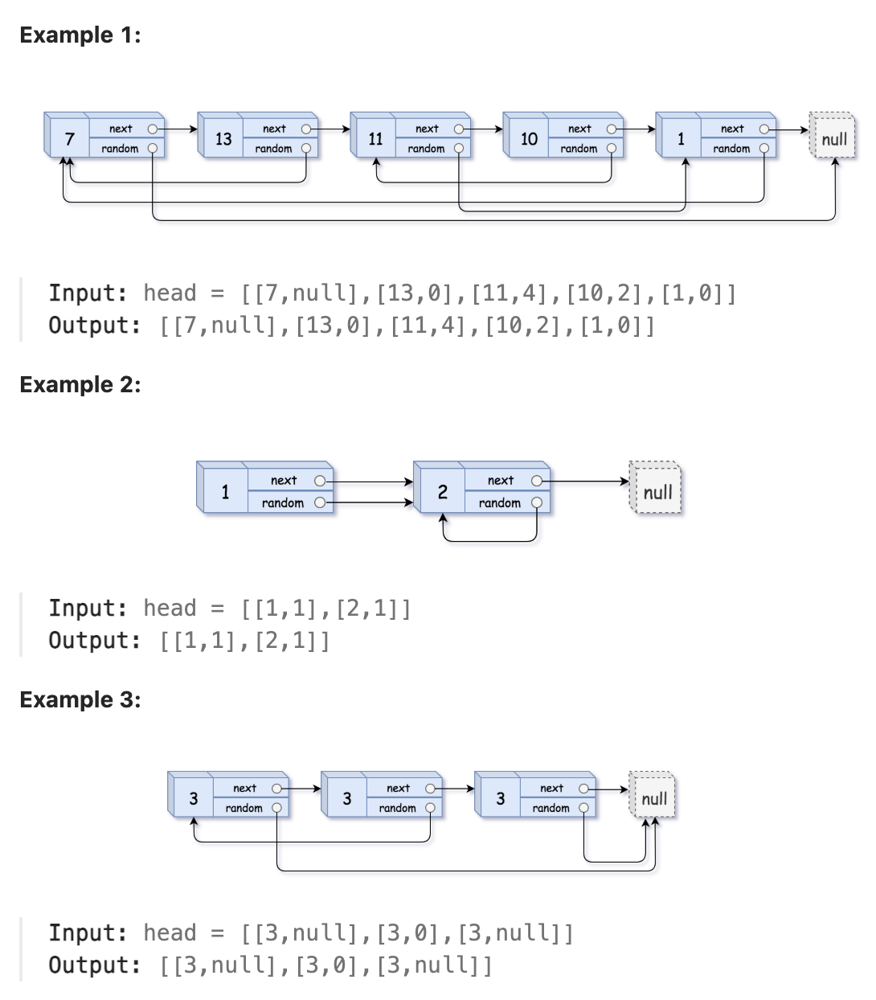

# 138.Copy List with Random Pointer

## LeetCode 题目链接

[138.随机链表的复制](https://leetcode.cn/problems/copy-list-with-random-pointer/)

## 题目大意

给一个长度为 `n` 的链表，每个节点包含一个额外增加的随机指针 `random`，该指针可以指向链表中的任何节点或空节点

构造这个链表的`深拷贝`。深拷贝应该正好由 `n` 个`全新`节点组成，其中每个新节点的值都设为其对应的原节点的值。新节点的 `next` 指针和 `random` 指针也都应指向复制链表中的新节点，并使原链表和复制链表中的这些指针能够表示相同的链表状态，复制链表中的指针都不应指向原链表中的节点

例如，若原链表中有 `X` 和 `Y` 两个节点，其中 `X.random --> Y`，则在复制链表中对应的两个节点 `x` 和 `y`，同样有 `x.random --> y` 

返回复制链表的头节点

用一个由 `n` 个节点组成的链表来表示输入/输出中的链表，每个节点用一个 `[val, random_index]` 表示：
- `val`：一个表示 `Node.val` 的整数
- `random_index`：随机指针指向的节点索引（范围从 `0` 到 `n-1`）；若不指向任何节点，则为 `null` 

代码只接受原链表的头节点 `head` 作为传入参数



限制:
- 0 <= n <= 1000
- -10^4 <= Node.val <= 10^4
- Node.random is null or is pointing to some node in the linked list.

## 解题

### 思路 1: 哈希辅助法

遍历链表，利用哈希表，以`旧节点: 新节点`为映射关系，将节点关系存储下来

再次遍历链表，将新链表的 `next` 和 `random` 指针设置好

```js
var copyRandomList = function(head) {
    let originToCopy = new Map();
    for (let p = head; p != null; p = p.next) {
        if (!originToCopy.has(p)) {
            originToCopy.set(p, new Node(p.val));
        }
    }

    for (let p = head; p != null; p = p.next) {
        if (p.next != null) originToCopy.get(p).next = originToCopy.get(p.next);
        if (p.random != null) originToCopy.get(p).random = originToCopy.get(p.random);
    }

    return originToCopy.get(head);
};
```
```python
class Solution:
    def copyRandomList(self, head: 'Optional[Node]') -> 'Optional[Node]':
        originToCopy = {}
        p = head
        while p:
            if p not in originToCopy:
                originToCopy[p] = Node(p.val)
            p = p.next
        
        p = head
        while p:
            if p.next:
                originToCopy[p].next = originToCopy[p.next]
            
            if p.random: 
                originToCopy[p].random = originToCopy[p.random]
            
            p = p.next
        
        return originToCopy.get(head)
```

- 时间复杂度：`O(n)`
- 空间复杂度：`O(n)`

### 思路 2: DFS

使用 `DFS` 图遍历框架

```js
var copyRandomList = function(head) {
    // 记录 DFS 遍历过的节点，防止走回头路
    let visited = new Set();
    // 记录原节点到克隆节点的映射
    let originToCopy = new Map();
    const traverse = function(node) {
        if (node == null) return;
        if (visited.has(node)) return;

        visited.add(node);

        if (!originToCopy.has(node)) originToCopy.set(node, new Node(node.val));
        let cloneNode = originToCopy.get(node);
        if (node.next) {
            traverse(node.next);
            cloneNode.next = originToCopy.get(node.next);
        }

        if (node.random) {
            traverse(node.random)
            cloneNode.random = originToCopy.get(node.random);
        }
    };

    traverse(head);
    return originToCopy.get(head);
};
```
```python
class Solution:
    def __init__(self):
        # 记录 DFS 遍历过的节点，防止走回头路
        self.visited = set()
        # 记录原节点到克隆节点的映射
        self.originToCopy = {}

    def copyRandomList(self, head: 'Optional[Node]') -> 'Optional[Node]':
        self.traverse(head)
        return self.originToCopy.get(head)
    
    def traverse(self, node):
        if node == None: 
            return

        if node in self.visited:
            return

        self.visited.add(node)
        # 如果当前节点未被克隆（即未在 originToCopy 中出现），则创建一个对应的克隆节点，并将其加入 originToCopy 哈希表中
        if node not in self.originToCopy:
            self.originToCopy[node] = Node(node.val)
        
        # 获取当前节点对应的克隆节点，方便后续对其 next 和 random 指针赋值
        cloneNode = self.originToCopy[node]
        # 递归处理当前节点的 next 指针
        self.traverse(node.next)
        # 克隆节点的 next 指针被设置为 originToCopy 中当前节点的 next 指针对应的克隆节点
        cloneNode.next = self.originToCopy.get(node.next)
        # 递归处理当前节点的 random 指针
        self.traverse(node.random)
        # 克隆节点的 random 指针被设置为 originToCopy 中当前节点的 random 指针对应的克隆节点
        cloneNode.random = self.originToCopy.get(node.random)
```

- 时间复杂度：`O(n)`，其中 `n` 是链表中节点的总数
  - 每个节点最多遍历两次（一次是为了创建节点映射，一次是赋值 `next` 和 `random` 指针）
  - 通过哈希表保证每个节点只被克隆一次，并能在 `O(1)` 时间内找到克隆节点
- 空间复杂度：`O(n)`
  - 需要额外的哈希表 `originToCopy` 保存 `n` 个节点的映射关系
  - 递归调用栈的深度最多为 `n`

### 思路 3: 原地修改法

直接在原链表中插入新节点，完成克隆后拆分链表。此方法更节省空间（`O(1)`），但复杂性较高

```js
var copyRandomList = function(head) {
    if (!head) return null;
    // 1: 在每个节点后插入一个克隆节点
    let cur = head;
    while (cur) {
        const clone = new Node(cur.val); // 创建克隆节点
        clone.next = cur.next;
        cur.next = clone;
        cur = clone.next; // 移动到下一个原节点
    }

    // 2: 设置克隆节点的 random 指针
    cur = head;
    while (cur) {
        if (cur.random) {
            cur.next.random = cur.random.next; // 克隆节点的 random 指向原 random 的 next
        }
        cur = cur.next.next; // 跳过克隆节点，移动到下一个原节点
    }

    // 3: 拆分链表
    cur = head;
    const cloneHead = head.next; // 克隆链表的头节点
    while (cur) {
        const clone = cur.next;
        cur.next = clone.next; // 恢复原链表的 next
        cur = cur.next;
        if (cur) clone.next = cur.next; // 设置克隆链表的 next
    }

    return cloneHead;
};
```
```python
class Solution:
    def copyRandomList(self, head: 'Optional[Node]') -> 'Optional[Node]':
        if not head:
            return None
        
        # 1: 在每个节点后插入一个克隆节点
        cur = head
        while cur:
            clone = Node(cur.val)  # 创建克隆节点
            clone.next = cur.next
            cur.next = clone
            cur = clone.next  # 移动到下一个原节点

        # 2: 设置克隆节点的 random 指针
        cur = head
        while cur:
            if cur.random:
                cur.next.random = cur.random.next  # 克隆节点的 random 指向原 random 的 next
            cur = cur.next.next  # 跳过克隆节点，移动到下一个原节点

        # 3: 拆分链表
        cur = head
        clone_head = head.next  # 克隆链表的头节点
        while cur:
            clone = cur.next
            cur.next = clone.next  # 恢复原链表的 next
            cur = cur.next
            if cur:
                clone.next = cur.next  # 设置克隆链表的 next

        return clone_head
```