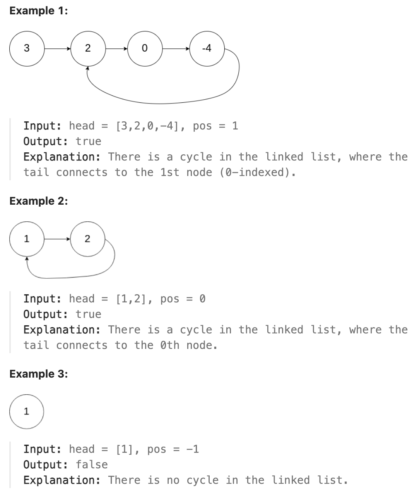

# 141.Linked List Cycle

## LeetCode 题目链接

[141.环形链表](https://leetcode.cn/problems/linked-list-cycle/)

## 题目大意

给一个链表的头节点 `head`，判断链表中是否有环

若链表中有某个节点，可以通过连续跟踪 `next` 指针再次到达，则链表中存在环

为了表示给定链表中的环，评测系统内部使用整数 `pos` 来表示链表尾连接到链表中的位置（索引从 `0` 开始）

注意：`pos` 不作为参数进行传递，仅仅是为了标识链表的实际情况

若链表中存在环 ，则返回 `true`；否则，返回 `false` 



限制:
- The number of the nodes in the list is in the range [0, 10^4].
- -10^5 <= Node.val <= 10^5
- pos is -1 or a valid index in the linked-list.

## 解题

### 思路 1: 哈希表

遍历所有节点，每次遍历节点前使用哈希表判断该节点是否被访问过

若访问过就说明存在环，若没访问过则将该节点添加到哈希表中，继续遍历判断

```js
var hasCycle = function(head) {
    let nodeSet = new Set();
    while (head != null) {
        if (nodeSet.has(head)) return true;
        nodeSet.add(head);
        head = head.next;
    }
    return false;
};
```
```python
class Solution:
    def hasCycle(self, head: Optional[ListNode]) -> bool:
        nodeSet = set()
        while head:
            if head in nodeSet:
                return True
            nodeSet.add(head)
            head = head.next
        
        return False
```

- 时间复杂度：`O(n)`
- 空间复杂度：`O(n)`

### 思路 2: 双指针

使用双指针技巧中的快慢指针，当慢指针 `slow` 前进一步，快指针 `fast` 就前进两步

若 `fast` 最终遇到空指针，则说明链表中没有环；若 `fast` 最终和 `slow` 相遇，则是`fast` 超过了 `slow` 一圈，说明链表中含有环

```js
var hasCycle = function(head) {
    let slow = fast = head;
    while (fast != null && fast.next != null) {
        slow = slow.next;
        fast = fast.next.next;
        if (slow == fast) return true;
    }
    return false;
};
```
```python
class Solution:
    def hasCycle(self, head: Optional[ListNode]) -> bool:
        slow = fast = head
        while fast and fast.next:
            slow = slow.next
            fast = fast.next.next

            if slow == fast:
                return True

        return False
```

- 时间复杂度：`O(n)`
- 空间复杂度：`O(1)`