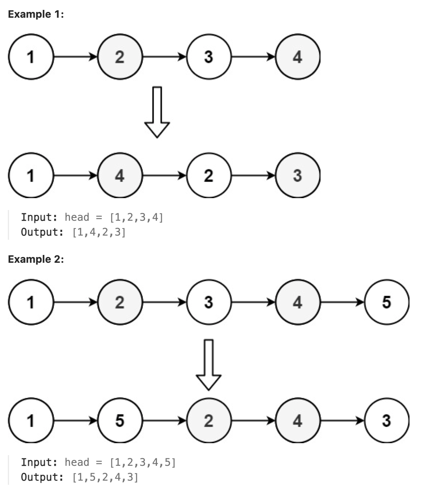

# 143.Reorder List

## LeetCode 题目链接

[143.Reorder List](https://leetcode.com/problems/reorder-list/)

## 题目大意

给定一个单链表 `L` 的头节点 `head`，单链表 `L` 表示为：`L0 → L1 → … → Ln - 1 → Ln`

请将其重新排列后变为：`L0 → Ln → L1 → Ln - 1 → L2 → Ln - 2 → …`

不能只是单纯的改变节点内部的值，而是需要实际的进行节点交换



限制:
- The number of nodes in the list is in the range [1, 5 * 10^4].
- 1 <= Node.val <= 1000

## 解题

### 思路 1: 栈

这题的难点在于：一个单链表只能从头部向尾部遍历节点，无法从尾部开始向头部遍历节点

可以利用`栈`先进后出的结构特点，按从头到尾的顺序让链表节点入栈，则出栈顺序就是反过来从尾到头

```js
var reorderList = function(head) {
    let stack = [];
    let p = head;
    while (p != null) {
        stack.push(p);
        p = p.next;
    }

    p = head;
    while (p != null) {
        let last = stack.pop();
        let next = p.next;
        if (last == next || last.next == next) {
            last.next = null;
            break;
        }
        p.next = last;
        last.next = next;
        p = next;
    }
};
```
```python
class Solution:
    def reorderList(self, head: Optional[ListNode]) -> None:
        stack = []
        p = head
        while p:
            stack.append(p)
            p = p.next
        
        p = head
        while p:
            last = stack.pop()
            next = p.next
            if last == next or last.next == next:
                last.next = None
                break
            
            p.next = last
            last.next = next
            p = next
```

- 时间复杂度：`O(n)`
- 空间复杂度：`O(n)`

### 思路 2: 双指针

通过将链表节点存储到列表中，然后通过双指针交替连接节点，重新排列链表，最终实现了所需的交替顺序

```js
var reorderList = function(head) {
    if (!head) return;
    let arr = [], p = head;
    while (p != null) {
        arr.push(p);
        p = p.next;
    }

    let left = 0, right = arr.length - 1;
    while (left < right) {
        arr[left].next = arr[right];
        left++;
        if (left == right) break;
        arr[right].next = arr[left];
        right--;
    }
    
    arr[left].next = null;
};
```
```python
class Solution:
    def reorderList(self, head: Optional[ListNode]) -> None:
        if not head:
            return 

        arr = []
        p = head

        while p != None:
            arr.append(p)
            p = p.next
        
        left, right = 0, len(arr) - 1
        while left < right:
            arr[left].next = arr[right]
            left += 1
            if left == right:
                break
            arr[right].next = arr[left]
            right -= 1
        
        arr[left].next = None
```

- 时间复杂度：`O(n)`
- 空间复杂度：`O(n)`