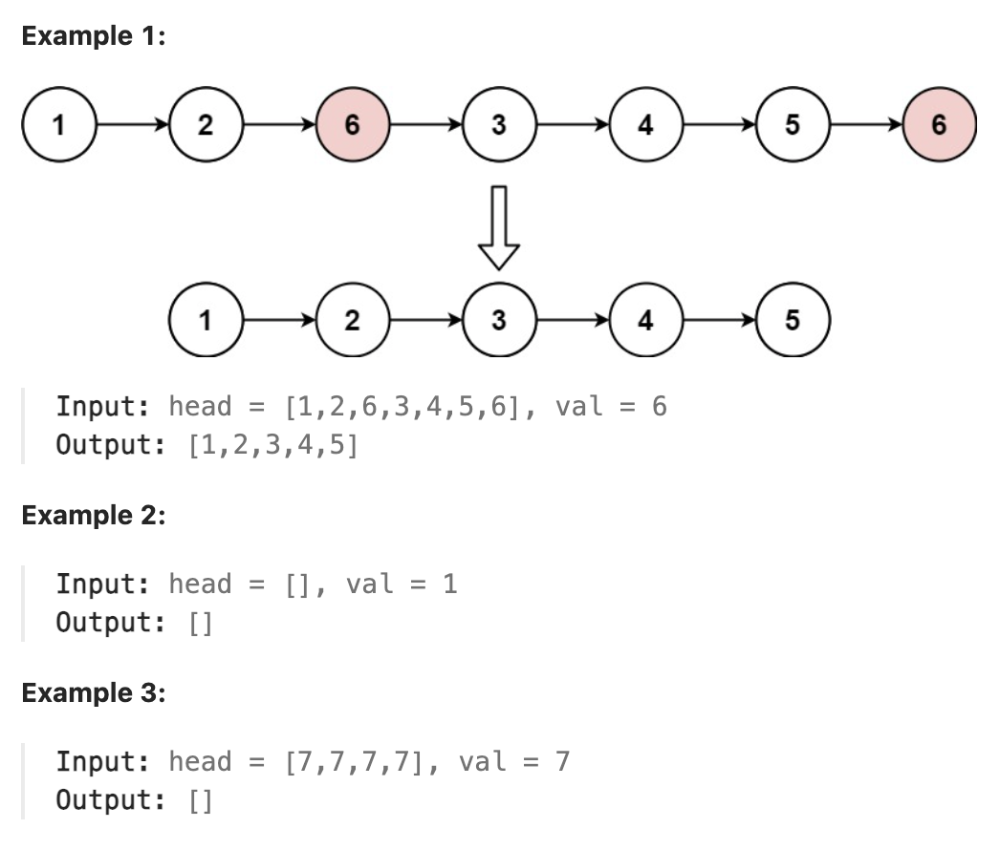

# 203.Remove Linked List Elements

## LeetCode 题目链接

[203.移除链表元素](https://leetcode.cn/problems/remove-linked-list-elements/)

## 题目大意

给你一个链表的头节点 `head` 和一个整数 `val`，请删除链表中所有满足 `Node.val == val` 的节点，并返回新的头节点 



限制:
- The number of nodes in the list is in the range [0, 10^4].
- 1 <= Node.val <= 50
- 0 <= val <= 50

## 解题

使用两个指针 `prev` 和 `cur`
- `prev` 指向前一节点，`cur` 指向当前节点
- 从前向后遍历链表，遇到值为 `val` 的节点时，将 `prev` 的 `next` 指针指向当前节点的下一个节点，继续递归遍历，没有遇到则将 `prev` 指针向后移动一步
- 向右移动 `cur`，继续遍历
  
注意：因为要删除的节点可能包含了头节点，可考虑在遍历之前新建一个头节点，让其指向原来的头节点。这样，最终如果删除的是头节点，则直接删除原头节点，然后最后返回新建头节点的下一个节点即可

```js
var removeElements = function(head, val) {
    let dummy = new ListNode(-1);
    dummy.next = head;
    pre = dummy;
    cur = head;
    while (cur != null) {
        if (cur.val == val) {
            pre.next = cur.next;
        } else {
            pre = cur;
        }
        cur = cur.next;
    }
    return dummy.next;
};
```
```python
class Solution:
    def removeElements(self, head: Optional[ListNode], val: int) -> Optional[ListNode]:
        dummy = ListNode(-1)
        dummy.next = head
        pre = dummy
        cur = head
        while cur:
            if cur.val == val:
                pre.next = cur.next
            else:
                pre = cur
            
            cur = cur.next
        
        return dummy.next
```

- 时间复杂度：`O(n)`
- 空间复杂度：`O(1)`