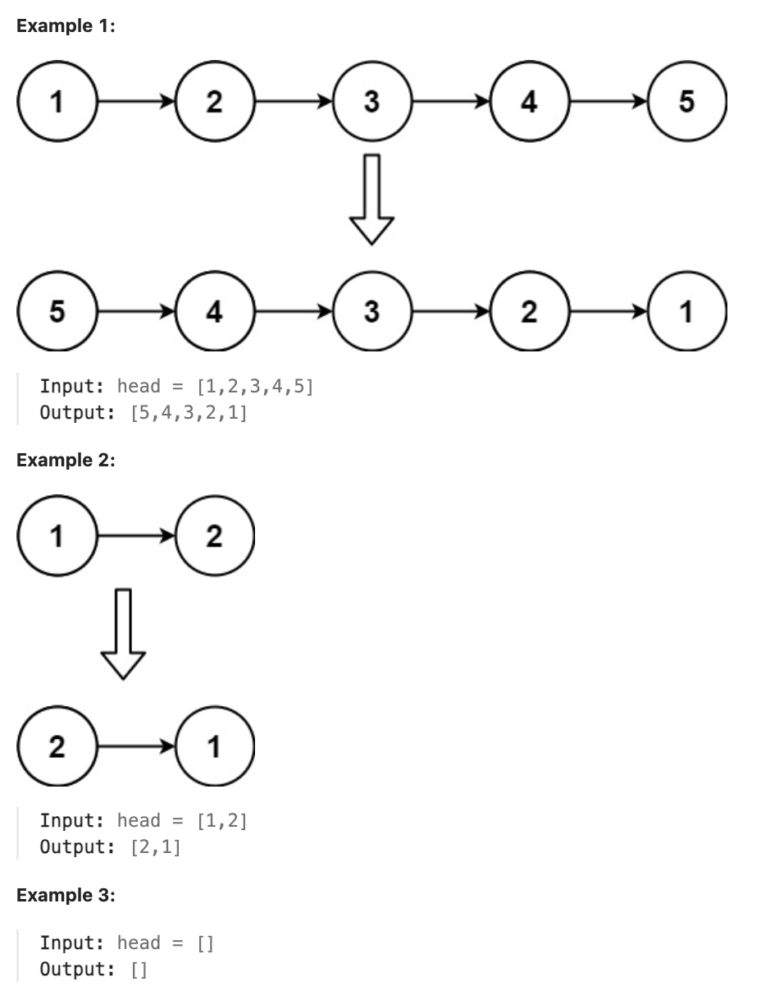

# 206.Reverse Linked List

## LeetCode 题目链接

[206.反转链表](https://leetcode.cn/problems/reverse-linked-list/)

## 题目大意

给出单链表的头节点 `head`，请反转链表，并返回反转后的链表



限制:
- The number of nodes in the list is the range [0, 5000].
- -5000 <= Node.val <= 5000

## 解题

### 思路 1: 递归

```js
// 从前往后翻转指针指向
var reverseList = function(head) {
    return reverse(null, head);
};

var reverse = function(pre, cur) {
    if (!cur) return pre;
    const next = cur.next;
    cur.next = pre;
    return reverse(cur, next);
};

// 从后往前翻转指针指向
var reverseList = function(head) {
    if (head == null || head.next == null) return head;
    let last = reverseList(head.next);
    head.next.next = head;
    head.next = null;
    return last;
};
```
```python
# 从前往后翻转指针指向
class Solution:
    def reverseList(self, head: Optional[ListNode]) -> Optional[ListNode]:
        return self.reverse(None, head)
    
    def reverse(self, pre, cur):
        if not cur:
            return pre
        
        next = cur.next
        cur.next = pre
        return self.reverse(cur, next)

# 从后往前翻转指针指向
class Solution:
    def reverseList(self, head: Optional[ListNode]) -> Optional[ListNode]:
        if not head or not head.next:
            return head
        # last 是反转后的链表头节点
        # 注意，这里 last 始终指向最终反转链表的头节点，不会被修改
        last = self.reverseList(head.next)
        # head.next 的 next 指向当前节点，即反转过来了
        head.next.next = head
        # 然后将当前节点 head 的 next 指针断开，设置为 None，以消除之前形成的环
        head.next = None

        return last
```

- 时间复杂度: `O(n)`，递归处理链表的每个节点
- 空间复杂度: `O(n)`
  - 递归调用了 `n` 层栈空间，虽然没有显式使用额外的数据结构，递归栈的大小在这里与链表长度成正比
  - 每进行一次递归调用都会在调用栈上添加一个新的层级，直到达到链表的末尾
  - 因此，若链表有 `n` 个节点，最坏情况下调用栈的大小也会达到 `n`，这决定了空间复杂度

### 思路 2: 双指针

先定义一个 `cur` 指针，指向头结点，再定义一个 `pre` 指针，初始化为 `null`

开始反转：首先要把 `cur->next` 节点用 `temp` 指针保存一下，即保存这个节点
> 要保存这个节点是因为接下来要改变 `cur->next` 的指向，将 `cur->next` 指向 `pre` ，此时已反转第一个节点

接着循环走代码逻辑，继续移动 `pre` 和 `cur` 指针

最后，`cur` 指针指向 `null`，循环结束，链表也反转完毕。 此时 `return temp`指针即可，`pre` 指针就指向了新的头结点

```js
var reverseList = function(head) {
    if(!head || !head.next) return head;
    let pre = null, cur = head, temp = null;
    while (cur != null) {
        temp = cur.next;
        cur.next = pre;
        pre = cur;
        cur = temp;
    }
    return pre;
};
```
```python
class Solution:
    def reverseList(self, head: Optional[ListNode]) -> Optional[ListNode]:
        if not head or not head.next:
            return head
        
        pre, cur, temp = None, head, None
        while cur:
            temp = cur.next
            cur.next = pre
            # pre 往前走一步
            pre = cur
            # cur 往前走一步
            cur = temp
        # 反转结束，pre 就会变成新链表的头结点
        return pre
```

- 时间复杂度：`O(n)`
- 空间复杂度：`O(1)`