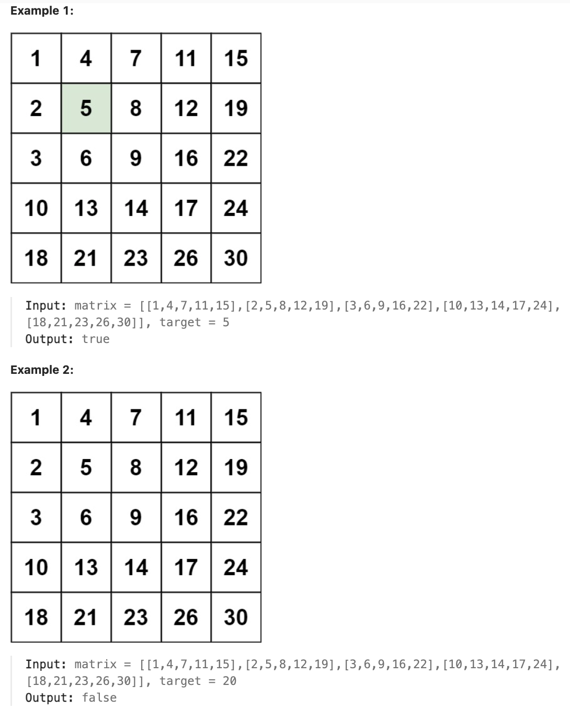

# 240.Search a 2D Matrix II

## LeetCode 题目链接

[240.搜索二维矩阵 II](https://leetcode.cn/problems/search-a-2d-matrix-ii/)

## 题目大意

编写一个高效的算法来搜索 `m x n` 矩阵 `matrix` 中的一个目标值 `target`，该矩阵具有以下特性：
- 每行的元素从左到右升序排列
- 每列的元素从上到下升序排列



限制:
- m == matrix.length
- n == matrix[i].length
- 1 <= n, m <= 300
- -10^9 <= matrix[i][j] <= 10^9
- All the integers in each row are sorted in ascending order.
- All the integers in each column are sorted in ascending order.
- -10^9 <= target <= 10^9

## 解题

### 思路 1: 双指针

这道题说 `matrix` 从上到下递增，从左到右递增 --> 左上角是最小元素，右下角是最大元素

若想高效在 `matrix` 中搜索一个元素，肯定需从某个角开始，如说从左上角开始，然后每次只能向右或向下移动，不要走回头路

注意，若向左移动，元素在减小；若向下移动，元素在增大，这样的话就可以根据当前位置的元素和 `target` 的相对大小来判断应该往哪移动，不断接近从而找到 `target` 的位置

```js
var searchMatrix = function(matrix, target) {
    let m = matrix.length, n = matrix[0].length;
    let i = 0, j = n - 1;
    while (i < m && j >= 0) {
        if (matrix[i][j] == target) {
            return true;
        } else if (matrix[i][j] < target) {
            i++;
        } else {
            j--;
        }
    }
    return false;
};
```
```python
class Solution:
    def searchMatrix(self, matrix: List[List[int]], target: int) -> bool:
        m, n = len(matrix), len(matrix[0])
        i, j = 0, n - 1
        while i < m and j >= 0:
            if matrix[i][j] == target:
                return True
            elif matrix[i][j] < target:
                i += 1
            else:
                j -= 1
        
        return False
```

- 时间复杂度：`O(m + n)`，`m` 是矩阵的行数，`n` 是矩阵的列数
- 空间复杂度：`O(1)`

### 思路 2: 二分查找

矩阵是有序的，可以考虑使用二分查找来实现
- 迭代对角线元素，假设对角线元素的坐标为 `(row, col)`，把数组元素按对角线分为右上角部分和左下角部分
- 对当前对角线元素右侧第 `row` 行、对角线元素下侧第 `col` 列分别进行二分查找
- 若找到目标，直接返回 `true`
- 若找不到目标，则缩小范围，继续查找
- 直到所有对角线元素都遍历完，依旧没找到，则返回 `false`

```js
var searchMatrix = function(matrix, target) {
    let rows = matrix.length, cols = matrix[0].length;
    if (rows == 0 || cols == 0) return false;
    let minVal = Math.min(rows, cols);
    const index = diagonalBinarySearch(matrix, minVal - 1, target);
    if (matrix[index][index] == target) return true;
    for (let i = 0; i <= index; i++) {
        const rowSearch = rowBinarySearch(matrix, i, cols - 1, target);
        const colSearch = colBinarySearch(matrix, i, rows - 1, target);
        if (rowSearch || colSearch) return true;
    }
    return false;
};

var diagonalBinarySearch = function(matrix, diagonal, target) {
    let left = 0, right = diagonal;
    while (left < right) {
        let mid = left + Math.floor((right - left) / 2);
        if (matrix[mid][mid] < target) {
            left = mid + 1;
        } else {
            right = mid;
        }
    }
    return left;
};

var rowBinarySearch = function(matrix, begin, cols, target) {
    let left = begin;
    let right = cols;
    while (left < right) {
        let mid = left + Math.floor((right - left) / 2);
        if (matrix[begin][mid] < target) {
            left = mid + 1;
        } else if (matrix[begin][mid] > target) {
            right = mid - 1;
        } else {
            return true;
        }
    }
    return begin <= left && left <= cols && matrix[begin][left] === target;
};

var colBinarySearch = function(matrix, begin, rows, target) {
    let left = begin + 1;
    let right = rows;
    while (left < right) {
        let mid = left + Math.floor((right - left) / 2);
        if (matrix[mid][begin] < target) {
            left = mid + 1;
        } else if (matrix[mid][begin] > target) {
            right = mid - 1;
        } else {
            return true;
        }
    }
    return begin <= left && left <= rows && matrix[left][begin] === target;
};
```
```python
class Solution:
    def searchMatrix(self, matrix: List[List[int]], target: int) -> bool:
        rows, cols = len(matrix), len(matrix[0])
        if rows == 0 or cols == 0:
            return False
        
        # 矩阵行数和列数中的较小值，用来确定矩阵中对角线上的元素数量。
        min_val = min(rows, cols)
        # 由于矩阵索引从 0 开始，最大的对角线索引为 minv_al - 1
        # min_val - 1 是为了确保对角线二分查找只在矩阵有效的对角线索引范围内进行，防止越界错误，同时保证算法的正确性和有效性
        index = self.diagonalBinarySearch(matrix, min_val - 1, target)
        if matrix[index][index] == target:
            return True

        for i in range(index + 1):
            rowSearch = self.rowBinarySearch(matrix, i, cols - 1, target)
            colSearch = self.colBinarySearch(matrix, i, rows - 1, target)
            if rowSearch or colSearch:
                return True
        
        return False

    def diagonalBinarySearch(self, matrix, diagonal, target):
        left, right = 0, diagonal
        while left < right:
            mid = left + (right - left) // 2
            if matrix[mid][mid] < target:
                left = mid + 1
            else:
                right = mid
        
        return left
    
    def rowBinarySearch(self, matrix, begin, cols, target):
        left, right = begin, cols
        while left < right:
            mid = left + (right - left) // 2
            if matrix[begin][mid] < target:
                left = mid + 1
            elif matrix[begin][mid] > target:
                right = mid - 1
            else:
                return True
        
        return begin <= left <= cols and matrix[begin][left] == target
    
    def colBinarySearch(self, matrix, begin, rows, target):
        # begin + 1，表示从这一列的下一个可能索引开始查找，因在 diagonalBinarySearch 中已经检查过对角线元素。
        left, right = begin + 1, rows
        while left < right:
            mid = left + (right - left) // 2
            if matrix[mid][begin] < target:
                left = mid + 1
            elif matrix[mid][begin] > target:
                right = mid - 1
            else:
                return True
                
        return begin <= left <= rows and matrix[left][begin] == target
```

- 时间复杂度：`O(min(m, n)*(log m + log n))`, `m` 是矩阵的行数，`n` 是矩阵的列数
- 空间复杂度：`O(1)`