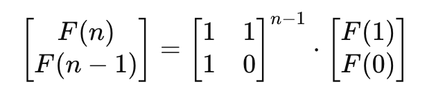
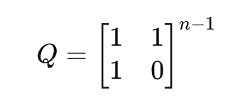

# 509.Fibonacci Number

## LeetCode 题目链接

[509.斐波那契数](https://leetcode.cn/problems/fibonacci-number/)

## 题目大意

斐波那契数（通常用 `F(n)` 表示）形成的序列称为`斐波那契数列`。该数列由 `0` 和 `1` 开始，后面的每一项数字都是前面两项数字的和，也就是：
- `F(0) = 0，F(1) = 1`
- `F(n) = F(n - 1) + F(n - 2)`，其中 `n > 1`
  
给定 `n`，请计算 `F(n)` 

```js
Example 1:
Input: n = 2
Output: 1
Explanation: F(2) = F(1) + F(0) = 1 + 0 = 1.

Example 2:
Input: n = 3
Output: 2
Explanation: F(3) = F(2) + F(1) = 1 + 1 = 2.

Example 3:
Input: n = 4
Output: 3
Explanation: F(4) = F(3) + F(2) = 2 + 1 = 3.
```

限制:
- 0 <= n <= 30

## 解题

### 思路 1: 递归

`return fib(n-1) + fib(n-2)`

超时，时间 `O(2ⁿ)`

### 思路 2: 动态规划

斐波那契数的边界条件是 `F(0)=0` 和 `F(1)=1`。当 `n > 1` 时，每一项的和都等于前两项的和，因此有如下递推关系：`F(n)=F(n−1)+F(n−2)`

由于斐波那契数存在递推关系，因此可以使用动态规划求解。动态规划的状态转移方程即为上述递推关系，边界条件为 `F(0)` 和 `F(1)`

根据状态转移方程和边界条件，可以得到时间复杂度和空间复杂度都是 `O(n)` 的实现。由于 `F(n)` 只和 `F(n−1)` 与 `F(n−2)` 有关，因此可以使用`滚动数组思想`把空间复杂度优化成 `O(1)`

```js
var fib = function(n) {
    // base case
    if (n === 0 || n === 1) return n;
    // 分别代表 dp[i - 1] 和 dp[i - 2]
    let dp_i_1 = 1, dp_i_2 = 0;
    for (let i = 2; i <= n; i++) {
        // dp[i] = dp[i - 1] + dp[i - 2];
        let dp_i = dp_i_1 + dp_i_2;
        dp_i_2 = dp_i_1;
        dp_i_1 = dp_i;
    }
    
    return dp_i_1;
};
```
```python
# 使用一维数组的写法
class Solution:
    def fib(self, n: int) -> int:
        if n <= 1:
            return n

        dp = [0 for _ in range(n + 1)]
        dp[0] = 0
        dp[1] = 1
        for i in range(2, n + 1):
            dp[i] = dp[i - 2] + dp[i - 1]

        return dp[n]

# 优化
class Solution:
    def fib(self, n: int) -> int:
        # base case
        if n == 0 or n == 1:
            return n
        
        # 分别代表 dp[i - 1] 和 dp[i - 2]
        dp_i_1, dp_i_2 = 1, 0
        for i in range(2, n+1):
            # dp[i] = dp[i - 1] + dp[i - 2]
            dp_i = dp_i_1 + dp_i_2
            dp_i_2 = dp_i_1
            dp_i_1 = dp_i
        
        return dp_i_1
```

- 时间复杂度：`O(n)`，一重循环遍历
- 空间复杂度：`O(1)`

### 思路 3: 矩阵快速幂

矩阵快速幂（Matrix Exponentiation）：利用线性代数中的矩阵乘法和幂的性质，加速求解斐波那契数列

斐波那契数列有这样一个数学性质（矩阵递推）：



所以只需要计算矩阵的幂次，就能在 `O(logn)` 的时间内求出 `F(n)`



```python
class Solution:
    def fib(self, n: int) -> int:
        # 对 n == 0 和 n == 1 直接返回
        # 否则进入矩阵快速幂
        if n < 2:
            return n
        
        # 这是斐波那契的基本递推矩阵
        q = [[1, 1], [1, 0]]
        # 快速幂函数
        res = self.matrix_pow(q, n - 1)

        # res 是 Q^(n-1)，其 [0][0] 位置正好就是 F(n)
        return res[0][0]
    
    # 这是标准的二分幂模板（快速幂）
    def matrix_pow(self, a, n):
        res = [[1, 0], [0, 1]] # 单位矩阵
        while n > 0:
            # 如果 n 是奇数，就乘一次
            if n & 1:
                res = self.matrix_multiply(res, a)

            # 每轮将矩阵 a 自乘（平方），n 每轮减半
            n >>= 1
            a = self.matrix_multiply(a, a)
        
        # 最终得到 a^n 的结果
        return res
    
    # 矩阵乘法
    # 2×2 矩阵乘法公式的实现
    def matrix_multiply(self, a, b):
        c = [[0, 0], [0, 0]]
        for i in range(2):
            for j in range(2):
                c[i][j] = a[i][0] * b[0][j] + a[i][1] * b[1][j]
        return c
```

- 时间复杂度：`O(logn)`，快速幂每次除以 `2`，总共 `log n` 次乘法
- 空间复杂度：`O(1)`，只维护 `2x2` 矩阵，常数空间

