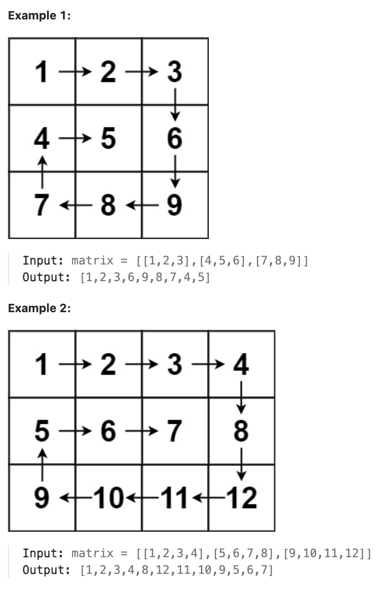

# 54.Spiral Matrix

## LeetCode 题目链接

[54.螺旋矩阵](https://leetcode.cn/problems/spiral-matrix/)

## 题目大意

给一个 `m` 行 `n` 列的矩阵 `matrix`，请按照`顺时针螺旋顺序`，返回矩阵中的所有元素



限制：
- m == matrix.length
- n == matrix[i].length
- 1 <= m, n <= 10
- -100 <= matrix[i][j] <= 100

## 解题

核心思路：按照`右、下、左、上`的顺序遍历数组，并使用四个变量圈定未遍历元素的边界

随着螺旋遍历，相应的边界会收缩，直到螺旋遍历完整个数组

```js
var spiralOrder = function(matrix) {
    let m = matrix.length, n = matrix[0].length;
    let up = 0, low = m - 1;
    let left = 0, right = n - 1;
    let res = [];
    while (res.length < m * n) {
        if (up <= low) {
            // 在顶部从左向右遍历
            for (let j = left; j <= right; j++) {
                res.push(matrix[up][j]);
            }
            // 上边界下移
            up++;
        }

        if (left <= right) {
            // 在右侧从上向下遍历
            for (let i = up; i <= low; i++) {
                res.push(matrix[i][right]);
            }
            // 右边界左移
            right--;
        }

        if (up <= low) {
            // 在底部从右向左遍历
            for (let j = right; j >= left; j--) {
                res.push(matrix[low][j]);
            }
            // 下边界上移
            low--;
        }

        if (left <= right) {
            // 在左侧从下向上遍历
            for (let i = low; i >= up; i--) {
                res.push(matrix[i][left]);
            }
            // 左边界右移
            left++;
        }
    }

    return res;
};
```
```python
class Solution:
    def spiralOrder(self, matrix: List[List[int]]) -> List[int]:
        m, n = len(matrix), len(matrix[0])
        up, low = 0, m - 1
        left, right = 0, n -1
        res = []
        
        while len(res) < m * n:
            # 在 upper 边界，从左 -> 右 遍历
            if up <= low:
                for i in range(left, right + 1):
                    res.append(matrix[up][i])
                up += 1
            
            # 在 right 边界，从上 -> 下遍历
            if left <= right:
                for i in range(up, low + 1):
                    res.append(matrix[i][right])
                right -= 1
            
            # 在 low 边界，从右 -> 左遍历
            if up <= low:
                for i in range(right, left - 1, -1):
                    res.append(matrix[low][i])
                low -= 1
            
            # 在 left 边界，从下 -> 上遍历
            if left <= right:
                for i in range(low, up - 1, -1):
                    res.append(matrix[i][left])
                left += 1

        return res
```

- 时间复杂度：`O(m * n)`，由于代码中有四个循环，每个循环都遍历矩阵的一边，但总共只遍历所有元素一次，所以时间复杂度为 `O(m * n)`，其中 `m` 和 `n` 分别是矩阵的行数和列数
- 空间复杂度：除了用于输出的列表 `res` 外，没有使用任何额外的空间，因此空间复杂度为 `O(1)`。注意，若输出空间不计算在内（通常情况下不计算输出空间），空间复杂度是`O(1)`；若输出空间计算在内，空间复杂度是 `O(m * n)`