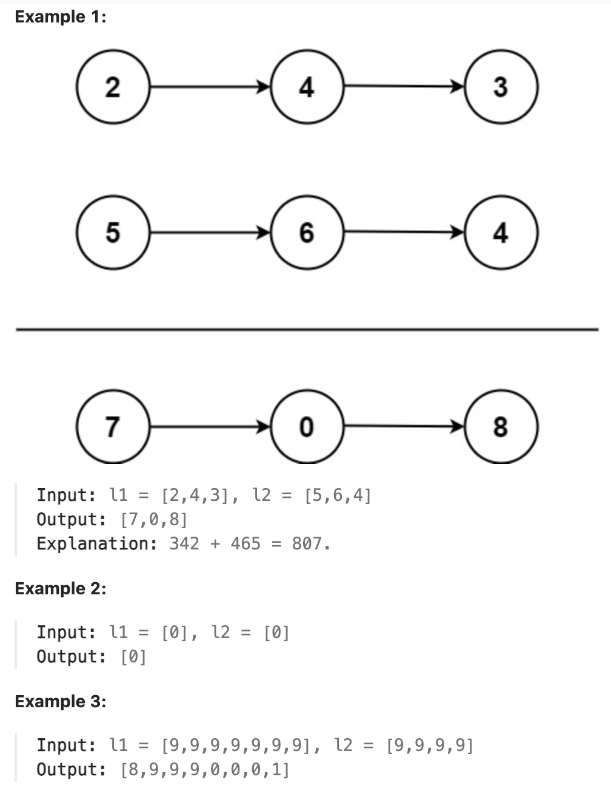

# 2.Add Two Numbers

## LeetCode 题目链接

[2.两数相加](https://leetcode.cn/problems/add-two-numbers/)

## 题目大意

给你两个非空的链表，表示两个非负的整数。它们每位数字都是按照逆序的方式存储的，并且每个节点只能存储一位数字

请将两个数相加，并以相同形式返回一个表示和的链表

可以假设除了数字 `0` 之外，这两个数都不会以 `0` 开头



限制：
- The number of nodes in each linked list is in the range [1, 100].
- 0 <= Node.val <= 9
- It is guaranteed that the list represents a number that does not have leading zeros.

## 解题

这个解决方案的核心思想是同时遍历两个链表，按位相加并处理进位

实现的详细解释：
- 创建一个虚拟头节点 `dummy`，简化了边界情况的处理
- 使用一个循环同时遍历两个链表，直到两个链表都遍历完
- 在每一步中：
  - 获取当前位的值（如果链表已经遍历完，则用 `0` 代替）
  - 计算当前位的和，包括之前的进位
  - 创建一个新节点，其值为和的个位数
  - 更新进位值
- 如果最后还有进位，创建一个额外的节点
- 返回虚拟头节点的下一个节点，即结果链表的实际头节点

```js
var addTwoNumbers = function(l1, l2) {
    let dummy = new ListNode(0);
    let p = dummy;
    let carry = 0;
    while (l1 !== null || l2 !== null) {
        const x = l1 ? l1.val : 0;
        const y = l2 ? l2.val : 0;
        let sum = carry + x + y;
        carry = Math.floor(sum / 10);
        p.next = new ListNode(sum % 10);
        p = p.next;
        if (l1 !== null) l1 = l1.next;
        if (l2 !== null) l2 = l2.next;
    }

    if (carry > 0) p.next = new ListNode(carry);
    return dummy.next;
};
```
```python
class Solution:
    def addTwoNumbers(self, l1: Optional[ListNode], l2: Optional[ListNode]) -> Optional[ListNode]:
        dummy = ListNode(0)
        p = dummy
        carry = 0

        while l1 is not None or l2 is not None:
            x = l1.val if l1 is not None else 0
            y = l2.val if l2 is not None else 0
            total = carry + x + y
            carry = total // 10
            p.next = ListNode(total % 10)
            p = p.next

            if l1 is not None:
                l1 = l1.next
            if l2 is not None:
                l2 = l2.next
        
        if carry > 0:
            p.next = ListNode(carry)
        
        return dummy.next
```

- 时间复杂度：`O(max(n, m))`，`n` 和 `m` 是两个输入链表的长度，只需遍历一次最长的链表
- 空间复杂度：`O(max(n, m))`，在最坏的情况下新链表的长度为 `max(n, m) + 1`（如，当有一个额外的进位时）