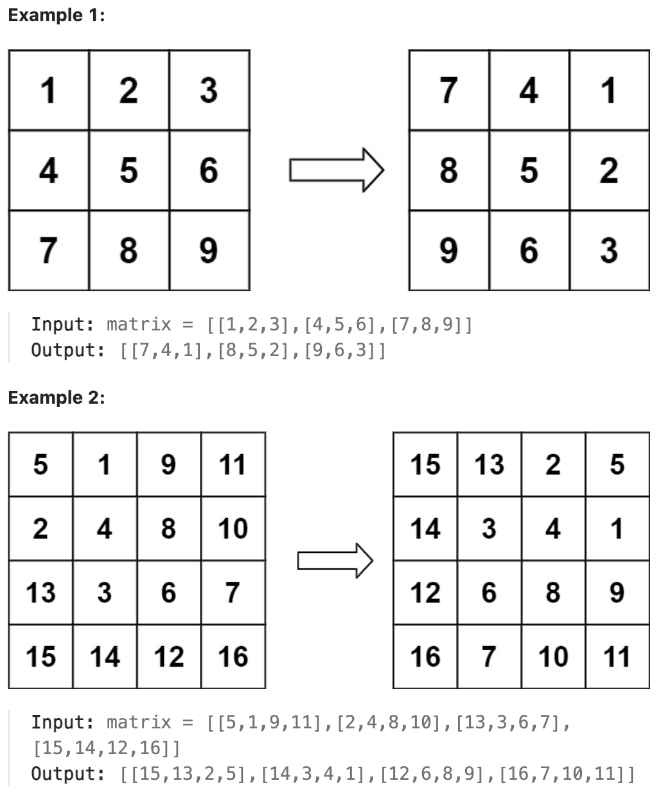

# 48.Rotate Image

## LeetCode 题目链接

[48.旋转图像](https://leetcode.cn/problems/rotate-image/)

## 题目大意

给定一个 `n × n` 的二维矩阵 `matrix` 表示一个图像，请将图像顺时针旋转 `90` 度

必须在`原地`旋转图像，这意味着需要直接修改输入的二维矩阵

请不要`使用另一个矩阵`来旋转图像



限制:
- n == matrix.length == matrix[i].length
- 1 <= n <= 20
- -1000 <= matrix[i][j] <= 1000

## 解题

### 思路 1: 原地翻转

先将 `n x n` 矩阵按照右上到左下的对角线进行镜像对称，然后再对矩阵的每一行进行反转 --> 结果就是 `matrix` 顺时针旋转 `90` 度的结果

```js
var rotate = function(matrix) {
    let n = matrix.length;
    for (let i = 0; i < n; i++) {
        for (let j = i; j < n; j++) {
            let temp = matrix[i][j];
            matrix[i][j] = matrix[j][i];
            matrix[j][i] = temp;
        }
    }

    for (let row of matrix){
        reverse(row);
    }
};

var reverse = function(arr) {
    let i = 0, j = arr.length - 1;
    while (i < j) {
        let temp = arr[i];
        arr[i] = arr[j];
        arr[j] = temp;
        i++;
        j--;
    }
};
```
```python
# 写法 1
class Solution:
    def rotate(self, matrix: List[List[int]]) -> None:
        n = len(matrix)
        # i 的范围是 0 到 n - 1，表示每一行都需要进行处理
        for i in range(n):
            # j 的范围是 0 到 i - 1，表示只交换上三角区域的元素
            # 这里的范围是从 i 到 n，所以只处理每行中从主对角线开始的元素（包括主对角线上的元素）
            for j in range(i, n):
                # 这是进行元素的交换，将上三角的元素和对应的下三角元素进行对称位置的互换
                matrix[i][j], matrix[j][i] = matrix[j][i], matrix[i][j]
        
        for row in matrix:
            self.reverse(row)
    
    def reverse(self, row):
        l, r = 0, len(row) - 1
        while l < r:
            row[l], row[r] = row[r], row[l]
            l += 1
            r -= 1

# 写法 2
# 上下翻转
# 再沿主对角线（从左上到右下的对角线）进行转置
class Solution:
    def rotate(self, matrix: List[List[int]]) -> None:
        n = len(matrix)
        # 外层循环 for i in range(n // 2)：i 的范围是 0 到 n // 2 - 1。这意味着只处理矩阵上半部分的行（即从第 0 行到第 n//2−1 行）
        # 将矩阵沿水平中线进行上下翻转
        # 交换矩阵中 i 行与 n - i - 1 行的元素
        for i in range(n // 2):
            # 内层循环 for j in range(n)：j 遍历矩阵的每一列（即从第 0 列到第 n−1 列）
            for j in range(n):
                # 将第 i 行和第 n - i - 1 行的元素进行互换
                # n - i - 1 表示从下往上数的第 i 行
                matrix[i][j], matrix[n - i - 1][j] = matrix[n - i - 1][j], matrix[i][j]
    
        
        # 再沿主对角线（从右上到左下的对角线）进行转置
        # i 代表当前处理的行索引，范围是从 0 到 n−1
        for i in range(n):
            # j 遍历每一行中的前 i 个元素
            # 这里 j 的范围是 [0, i)，即只处理左上三角区域的元素（不包括主对角线上的元素）
            for j in range(i):
                matrix[i][j], matrix[j][i] = matrix[j][i], matrix[i][j] 
```

- 时间复杂度：`O(n^2)`
  - 对矩阵进行对角线镜像对称：这个步骤涉及遍历矩阵的一半，对于 `n x n` 的矩阵，需要 `O(n^2/2)`的时间，但因这是一个常数倍的差异，通常忽略常数倍差异，所以这部分的时间复杂度是 `O(n^2)`
  - 反转每一行：每行都被反转，对于每行的操作时间复杂度是 `O(n)`，因为矩阵有 `n` 行，所以这个步骤的总的时间复杂度是 `O(n^2)`
- 空间复杂度：`O(1)`，这个函数是原地操作，除了用于交换的 `temp` 变量外，没有使用额外的空间

### 思路 2: 原地旋转

若使用额外数组空间，将对应元素存放到对应位置即可，若不使用额外的数组空间，则需观察每个位置上的点最初位置和最终位置有什么规律

对于矩阵中第 `i` 行的第 `j` 个元素，旋转后它出现在倒数第 `i` 列的第 `j` 个位置，即：`matrixnew[j][n - i - 1] = matrix[i][j]`

而 `matrixnew[j][n - i - 1]` 的点经过旋转移动到了 `matrix[n - i - 1][n - j - 1]` 的位置

`matrix[n -i - 1][n - j - 1]` 位置上的点经过旋转移动到了 `matrix[n - j - 1][i]` 的位置

`matrix[n - j - 1][i]` 位置上的点经过旋转移动到了最初的 `matrix[i][j]` 位置

这样就形成了一个循环，只需要通过一个临时变量 `temp` 就可以将循环中的元素逐一进行交换

```js
var rotate = function(matrix) {
    const n = matrix.length;
    for (let i = 0; i < Math.floor(n / 2); i++) {
        for (let j = 0; j < Math.floor((n + 1) / 2); j++) {
            let temp = matrix[i][j];
            matrix[i][j] = matrix[n - j - 1][i];
            matrix[n - j - 1][i] = matrix[n - i - 1][n - j - 1];
            matrix[n - i - 1][n - j - 1] = matrix[j][n - i - 1];
            matrix[j][n - i - 1] = temp;
        }
    }
};
```
```python
class Solution:
    def rotate(self, matrix: List[List[int]]) -> None:
        n = len(matrix)
        # 遍历矩阵的上半部分（行数为 n//2）
        # n//2 的目的是只遍历矩阵的上半部分，因为在旋转过程中每个元素都只会被旋转一次，且每个元素的旋转会影响到四个位置（上下左右），因此只需要遍历一半的行
        for i in range(n // 2):
            # 表示从左到右遍历矩阵的前 (n+1)//2 列
            # (n+1)//2 的目的是只遍历每行的前半部分（包括中间列）
            # 因为在每个旋转过程中，每行的元素会被移到其他列，而每列的元素也会被移到其他行，只需遍历前半部分即可
            for j in range((n+1) // 2):
                # matrix[i][j]：这是当前遍历到的元素
                # matrix[n - j - 1][i]：这是将 matrix[i][j] 顺时针旋转 90 度后的位置
                # matrix[n - i - 1][n - j - 1]：这是将 matrix[n - j - 1][i] 再顺时针旋转 90 度后的位置
                # matrix[j][n - i - 1]：这是将 matrix[n - i - 1][n - j - 1] 再顺时针旋转 90 度后的位置
                matrix[i][j], matrix[n-j-1][i], matrix[n-i-1][n-j-1], matrix[j][n-i-1] = matrix[n - j - 1][i], matrix[n - i - 1][n - j - 1], matrix[j][n - i - 1], matrix[i][j]
```

- 时间复杂度：`O(n^2)`
- 空间复杂度：``O(1)`