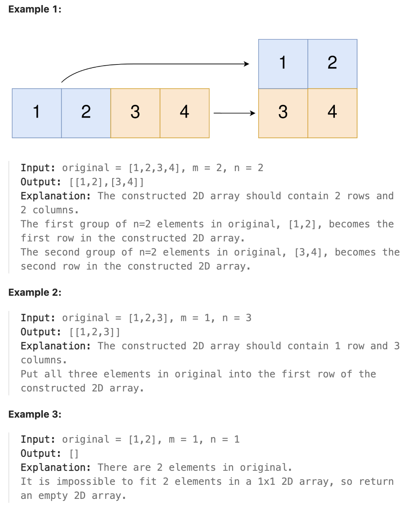

# 2022.Convert 1D Array Into 2D Array

## LeetCode 题目链接

[2022.将一维数组转变成二维数组](https://leetcode.cn/problems/convert-1d-array-into-2d-array/)

## 题目大意

给你一个下标从 `0` 开始的一维整数数组 `original` 和两个整数 `m` 和  `n`。你需使用 `original` 中 所有元素创建一个 `m` 行 `n` 列的二维数组

`original` 中下标从 `0` 到 `n - 1` （都包含）的元素构成二维数组的第一行，下标从 `n` 到 `2 * n - 1`（都包含）的元素构成二维数组的第二行，依此类推

请根据上述过程返回一个 `m x n` 的二维数；如果无法构成这样的二维数组，请返回一个空的二维数组



限制:
- 1 <= original.length <= 5 * 10^4
- 1 <= original[i] <= 10^5
- 1 <= m, n <= 4 * 10^4

## 解题

要将 `original` 转换成 `m x n` 的二维数组，则 `original` 的长度必须等于 `m * n`，否则无法构成一个 `m x n` 的二维数组，直接返回空数组 `[]`

```js
// 写法 1
var construct2DArray = function(original, m, n) {
    // 如果元素个数不等于 m * n，无法构造二维数组，返回空数组
    if (original.length !== m * n) return [];
    // 构建二维数组，并填充数据
    let res = Array.from({ length: m }, () => Array(n).fill(0));
    for (let i = 0; i < original.length; i++) {
        // 计算当前元素所在的行号
        let row = Math.floor(i / n); 
        // 计算当前元素所在的列号
        let col = i % n;          
        res[row][col] = original[i];
    }

    return res;
};

// 写法 2
var construct2DArray = function(original, m, n) {
    if (original.length !== m * n) return [];
    const res = [];
    for (let i = 0; i < m; i++) {
        res.push(original.slice(i * n, (i + 1) * n));
    }
    return res;
};
```
```python
# 写法 1
class Solution:
    def construct2DArray(self, original: List[int], m: int, n: int) -> List[List[int]]:
        if len(original) != m * n:
            return []
        
        res = [[0] * n for _ in range(m)]

        for i in range(len(original)):
            row = i // n  # 计算当前元素所在的行号
            col = i % n   # 计算当前元素所在的列号
            res[row][col] = original[i]
        
        return res

# 写法 2
class Solution:
    def construct2DArray(self, original: List[int], m: int, n: int) -> List[List[int]]:
        if len(original) != m * n:
            return []
        
        # range(m) 生成从 0 到 m-1 的索引 i，表示二维数组中的第 i 行
        # original[i*n:(i+1)*n]
        # - 这部分代码表示取出 original 中的第 i 行的所有元素
        # - i * n 是当前行的起始索引位置
        # - (i + 1) * n 是当前行的结束索引位置（不包含该位置）
        # - 每次切片操作 original[i*n:(i+1)*n] 会返回 original 中从第 i * n 到第 (i + 1) * n 的元素，正好构成二维数组的一行
        return [original[i*n:(i+1)*n] for i in range(m)]
```

- 时间复杂度：`O(mn)`，因为需要遍历 `original` 数组中的每个元素
- 空间复杂度：
  - `O(1)`，不考虑返回值的空间占用
  - 若考虑返回值，存储二维数组 `res` 的空间复杂度为 `O(m * n)`，因为需 `m` 行 `n` 列的存储空间来保存结果
