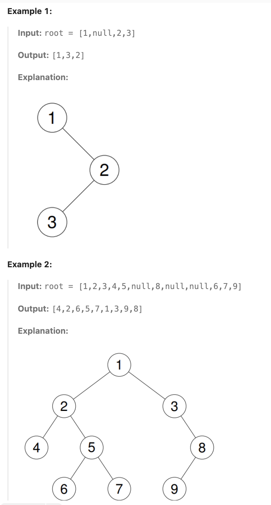

# 94.Binary Tree Inorder Traversal

## LeetCode 题目链接

[94.二叉树的中序遍历](https://leetcode.cn/problems/binary-tree-inorder-traversal/)

## 题目大意

给定一个二叉树的根节点 `root`，返回它的`中序`遍历



限制:
- The number of nodes in the tree is in the range [0, 100].
- -100 <= Node.val <= 100

## 解题

### 思路 1：递归

递归本质上就是`深度优先搜索（DFS）`的一种形式

> 递归法 & DFS
> - 递归（Recursion）是一种 实现方式，它利用函数调用自身来遍历结构化数据（如树）
> - DFS（Depth-First Search，深度优先搜索）是一种 遍历策略，指的是 先往深处走到底，再回溯，适用于树和图的遍历
> - 中序遍历（Inorder Traversal：左 - 根 - 右） 是一种 DFS 方式，因为它是深度优先地遍历二叉树

```js
// 写法 1
var inorderTraversal = function(root) {
    let res = [];
    traverse(root, res);
    return res;
};

var traverse = function(root, res) {
    if (root == null) return;
    traverse(root.left, res);
    res.push(root.val);
    traverse(root.right, res);
};

// 写法 2
var inorderTraversal = function(root) {
    let res = [];
    if (root == null) return res;
    res = res.concat(inorderTraversal(root.left));
    res.push(root.val);
    res = res.concat(inorderTraversal(root.right));
    return res;
};
```
```python
# 写法 1
class Solution:
    def inorderTraversal(self, root: Optional[TreeNode]) -> List[int]:
        res = []
        self.traverse(root, res)
        return res
    
    def traverse(self, root, res):
        if not root:
            return
        self.traverse(root.left, res)
        res.append(root.val)
        self.traverse(root.right, res)

# 写法 2
class Solution:
    def inorderTraversal(self, root: Optional[TreeNode]) -> List[int]:
        res = []
        if not root:
            return res
            
        res.extend(self.inorderTraversal(root.left))
        res.append(root.val)
        res.extend(self.inorderTraversal(root.right))
        return res
```

- 时间复杂度：`O(n)`，其中 `n` 是二叉树的节点数目
- 空间复杂度：`O(n)`

### 思路 2: 迭代

二叉树的前序遍历递归实现的过程，实际上就是调用系统栈的过程，可以使用一个显式栈 `stack` 来模拟递归的过程

前序遍历的顺序为：`根-左-右`，而根据栈的`先入后出`特点，所以入栈的顺序应该为：`先放入右子树，再放入左子树`，这样可保证最终遍历顺序为中序遍历顺序

```js
// 写法 1
var inorderTraversal = function(root) {
    let res = [];
    if (root == null) return res;
    let stack = [];
    let cur = root;
    while (cur != null || stack.length) {
        if (cur != null) {
            stack.push(cur);
            cur = cur.left;
        } else {
            cur = stack.pop();
            res.push(cur.val);
            cur = cur.right;
        }
    } 
    return res;
};

// 写法 2
var inorderTraversal = function(root) {
    let res = [];
    let stack = [];
    while (root || stack.length) { 
        while (root) {
            stack.push(root); 
            root = root.left; 
        }
        let node = stack.pop(); 
        res.push(node.val); 
        root = node.right; 
    }
    return res
};
```
```python
# 写法 1
class Solution:
    def inorderTraversal(self, root: Optional[TreeNode]) -> List[int]:
        res = []
        if res is None:
            return res
        stack = []
        cur = root

        while cur or len(stack):
            if cur:
                stack.append(cur)
                cur = cur.left
            else:
                cur = stack.pop()
                res.append(cur.val)
                cur = cur.right
        return res

# 写法 2
class Solution:
    def inorderTraversal(self, root: Optional[TreeNode]) -> List[int]:
        res = []
        if not root:             
            return res
        stack = []

        while root or stack:       
            while root:
                stack.append(root)  
                root = root.left   
            
            node = stack.pop()     
            res.append(node.val)   
            root = node.right     
            
        return res
```

- 时间复杂度：`O(n)`，其中 `n` 是二叉树的节点数目
- 空间复杂度：`O(n)`

### 思路 3: Morris 中序遍历
  
`Morris` 遍历算法是另一种遍历二叉树的方法，它能将非递归的中序遍历空间复杂度降为 `O(1)`

> `Morris` 遍历使用`线索二叉树（Threaded Binary Tree）`，让树本身暂时充当栈来存储路径信息

`Morris` 遍历算法整体步骤如下（假设当前遍历到的节点为 `cur`）
- 如果 `cur` 无左孩子，先将 `cur` 的值加入答案数组，再访问 `cur` 的右孩子，即 `cur=cur.right`
- 如果 `cur` 有左孩子，则找到 `cur` 左子树上最右的节点（即左子树中序遍历的最后一个节点，`cur` 在中序遍历中的前驱节点），记为 `predecessor`。根据 `predecessor` 的右孩子是否为空，进行如下操作
  - 如果 `predecessor` 的右孩子为空，则将其右孩子指向 `cur`，然后访问 `cur` 的左孩子，即 `cur=cur.left`
  - 如果 `predecessor` 的右孩子不为空，则此时其右孩子指向 `cur`，说明我们已经遍历完 `cur` 的左子树，我们将 predecessor 的右孩子置空，将 `cur` 的值加入答案数组，然后访问 `cur` 的右孩子，即 `cur=cur.right`
- 重复上述操作，直至访问完整棵树


```python
class Solution:
    def inorderTraversal(self, root: Optional[TreeNode]) -> List[int]:
        res = []
        predecessor = None

        while root:
            if root.left:
                # predecessor 节点就是当前 root 节点向左走一步，然后一直向右走至无法走为止
                predecessor = root.left
                while predecessor.right and predecessor.right != root:
                    predecessor = predecessor.right
                
                # 让 predecessor 的右指针指向 root，继续遍历左子树
                if not predecessor.right:
                    predecessor.right = root
                    root = root.left
                # 说明左子树已经访问完了，需要断开链接
                else:
                    res.append(root.val)
                    predecessor.right = None
                    root = root.right
                
            # 如果没有左孩子，则直接访问右孩子
            else:
                res.append(root.val)
                root = root.right
        
        return res
```

- 时间复杂度：`O(n)`，其中 `n` 为二叉树的节点个数。`Morris` 遍历中每个节点会被访问两次，因此总时间复杂度为 `O(2n)=O(n)`
- 空间复杂度：`O(1)`