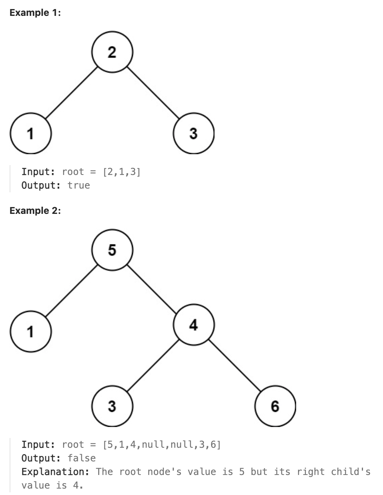

# 98.Validate Binary Search Tree

## LeetCode 题目链接

[98.验证二叉搜索树](https://leetcode.cn/problems/validate-binary-search-tree/)

## 题目大意

给一个二叉树的根节点 `root`，判断其是否是一个有效的二叉搜索树

有效二叉搜索树定义如下：
- 节点的左子树只包含`小于`当前节点的数
- 节点的右子树只包含`大于`当前节点的数
- 所有左子树和右子树自身必须也是二叉搜索树



限制:
- The number of nodes in the tree is in the range [1, 10^4].
- -2^31 <= Node.val <= 2^31 - 1

## 解题

### 思路 1: 递归

```js
// 写法 1
var isValidBST = function(root) {
    const traverse = function(root, min, max) {
        if (root == null) return true;
        if (min != null && root.val <= min.val) return false;
        if (max != null && root.val >= max.val) return false;
        // 限定左子树的最大值是 root.val，右子树的最小值是 root.val
        return traverse(root.left, min, root) && traverse(root.right, root, max);
    };
    return traverse(root, null, null);
};

// 写法 2
var isValidBST = function(root) {
    let prev = -Infinity;  // 将 prev 放在函数作用域内
    const validate = function(node) {
        if (node === null) return true;
        if (!validate(node.left)) return false;
        if (node.val <= prev) return false;
        
        prev = node.val;
        return validate(node.right);
    };
    return validate(root);
};
```
```python
# 写法 1
class Solution:
    def isValidBST(self, root: Optional[TreeNode]) -> bool:
        return self.traverse(root, None, None)
    
    def traverse(self, root, min, max):
        if not root:
            return True
        
        if min and root.val <= min.val:
            return False
        
        if max and root.val >= max.val:
            return False
        
        return self.traverse(root.left, min, root) and self.traverse(root.right, root, max)

# 写法 2
# 使用中序遍历
class Solution:
    def isValidBST(self, root: Optional[TreeNode]) -> bool:
        # 初始化一个成员变量 prev，记录前一个访问的节点值
        self.prev = float("-inf")
        return self.validate(root)
    
    def validate(self, node):
        if not node:
            return True
        
        # 递归检查左子树是否是合法的二叉搜索树
        if not self.validate(node.left):
            return False
        
        # 如果当前节点的值小于等于前一个访问的节点值，则不合法
        if node.val <= self.prev:
            return False
            
        # 更新 prev 为当前节点的值
        self.prev = node.val

        # 递归检查右子树是否是合法的二叉搜索树
        return self.validate(node.right)
```

- 时间复杂度：`O(n)`，其中 `n` 是树中的节点数
- 空间复杂度：  
  - 最坏情况：`O(n)`（树退化为链表）
  - 最好情况：`O(log n)`（树是平衡的）

### 思路 2: 迭代

中序遍历性质：
- 中序遍历（In-order Traversal）是按照左子树 -> 当前节点 -> 右子树的顺序遍历所有节点
- 对于合法的二叉搜索树，其中序遍历得到的节点值序列一定是递增的

利用中序遍历验证 `BST`：
- 在中序遍历的过程中，当前节点的值一定大于前一个节点的值
- 所以，使用中序遍历的方法遍历二叉树，并检查每个节点的值是否比之前的节点值大，即可判断二叉树是否为合法的 `BST`

```js
var isValidBST = function(root) {
    if (root == null) return true;
    let stack = [];
    let pre = null;
    while (root != null || stack.length) {
        while (root != null) {
            stack.push(root);
            root = root.left;
        }
        let cur = stack.pop();
        if (pre != null && cur.val <= pre.val) return false;
        pre = cur;
        root = cur.right;
    }
    
    return true;
};
```
```python
class Solution:
    def isValidBST(self, root: Optional[TreeNode]) -> bool:
        if not root:
            return True
        
        stack = []
        pre = None

        while root or stack:
            while root:
                stack.append(root)
                root = root.left
            
            cur = stack.pop()
            if pre and cur.val <= pre.val:
                return False
            
            pre = cur
            root = cur.right
        
        return True
```

- 时间复杂度：`O(n)`，因为每个节点访问一次
- 空间复杂度：
  - 最坏情况：`O(n)`（树退化为链表）
  - 最好情况：`O(log n)`（树是完全平衡的）