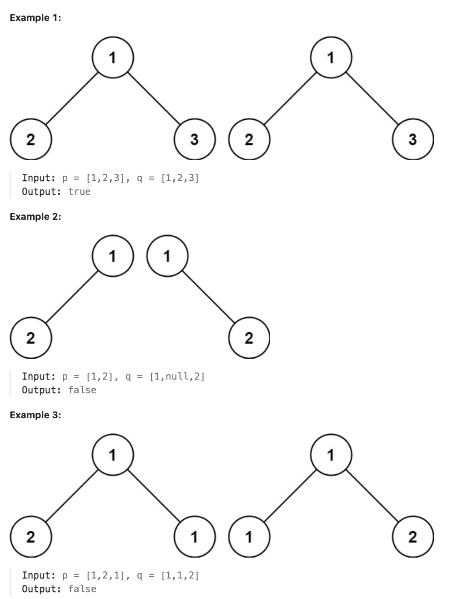

# 100.Same Tree

## LeetCode 题目链接

[100.相同的树](https://leetcode.cn/problems/same-tree/)

## 题目大意

给定一个二叉树的根节点 `root`，返回它的`中序`遍历



限制:
- The number of nodes in both trees is in the range [0, 100].
- -10^4 <= Node.val <= 10^4

## 解题

先判断两棵树的根节点是否相同，然后再递归地判断左右子树是否相同

```js
var isSameTree = function(p, q) {
    if (p == null && q == null) return true;
    if (p == null || q == null) return false;
    if (p.val != q.val) return false;
    return isSameTree(p.left, q.left) && isSameTree(p.right, q.right);
};
```
```python
class Solution:
    def isSameTree(self, p: Optional[TreeNode], q: Optional[TreeNode]) -> bool:
        if not p and not q:
            return True

        if not p or not q:
            return False
        
        if p.val != q.val:
            return False
        
        return self.isSameTree(p.left, q.left) and self.isSameTree(p.right, q.right)
```

- 时间复杂度：`O(min(m, n))`，其中 `m`、`n` 分别为两棵树中的节点数量
- 空间复杂度：`O(min(m, n))`