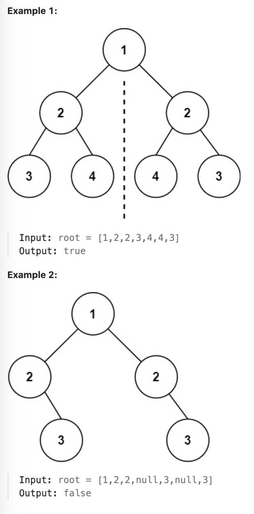

# 101.Symmetric Tree

## LeetCode 题目链接

[101.对称二叉树](https://leetcode.cn/problems/symmetric-tree/)

## 题目大意

给一个二叉树的根节点 `root`， 检查它是否轴对称



限制:
- The number of nodes in the tree is in the range [1, 1000].
- -100 <= Node.val <= 100

## 解题

### 思路 1: DFS

```js
// 写法 1
var isSymmetric = function(root) {
    if (root === null) return true;
    // 定义：判断输入的两棵树是否是镜像对称的
    const check = function(left, right) {
        if (left === null || right === null) return left === right;
        // 两个根节点需要相同
        if (left.val !== right.val) return false;
        // 左右子树也需要镜像对称
        return check(left.right, right.left) && check(left.left, right.right);
    }
    
    // 检查两棵子树是否对称
    return check(root.left, root.right);
};

// 写法 2
var isSymmetric = function(root) {
    if (root == null) return true;
    return check(root.left, root.right);
};

var check = function(left, right) {
    if (left == null && right == null) {
        return true;
    } else if (left == null || right == null) {
        return false;
    } else if (left.val != right.val) {
        return false;
    }
    
    return check(left.right, right.left) && check(left.left, right.right);
};
```
```python
# 写法 1
class Solution:
    def isSymmetric(self, root: Optional[TreeNode]) -> bool:
        if not root:
            return True
        return self.check(root.left, root.right)

    def check(self, left, right):
        if left is None or right is None :
            return left == right
        # 两个根节点需要相同
        if left.val != right.val:
            return False
        # 左右子树也需要镜像对称
        return self.check(left.right, right.left) and self.check(left.left, right.right)

# 写法 2
class Solution:
    def isSymmetric(self, root: Optional[TreeNode]) -> bool:
        if not root:
            return True
        return self.check(root.left, root.right)
    
    def check(self, left, right):
        if left is None and right is None:
            return True
        elif left is None or right is None:
            return False
        elif left.val != right.val:
            return False
            
        return self.check(left.right, right.left) and self.check(left.left, right.right)
```

- 时间复杂度：`O(n)`，其中 `n` 是二叉树的节点数目
- 空间复杂度：`O(n)`，递归函数需要用到栈空间，栈空间取决于递归深度，最坏情况下递归深度为 `n`

### 思路 2: 迭代

```js
var isSymmetric = function(root) {
    // 迭代方法判断是否是对称二叉树
    // 首先判断root是否为空
    if(root === null) return true;
    let que = [];
    que.push(root.left);
    que.push(root.right);
    while (que.length) {
        let leftNode = que.shift();    //左节点
        let rightNode = que.shift();   //右节点
        if (leftNode === null && rightNode === null) continue;
        if (leftNode === null || rightNode === null || leftNode.val !== rightNode.val) {
            return false;
        }
        que.push(leftNode.left);     //左节点左孩子入队
        que.push(rightNode.right);   //右节点右孩子入队
        que.push(leftNode.right);    //左节点右孩子入队
        que.push(rightNode.left);    //右节点左孩子入队
    }
    return true;
};
```
```python
# 写法 1
class Solution:
    def isSymmetric(self, root: Optional[TreeNode]) -> bool:
        if not root:
            return True
        stack = [] #这里改成了栈
        stack.append(root.left)
        stack.append(root.right)
        while stack:
            rightNode = stack.pop()
            leftNode = stack.pop()
            if not leftNode and not rightNode:
                continue
            if not leftNode or not rightNode or leftNode.val != rightNode.val:
                return False
            stack.append(leftNode.left)
            stack.append(rightNode.right)
            stack.append(leftNode.right)
            stack.append(rightNode.left)
        return True

# 写法 2
class Solution:
    def isSymmetric(self, root: Optional[TreeNode]) -> bool:
        if not root:
            return True
        
        que = collections.deque([root.left, root.right])
        while que:
            levelSize = len(que)
            
            if levelSize % 2 != 0:
                return False
            
            levelVal = []
            for i in range(levelSize):
                node = que.popleft()
                if node:
                    levelVal.append(node.val)
                    que.append(node.left)
                    que.append(node.right)
                else:
                    levelVal.append(None)
                    
            if levelVal != levelVal[::-1]:
                return False
        
        return True
```

