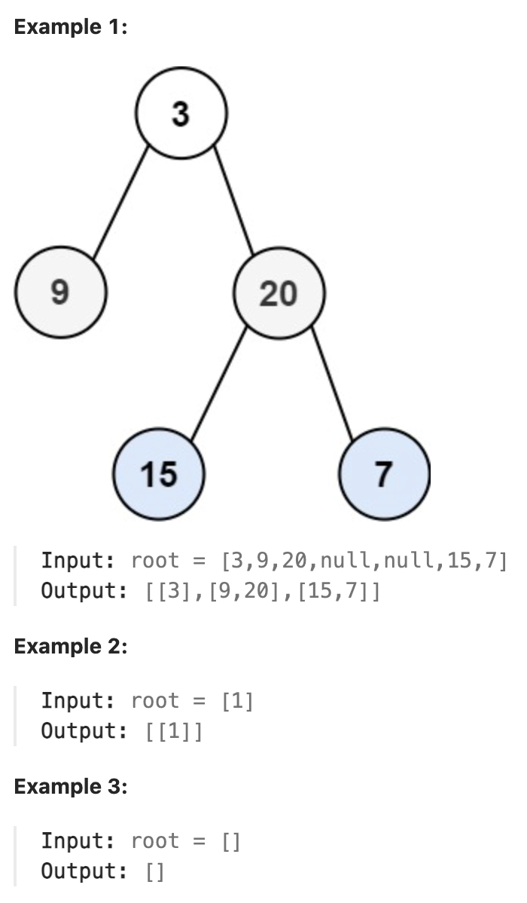

# 102.Binary Tree Level Order Traversal

## LeetCode 题目链接

[102.二叉树的层序遍历](https://leetcode.cn/problems/binary-tree-level-order-traversal/)

## 题目大意

给你二叉树的根节点 `root`，返回其节点值的层序遍历（即逐层地，从左到右访问所有节点）



限制:
- The number of nodes in the tree is in the range [0, 2000].
- -1000 <= Node.val <= 1000

## 解题

### 思路 1: 层次遍历

```js
var levelOrder = function(root) {
    let res = [];
    if (root == null) return res;
    let que = [root];
    while (que.length) {
        let size = que.length;
        let nodeList = [];
         while (size-- > 0) {
            let cur = que.shift();
            nodeList.push(cur.val);
            if (cur.left != null) que.push(cur.left);
            if (cur.right != null) que.push(cur.right);
        }
        res.push(nodeList);
    }
    return res;
};
```
```python
class Solution:
    def levelOrder(self, root: Optional[TreeNode]) -> List[List[int]]:
        res = []
        if not root:
            return res
        que = collections.deque([root])

        while que:
            size = len(que)
            nodeList = []
            for i in range(size):
                cur = que.popleft()
                nodeList.append(cur.val)
                if cur.left:
                    que.append(cur.left)
                if cur.right:
                    que.append(cur.right)
            
            res.append(nodeList)
        
        return res
```

- 时间复杂度：`O(n)`，`n` 是二叉树的节点数目
- 空间复杂度：`O(n)`

### 思路 2: 递归

```js
var levelOrder = function(root) {
    let res = [];
    traverse(root, 0, res);
    return res;
};

var traverse = function(root, depth, res) {
    if (root == null) return;
    if (res.length == depth) res.push([]);
    res[depth].push(root.val);
    
    traverse(root.left, depth+1, res);
    traverse(root.right, depth+1, res);
};
```
```python
class Solution:
    def levelOrder(self, root: Optional[TreeNode]) -> List[List[int]]:
        res = []
        self.traverse(root, 0, res)
        return res
    
    def traverse(self, root, depth, res):
        if not root:
            return
        
        # 若 res 的长度等于 depth，说明还没有创建当前深度（层）对应的列表
        # 因此需在 res 中新增一个空列表，表示当前层
        if len(res) == depth:
            res.append([])
        
        res[depth].append(root.val)
        self.traverse(root.left, depth+1, res)
        self.traverse(root.right, depth+1, res)
```

- 时间复杂度：`O(n)`，其中 `n` 是二叉树的节点数，每个节点处理一次
- 空间复杂度：`O(n)`
  - 总的空间复杂度由递归堆栈使用的空间与结果列表使用的空间中的最大值决定
  - 在最坏的情况下（倾斜树），这简化为 `O(n)`；在平衡树中，这简化为 `O(n + log n)`，这仍然是 `O(n)`