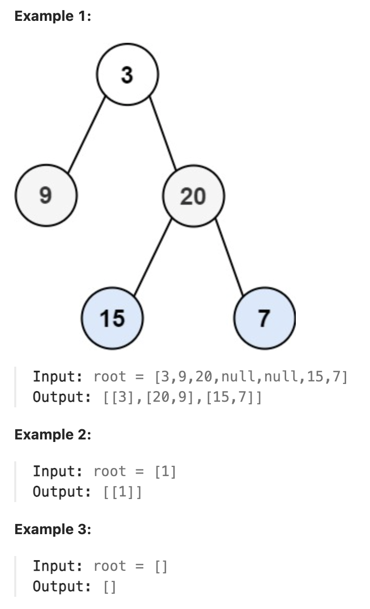

# 103.Binary Tree Zigzag Level Order Traversal

## LeetCode 题目链接

[103.二叉树的锯齿形层序遍历](https://leetcode.cn/problems/binary-tree-zigzag-level-order-traversal/)

## 题目大意

给你二叉树的根节点 `root`，返回其节点值的锯齿形层序遍历（即先从左往右，再从右往左进行下一层遍历，以此类推，层与层之间交替进行）



限制:
- The number of nodes in the tree is in the range [0, 2000].
- -100 <= Node.val <= 100

## 解题

可以使用`BFS`的方式来解决这个问题，类似于普通的层序遍历。唯一的区别是需交替改变每一层的遍历顺序
- 使用一个队列来存储当前层的节点
- 使用一个布尔变量来标识当前层是从左到右遍历还是从右到左遍历
- 对每一层，弹出当前层的所有节点，并根据标识决定是将它们从左到右还是从右到左加入结果列表

```js
var zigzagLevelOrder = function(root) {
    if (root == null) return []
    const res = [];
    const que = [root];
    let leftToRight = true;  // 标志层的遍历方向
    while (que.length) {
        const levelSize = que.length;
        const curLevel = [];
        for (let i = 0; i < levelSize; i++) {
            const curNode = que.shift();
            if (leftToRight) {
                curLevel.push(curNode.val);  // 从右端添加元素
            } else {
                curLevel.unshift(curNode.val);  // 从左端添加元素
            }
            if (curNode.left) que.push(curNode.left);
            if (curNode.right) que.push(curNode.right);
        }
        res.push(curLevel);
        leftToRight = !leftToRight;  // 反转遍历方向
    }

    return res;
};
```
```python
class Solution:
    def zigzagLevelOrder(self, root: Optional[TreeNode]) -> List[List[int]]:
        if not root:
            return []
        
        res = []
        # 这是一个布尔变量，表示当前层的遍历方向。如果为 True，表示从左到右遍历；如果为 False，表示从右到左遍历
        # 每一层遍历结束后，这个变量会取反，控制下一层的遍历方向
        leftToRight = True
        # 使用一个双端队列（deque），初始时队列中只有根节点。队列用于在广度优先搜索（BFS）过程中存储当前层的节点
        que = deque([root])

        while que:
            levelSize = len(que)
            # 使用 deque 是因为可能需要从两端插入元素，以支持从右到左的遍历方式
            curLevel = deque()

            for i in range(levelSize):
                # 从队列的左端弹出一个节点，表示我们正在处理当前层的一个节点
                # popleft() 是 O(1) 操作
                curNode = que.popleft()
                # 从左到右遍历，所以将节点的值直接添加到 curLevel 的右端（使用 append()）
                if leftToRight:
                    curLevel.append(curNode.val)
                else:
                    # 从右到左遍历，所以将节点的值添加到 curLevel 的左端（使用 appendleft()），实现反向插入
                    curLevel.appendleft(curNode.val)

                # 这样的插入顺序不会影响到遍历的方向
                # 在遍历时，遍历方向由 leftToRight 标志决定，而不是由子节点加入队列的顺序决定
                if curNode.left:
                    que.append(curNode.left)

                if curNode.right:
                    que.append(curNode.right)
            
            res.append(list(curLevel))
            # 每遍历完一层后，将 leftToRight 取反，确保下一层是反方向遍历
            leftToRight = not leftToRight
        
        return res
```

- 时间复杂度：`O(n)`，`n` 是树中的节点数，需要访问每个节点一次
- 空间复杂度：`O(w)`，`w` 是树的最大宽度
  - 在最坏情况下，队列可能需要存储树的最宽层的所有节点
  - 对于一个完全二叉树，最后一层可能包含 `n/2` 个节点，因此空间复杂度可以近似为 `O(n)`