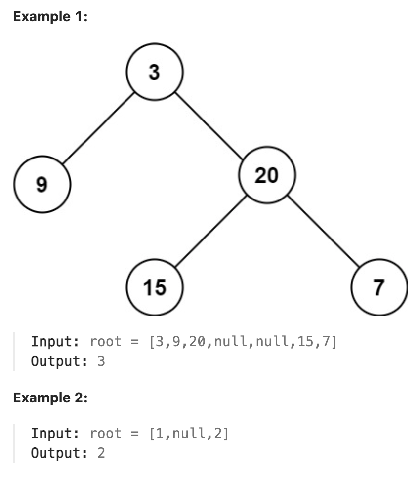

# 104.Maximum Depth of Binary Tree 

## LeetCode 题目链接

[104.二叉树的最大深度](https://leetcode.cn/problems/maximum-depth-of-binary-tree/)

## 题目大意

给定一个二叉树 `root`，返回其最大深度

二叉树的`最大深度`是指从根节点到最远叶子节点的最长路径上的节点数



限制:
- The number of nodes in the tree is in the range [0, 10^4].
- -100 <= Node.val <= 100

## 解题

### 思路 1: 层次遍历

使用迭代法的话，使用层序遍历是最为合适的，因为最大的深度就是二叉树的层数，和层序遍历的方式极其吻合

```js
var maxDepth = function(root) {
    if (root == null) return 0;
    let que = [root];
    let depth = 0;
    while (que.length) {
        let size = que.length;
        while (size-- > 0) {
            let cur = que.shift();
            if (cur.left) que.push(cur.left);
            if (cur.right) que.push(cur.right);
        }
        depth++;
    }
    return depth;
};
```
```python
class Solution:
    def maxDepth(self, root: Optional[TreeNode]) -> int:
        if not root:
            return 0

        que = collections.deque([root])
        depth = 0

        while que:
            size = len(que)
            for _ in range(size):
                cur = que.popleft()
                if cur.left:
                    que.append(cur.left)

                if cur.right:
                    que.append(cur.right)
            
            depth += 1
        
        return depth
```

- 时间复杂度：`O(n)`
- 空间复杂度：`O(n)`

### 思路 2: 递归

```js
// 写法 1：回溯算法思路
var maxDepth = function(root) {
    let depth = 0;
    let res = 0;

    const traverse = function(root) {
        if (root == null) return;
        // 前序遍历位置
        depth++;
        // 遍历的过程中记录最大深度
        res = Math.max(res, depth);
        traverse(root.left);
        traverse(root.right);
        // 后序遍历位置
        depth--;
    };

    traverse(root);
    return res;
};

// 写法 2：动态规划思路
var maxDepth = function(root) {
    if (root == null) return 0;
    let leftMax = maxDepth(root.left);
    let rightMax = maxDepth(root.right);
    return Math.max(leftMax, rightMax) + 1;
};
```
```python
# 写法 1：回溯算法思路
class Solution:
    def __init__(self):
        self.depth = 0
        self.res = 0

    def maxDepth(self, root: Optional[TreeNode]) -> int:
        self.traverse(root)
        return self.res
    
    def traverse(self, root):
        if root is None:
            return

        # 前序遍历位置
        self.depth += 1
        # 遍历的过程中记录最大深度
        self.res = max(self.res, self.depth)
        self.traverse(root.left)
        self.traverse(root.right)
        
        # 后序遍历位置
        self.depth -= 1

# 写法 2：动态规划思路
class Solution:
    def maxDepth(self, root: Optional[TreeNode]) -> int:
        if root is None:
            return 0

        leftMax = self.maxDepth(root.left)
        rightMax = self.maxDepth(root.right)
        
        return max(leftMax, rightMax) + 1
```

- 时间复杂度：`O(n)`
- 空间复杂度：
  - 写法 1：最坏情况(链状树) `O(n)`，平均情况(平衡树) `O(logn)`
  - 写法 2：`O(n)`，递归函数需要用到栈空间，栈空间取决于递归深度，最坏情况下递归深度为 `n`，所以空间复杂度为 `(n)`