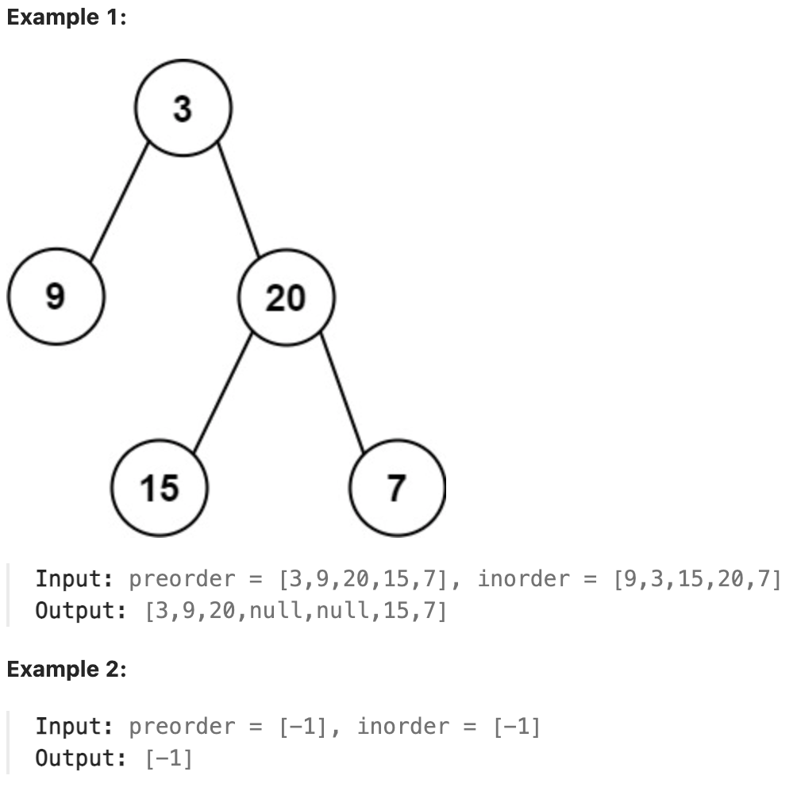

# 105.Construct Binary Tree from Preorder and Inorder Traversal

## LeetCode 题目链接

[105.从前序与中序遍历序列构造二叉树](https://leetcode.cn/problems/construct-binary-tree-from-preorder-and-inorder-traversal/)

## 题目大意

给定两个整数数组 `preorder` 和 `inorder`，其中 `preorder` 是二叉树的先序遍历，`inorder` 是同一棵树的中序遍历，请构造二叉树并返回其根节点



限制:
- 1 <= preorder.length <= 3000
- inorder.length == preorder.length
- -3000 <= preorder[i], inorder[i] <= 3000
- preorder and inorder consist of unique values.
- Each value of inorder also appears in preorder.
- preorder is guaranteed to be the preorder traversal of the tree.
- inorder is guaranteed to be the inorder traversal of the tree.

## 解题

前序遍历结果第一个就是根节点的值，然后再根据中序遍历结果确定左右子树的节点

```js
var buildTree = function(preorder, inorder) {
    let valToIndex = new Map();
    for (let i = 0; i < inorder.length; i++) {
        valToIndex.set(inorder[i], i);
    }
    const build = function(preorder, preStart, preEnd, inorder, inStart, inEnd) {
        if (preStart > preEnd || inStart > inEnd) return null;
        let rootVal = preorder[preStart];
        let index = valToIndex.get(rootVal);
        let leftSize = index - inStart;
        let root = new TreeNode(rootVal);
        root.left = build(preorder, preStart + 1, preStart + leftSize, inorder, inStart, index - 1);
        root.right = build(preorder, preStart + leftSize + 1, preEnd, inorder, index + 1, inEnd);
        return root;
    };
    return build(preorder, 0, preorder.length - 1, inorder, 0, inorder.length - 1);
};
```
```python
# Definition for a binary tree node.
# class TreeNode:
#     def __init__(self, val=0, left=None, right=None):
#         self.val = val
#         self.left = left
#         self.right = right
class Solution:
    def buildTree(self, preorder: List[int], inorder: List[int]) -> Optional[TreeNode]:
        self.valToIndex = {}
        for i in range(len(inorder)):
            self.valToIndex[inorder[i]] = i
        
        return self.build(preorder, 0, len(preorder) - 1, inorder, 0, len(inorder) - 1)
    
    def build(self, preorder, preStart, preEnd, inorder, inStart, inEnd):
        if preStart > preEnd or inStart > inEnd:
            return None
        
        rootVal = preorder[preStart]
        index = self.valToIndex[rootVal]
        leftSize = index - inStart
        root = TreeNode(rootVal)
        root.left = self.build(preorder, preStart+1, preStart+leftSize, inorder, inStart, index - 1)
        root.right = self.build(preorder, preStart+leftSize+1, preEnd, inorder, index+1, preEnd)

        return root
```

- 时间复杂度：`O(n)`，因为每个节点只会被访问一次，且哈希查找操作是 `O(1)` 
- 空间复杂度：`O(n)`，包括哈希表存储和递归栈空间
