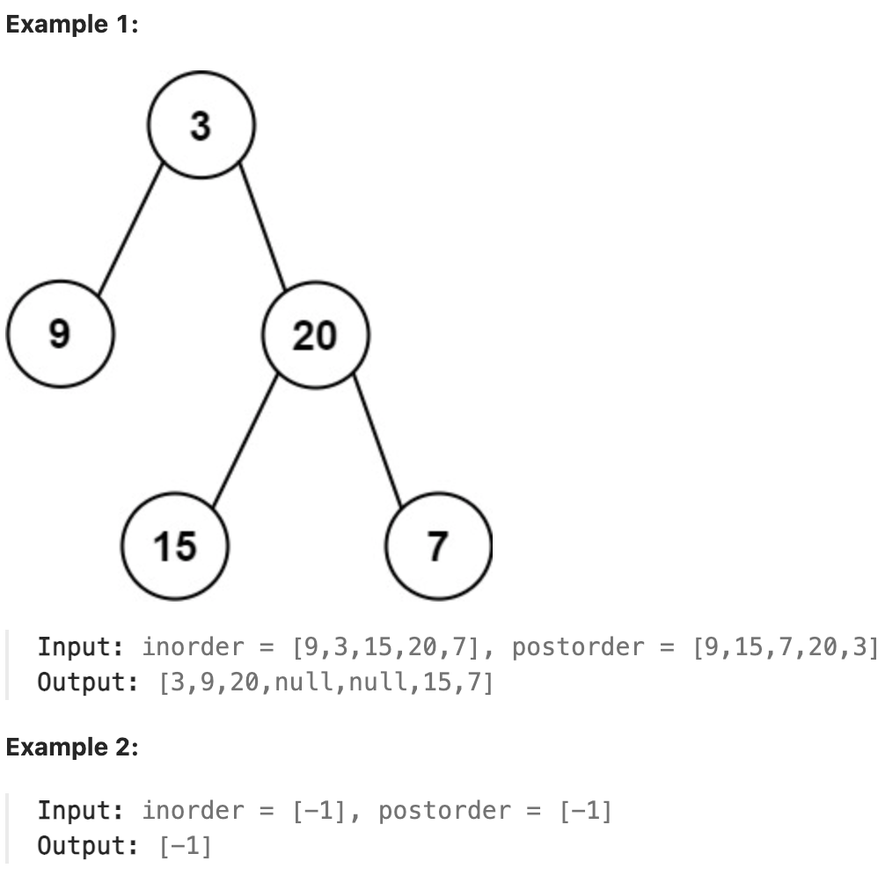

# 106.Construct Binary Tree from Inorder and Postorder Traversal

## LeetCode 题目链接

[106.从中序与后序遍历序列构造二叉树](https://leetcode.cn/problems/construct-binary-tree-from-inorder-and-postorder-traversal/)

## 题目大意

给定两个整数数组 `inorder` 和 `postorder`，其中 `inorder` 是二叉树的中序遍历，`postorder` 是同一棵树的后序遍历，请构造并返回这颗 二叉树 



限制:
- 1 <= inorder.length <= 3000
- postorder.length == inorder.length
- -3000 <= inorder[i], postorder[i] <= 3000
- inorder and postorder consist of unique values.
- Each value of postorder also appears in inorder.
- inorder is guaranteed to be the inorder traversal of the tree.
- postorder is guaranteed to be the postorder traversal of the tree.

## 解题

构造二叉树，第一件事一定是找根节点，然后想办法构造左右子树

### 思路 1: 递归

```js
var buildTree = function(inorder, postorder) {
    let valToIndex = new Map();
    for (let i = 0; i < inorder.length; i++) {
        valToIndex.set(inorder[i], i);
    }

    const build = function(inorder, inStart, inEnd, postorder, postStart, postEnd) {
        if (inStart > inEnd) return null;
        let rootVal = postorder[postEnd];
        let index = valToIndex.get(rootVal);
        let leftSize = index - inStart;
        let root = new TreeNode(rootVal);
        root.left = build(inorder, inStart, index - 1, postorder, postStart, postStart + leftSize - 1);
        root.right = build(inorder, index + 1, inEnd, postorder, postStart + leftSize, postEnd - 1);
        return root;
    };

    return build(inorder, 0, inorder.length - 1, postorder, 0, postorder.length - 1);
};
```
```python
class Solution:
    def buildTree(self, inorder: List[int], postorder: List[int]) -> Optional[TreeNode]:
        self.val_to_index = {}
        for i in range(len(inorder)):
            self.val_to_index[inorder[i]] = i
        return self.build(inorder, 0, len(inorder) - 1, postorder, 0, len(postorder) - 1)

    def build(self, inorder, in_start, in_end, postorder, post_start, post_end):
        if in_start > in_end:
            return None
        # root 节点对应的值就是后序遍历数组的最后一个元素
        root_val = postorder[post_end]
        # rootVal 在中序遍历数组中的索引
        index = self.val_to_index[root_val]
        # 左子树的节点个数
        left_size = index - in_start
        root = TreeNode(root_val) 

        # 递归构造左右子树
        root.left = self.build(inorder, in_start, index - 1, postorder, post_start, post_start + left_size - 1)
        root.right = self.build(inorder, index + 1, in_end, postorder, post_start + left_size, post_end - 1)

        return root
```

- 时间复杂度：`O(n)`，其中 `n` 是树中的节点个数
- 空间复杂度：`O(n)`，需要使用 `O(n)` 的空间存储哈希表，以及 `O(h)`（`h` 是树的高度）的空间表示递归时栈空间。这里 `h<n`，所以总空间复杂度为 `O(n)`

### 思路 2: 迭代

迭代法是一种非常巧妙的实现方法，迭代法的实现基于以下两点发现
- 如果将中序遍历反序，则得到反向的中序遍历，即每次遍历右孩子，再遍历根节点，最后遍历左孩子
- 如果将后序遍历反序，则得到反向的前序遍历，即每次遍历根节点，再遍历右孩子，最后遍历左孩子
  
「反向」的意思是交换遍历左孩子和右孩子的顺序，即反向的遍历中，右孩子在左孩子之前被遍历

算法流程：
- 用一个栈和一个指针辅助进行二叉树的构造。初始时栈中存放了根节点（后序遍历的最后一个节点），指针指向中序遍历的最后一个节点
- 依次枚举后序遍历中除了第一个节点以外的每个节点。如果 `index` 恰好指向栈顶节点，不断地弹出栈顶节点并向左移动 `index`，并将当前节点作为最后一个弹出的节点的左儿子；如果 `index` 和栈顶节点不同，我们将当前节点作为栈顶节点的右儿子
- 无论是哪一种情况，我们最后都将当前的节点入栈

最后得到的二叉树即为答案

```js
var buildTree = function(inorder, postorder) {
    if (postorder.length == 0) return null;
    
    const root = new TreeNode(postorder[postorder.length - 1]);
    const stack = [];
    stack.push(root);
    let inorderIndex = inorder.length - 1;
    for (let i = postorder.length - 2; i >= 0; i--) {
        let postorderVal = postorder[i];
        let node = stack[stack.length - 1];
        if (node.val !== inorder[inorderIndex]) {
            node.right = new TreeNode(postorderVal);
            stack.push(node.right);
        } else {
            while (stack.length && stack[stack.length - 1].val === inorder[inorderIndex]) {
                node = stack.pop();
                inorderIndex--;
            }
            node.left = new TreeNode(postorderVal);
            stack.push(node.left);
        }
    }
    return root;
};
```
```python
class Solution:
    def buildTree(self, inorder: List[int], postorder: List[int]) -> Optional[TreeNode]:
        if not postorder:
            return None

        root = TreeNode(postorder[-1])
        stack = [root]
        inorder_index = len(inorder) - 1

        for i in range(len(postorder) - 2, -1, -1):
            postorder_val = postorder[i]
            node = stack[-1]

            if node.val != inorder[inorder_index]:
                node.right = TreeNode(postorder_val)
                stack.append(node.right)
            else:
                while stack and stack[-1].val == inorder[inorder_index]:
                    node = stack.pop()
                    inorder_index -= 1
                node.left = TreeNode(postorder_val)
                stack.append(node.left)

        return root
```

- 时间复杂度：`O(n)`，其中 `n` 是树中的节点个数
- 空间复杂度：`O(n)`，需使用 `O(h)`（`h` 是树的高度）的空间存储栈，这里 `h<n`，所以（在最坏情况下）总空间复杂度为 `O(n)`

