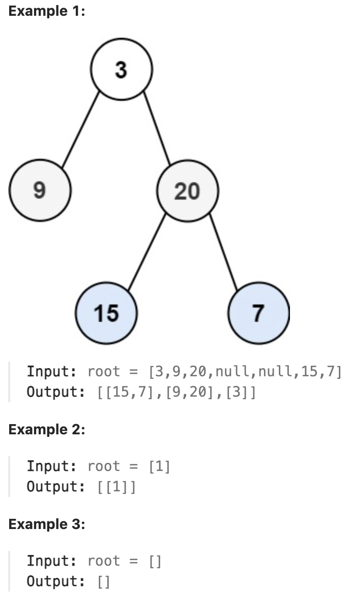

# 107.Binary Tree Level Order Traversal II 

## LeetCode 题目链接

[107.二叉树的层序遍历 II](https://leetcode.cn/problems/binary-tree-level-order-traversal-ii/)

## 题目大意

给二叉树的根节点 `root`，返回其节点值`自底向上`的层序遍历（即按从叶子节点所在层到根节点所在的层，逐层从左向右遍历）



限制：
- The number of nodes in the tree is in the range [0, 2000]
- -1000 <= Node.val <= 1000

## 解题

先得到层次遍历的节点顺序，再将其进行反转返回即可

```js
var levelOrderBottom = function(root) {
    let res = [];
    if (root == null) return res;
    let que = [];
    que.push(root);
    while (que.length) {
        let size = que.length;
        let nodeList = [];
        for (let i = 0; i < size; i++) {
            let cur = que.shift();
            nodeList.push(cur.val);
            if (cur.left) que.push(cur.left);
            if (cur.right) que.push(cur.right);
        }
        res.unshift(nodeList);
    }
    return res;
};
```
```python
# 写法 1
# res 使用 deque，直接使用appendleft加入到头部，返回list(res)
class Solution:
    def levelOrderBottom(self, root: Optional[TreeNode]) -> List[List[int]]:
        res = deque()
        if root is None:
            return list(res)

        que = deque([root])
        # while 循环控制从上向下一层层遍历
        while que:
            size = len(que)
            # 记录这一层的节点值
            nodeList = []
            # for 循环控制每一层从左向右遍历
            for _ in range(size):
                cur = que.popleft()
                nodeList.append(cur.val)
                if cur.left:
                    que.append(cur.left)
                if cur.right:
                    que.append(cur.right)
            # 把每一层添加到头部，就是自底向上的层序遍历。
            res.appendleft(nodeList)
        
        return list(res)

# 写法 2
# res 使用 []，先添加再反转
class Solution:
    def levelOrderBottom(self, root: Optional[TreeNode]) -> List[List[int]]:
        res = []
        if root is None:
            return res

        que = deque([root])
        # while 循环控制从上向下一层层遍历
        while que:
            size = len(que)
            # 记录这一层的节点值
            nodeList = []
            # for 循环控制每一层从左向右遍历
            for _ in range(size):
                cur = que.popleft()
                nodeList.append(cur.val)
                if cur.left:
                    que.append(cur.left)
                if cur.right:
                    que.append(cur.right)

            res.append(nodeList)
            
        return res[::-1]
```

- 时间复杂度：`O(n)`
  - 遍历节点：遍历了每个节点一次，而每个节点在遍历时进行基本的操作（如访问节点的值、添加子节点到队列等），设二叉树的节点总数为 `n`，则遍历所有节点的时间复杂度为 `O(n)`
  - 层次遍历：每层的节点会被从队列中弹出，然后其子节点会被加入队列且每层的节点都会被记录到 `nodeList` 中，因为每个节点只处理一次，整个遍历的时间还是 `O(n)`
- 空间复杂度：`O(n)`
  - 在最坏的情况下（完全二叉树），队列 `que` 在遍历树的最底层时会持有最多的节点数，这个数量大约为 `O(n)`，因为最底层的节点数接近 `n/2`
  - `res` 存储的是每一层的节点值。因为总共有 `n` 个节点，所以 `res` 的存储需求也是 `O(n)`
  - `nodeList` 在每层的遍历时用于临时存储当前层的节点值，最大也不会超过队列的最大节点数，仍然是 `O(n)`