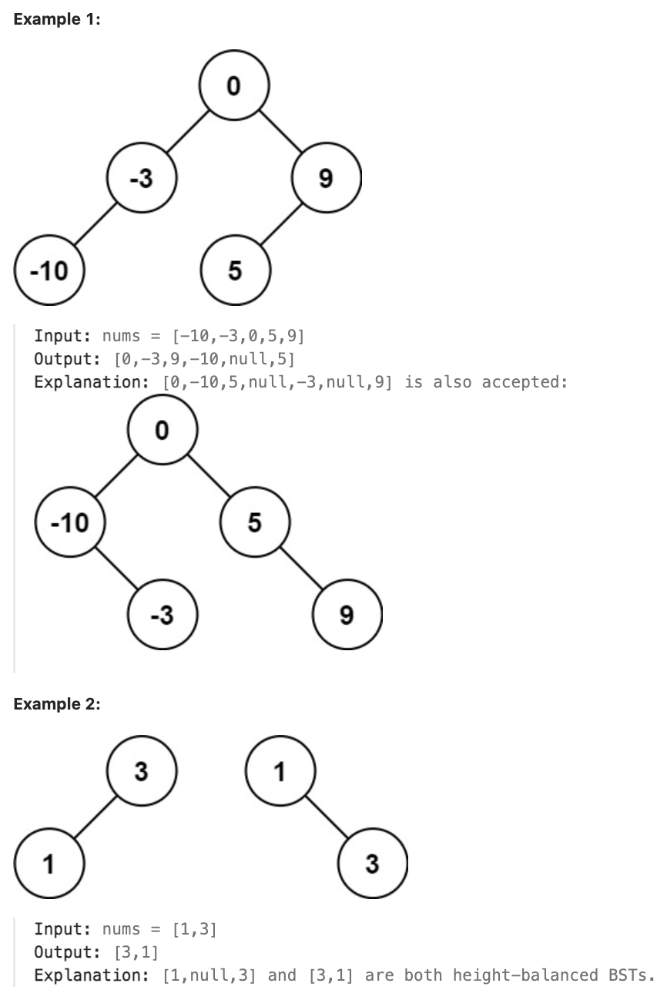

# 108.Convert Sorted Array to Binary Search Tree 

## LeetCode 题目链接

[108.将有序数组转换为二叉搜索树](https://leetcode.cn/problems/convert-sorted-array-to-binary-search-tree/)

## 题目大意

给一个整数数组 `nums`，其中元素已经按`升序`排列，请将其转换为一棵平衡二叉搜索树



限制：
- 1 <= nums.length <= 10^4
- -10^4 <= nums[i] <= 10^4
- nums is sorted in a strictly increasing order.

## 解题

二叉树的构建问题遵循固定的套路，构造整棵树可以分解成：先构造根节点，再构建左右子树

一个有序数组对于 `BST` 来说就是`中序遍历`的结果，根节点在数组中心，数组左侧是左子树元素，右侧是右子树元素

### 思路 1: 递归

```js
var sortedArrayToBST = function(nums) {
    return build(nums, 0, nums.length - 1);
};

var build = function(nums, left, right) {
    if (left > right) return null;
    let mid = left + Math.floor((right - left) / 2);
    let root = new TreeNode(nums[mid]);
    root.left = build(nums, left, mid - 1);
    root.right = build(nums, mid + 1, right);
    return root;
};
```
```python
class Solution:
    def sortedArrayToBST(self, nums: List[int]) -> Optional[TreeNode]:
        return self.build(nums, 0, len(nums) - 1)
    
    def build(self, nums, left, right):
        if left > right:
            return None
        
        mid = left + (right - left) // 2
        root = TreeNode(nums[mid])
        root.left = self.build(nums, left, mid - 1)
        root.right = self.build(nums, mid + 1, right)
        
        return root
```

- 时间复杂度：`O(n)`，其中 `n` 是数组的长度，遍历了数组中的每个元素一次
- 空间复杂度：`O(logn)`，因为递归调用栈的深度是平衡二叉树的高度

### 思路 2: 迭代

```python
class Solution:
    def sortedArrayToBST(self, nums: List[int]) -> Optional[TreeNode]:
        if len(nums) == 0:
            return None
        
        root = TreeNode(0)  # 初始根节点
        nodeQue = deque()   # 存放遍历的节点
        leftQue = deque()   # 保存左区间下标
        rightQue = deque()  # 保存右区间下标

        nodeQue.append(root)               # 根节点入队列
        leftQue.append(0)                  # 0为左区间下标初始位置
        rightQue.append(len(nums) - 1)     # len(nums) - 1为右区间下标初始位置

        while nodeQue:
            cur = nodeQue.popleft()
            left = leftQue.popleft()
            right = rightQue.popleft()

            # 计算当前区间的中间索引 mid，并将 nums[mid] 赋值给当前节点 cur 的值。这样保证了树的平衡性，因为总是选择中间值作为节点
            mid = left + (right - left) // 2
            cur.val = nums[mid]  # 将mid对应的元素给中间节点

            if left <= mid - 1:  # 处理左区间
                cur.left = TreeNode(0)
                nodeQue.append(cur.left)
                leftQue.append(left)
                rightQue.append(mid - 1)

            if right >= mid + 1:  # 处理右区间
                cur.right = TreeNode(0)
                nodeQue.append(cur.right)
                leftQue.append(mid + 1)
                rightQue.append(right)
        
        return root
```

- 时间复杂度：`O(n)`，每个元素都只访问一次
- 空间复杂度：`O(n)`，队列和树节点的存储