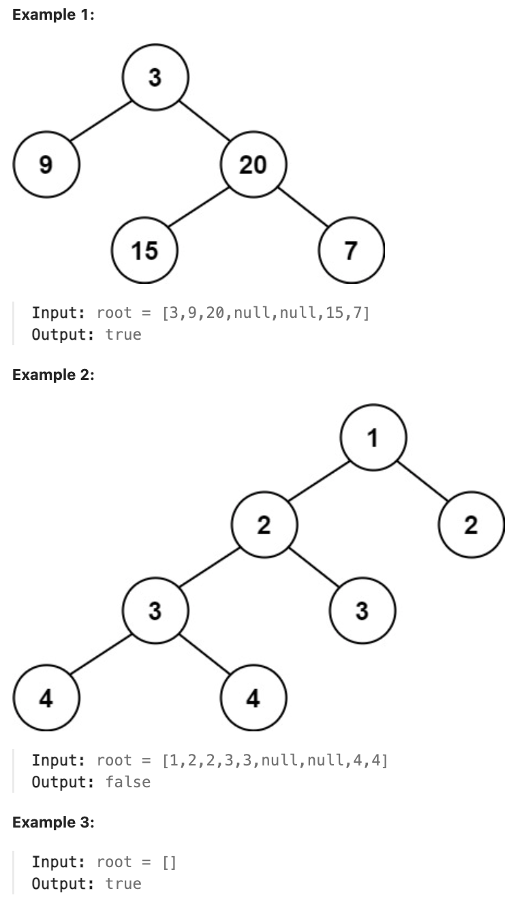

# 110.Balanced Binary Tree 

## LeetCode 题目链接

[110.平衡二叉树](https://leetcode.cn/problems/balanced-binary-tree/)

## 题目大意

给定一个二叉树，判断它是否是`平衡二叉树`


  
限制：
- The number of nodes in the tree is in the range [0, 5000].
- -10^4 <= Node.val <= 10^4

## 解题

### 思路 1: 递归

```js
var isBalanced = function(root) {
    let isBalanced = true;

    const getHeight = function(root) {
        if (root == null) return 0;
        let leftHeight = getHeight(root.left);
        let rightHeight = getHeight(root.right);
        if (leftHeight == -1 || rightHeight == -1 || Math.abs(leftHeight - rightHeight) > 1) {
            isBalanced = false;
        }
        return Math.max(leftHeight, rightHeight) + 1;
    };

    getHeight(root);
    return isBalanced;
}
```
```python
class Solution:
    def isBalanced(self, root: Optional[TreeNode]) -> bool:
        self.isBalanced = True
        self.getHeight(root)
        return self.isBalanced
    
    def getHeight(self, root):
        if not root:
            return 0
            
        leftHeight = self.getHeight(root.left)
        rightHeight = self.getHeight(root.right)

        if leftHeight == -1 or rightHeight == -1 or abs(leftHeight - rightHeight) > 1:
            self.isBalanced = False
        
        # 树的高度是指从当前节点到叶子节点的最长路径上的节点数（包括当前节点在内）
        # +1：表示当前节点本身的高度（从当前节点再向下延伸一层）
        return max(leftHeight, rightHeight) + 1
```

- 时间复杂度：`O(n)`，`n` 是二叉树的节点数目
- 空间复杂度：`O(n)`，递归函数需要用到栈空间，栈空间取决于递归深度，最坏情况下递归深度为 `n`

### 思路 2: 迭代

```js
var isBalanced = function(root) {
    if (root == null) return true;
    let stack = [root];

    while (stack.length) {
        // 取出栈顶
        let node = stack[stack.length - 1];
        stack.pop();
        if (Math.abs(getHeight(node.left) - getHeight(node.right)) > 1) return false;
        node.right && stack.push(node.right);
        node.left && stack.push(node.left);
    }

    return true;
}

var getHeight = function(cur) {
    let que = [];
    if (cur != null) que.push(cur);
    let depth = 0, res = 0;
    while (que.length) {
        let node = que[que.length - 1]; // 取出栈顶
        if (node !== null) {
            que.pop();
            que.push(node);   // 中
            que.push(null);
            depth++;
            node.right && que.push(node.right);   // 右
            node.left && que.push(node.left);     // 左
        } else {
            que.pop();
            node = que[que.length - 1];
            que.pop();
            depth--;
        }
        res = res > depth ? res : depth;
    }
    return res;
};
```
```python
class Solution:
    def isBalanced(self, root: Optional[TreeNode]) -> bool:
        if not root:
            return True
        
        # 通过 height_map 字典记录每个节点的高度
        # 使用 None 作为标记，来区分访问节点的顺序，从而确保计算每个节点的左右子树高度
        height_map = {}
        stack = [root]

        while stack:
            node = stack.pop()
            if node:
                # 再次将当前节点压入栈中（待处理）
                stack.append(node)
                # 插入一个标记节点（标识该节点已经被访问过）
                # None 标记节点表示当前节点已被访问过，接下来将处理该节点的左右子树
                # 这段代码使用了 None 作为标记节点，使得可区分节点是第一次被访问（将子树加入栈中）还是第二次被访问（计算高度）
                # 表示该节点需要等待其子树处理完毕后再计算高度
                stack.append(None)
                # 将左子节点和右子节点依次入栈（先左后右）
                if node.left: 
                    stack.append(node.left)

                if node.right: 
                    stack.append(node.right)
            else:
                # 遇到 None 时弹出栈顶的 real_node，表示当前节点的左右子树已经处理完毕，可以进行高度计算和平衡性判断
                real_node = stack.pop()
                # 获取左右子树的高度，如果子树不存在，则高度为 0
                left, right = height_map.get(real_node.left, 0), height_map.get(real_node.right, 0)
                # 检查当前节点的平衡性（左右子树高度差不超过 1）
                if abs(left - right) > 1:
                    return False

                # 记录当前节点的高度（1 + 左右子树最大高度）
                height_map[real_node] = 1 + max(left, right)
        
        return True
```

- 时间复杂度：`O(n)`，其中 `n` 是二叉树的节点数目
- 空间复杂度：`O(n)`，递归函数需要用到栈空间，栈空间取决于递归深度，最坏情况下递归深度为 `n`