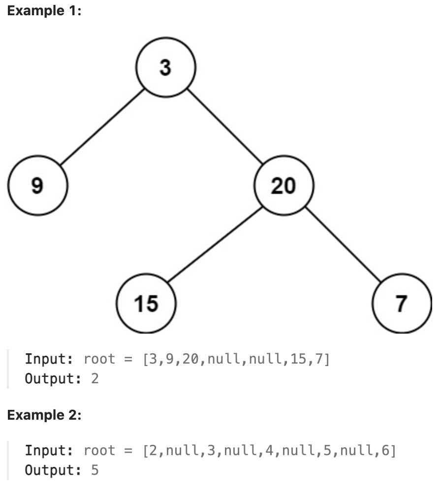

# 111.Minimum Depth of Binary Tree 

## LeetCode 题目链接

[111.二叉树的最小深度](https://leetcode.cn/problems/minimum-depth-of-binary-tree/)

## 题目大意

给定一个二叉树，找出其最小深度

最小深度是从根节点到最近叶子节点的最短路径上的节点数量

说明：叶子节点是指没有子节点的节点



限制：
- The number of nodes in the tree is in the range [0, 10^5]
- -1000 <= Node.val <= 1000

## 解题

注意：只有当左右孩子都为空时，才说明遍历到最低点，若其中一个孩子为空则不是最低点

### 思路 1: BFS

```js
var minDepth = function(root) {
    if (root == null) return 0;
    let que = [];
    que.push(root);
    let depth = 1;
    while (que.length) {
        let size = que.length;
        for (let i = 0; i < size; i++) {
            let cur = que.shift();
            if (cur.left == null && cur.right == null) return depth;
            if (cur.left) que.push(cur.left);
            if (cur.right) que.push(cur.right);
        }

        depth++;
    }
    
    return depth;
};
```
```python
class Solution:
    def minDepth(self, root: Optional[TreeNode]) -> int:
        if not root:
            return 0
        que = collections.deque([root])
        depth = 1

        while que:
            size = len(que)
            for i in range(size):
                cur = que.popleft()
                if not cur.left and not cur.right:
                    return depth
                
                if cur.left:
                    que.append(cur.left)
                
                if cur.right:
                    que.append(cur.right)
                
            depth += 1
        
        return depth
```

- 时间复杂度：`O(n)`
- 空间复杂度：在最坏情况下（倾斜树），空间复杂度为 `O(n)`，在平均情况下空间复杂度为 `O(W)`（`W` 是树的最大宽度）

### 思路 2: DFS

```js
// 迭代的递归思路
var minDepth = function(root) {
    if (root == null) return 0;
    let minDepth = Number.MAX_VALUE;
    let curDepth = 0;
    const traverse = function(root) {
        if (root == null) return;
        curDepth++;
        // 若当前节点是叶子节点，更新最小深度
        if (root.left === null && root.right === null) {
            minDepth = Math.min(minDepth, curDepth);
        }
        traverse(root.left);
        traverse(root.right);
        curDepth--;
    };

    traverse(root);
    return minDepth;
};

// 分解的递归思路
var minDepth = function(root) {
    if (root == null) return 0;
    let leftDepth = minDepth(root.left);
    let rightDepth = minDepth(root.right);
    if (leftDepth == 0) return rightDepth + 1;
    if (rightDepth == 0) return leftDepth + 1;
    return Math.min(leftDepth, rightDepth) + 1;
};
```
```python
# 迭代的递归思路
class Solution:
    def minDepth(self, root: Optional[TreeNode]) -> int:
        if not root:
            return 0
        
        self.minDepth = float("inf")
        self.curDepth = 0
        self.traverse(root)
        return self.minDepth
    
    def traverse(self, root):
        if not root:
            return
        
        self.curDepth += 1
        if not root.left and not root.right:
            self.minDepth = min(self.minDepth, self.curDepth)

        self.traverse(root.left)
        self.traverse(root.right)

        self.curDepth -= 1

# 分解的递归思路
class Solution:
    def minDepth(self, root: Optional[TreeNode]) -> int:
        if not root:
            return 0
        leftDepth = self.minDepth(root.left)
        rightDepth = self.minDepth(root.right)
        # +1 是加上当前节点本身
        if leftDepth == 0:
            return rightDepth + 1

        if rightDepth == 0:
            return leftDepth + 1
            
        return min(leftDepth, rightDepth) + 1
```

- 时间复杂度：`O(n)`
- 空间复杂度：`O(n)`（最坏情况），`O(logn)`（平衡情况）