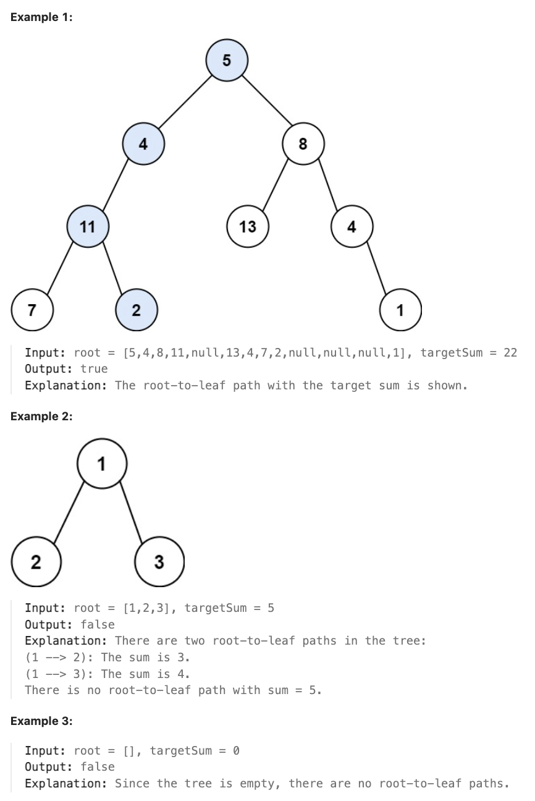

# 112.Path Sum 

## LeetCode 题目链接

[112.路径总和](https://leetcode.cn/problems/path-sum/)

## 题目大意

给二叉树的根节点 `root` 和一个表示目标和的整数 `targetSum`。判断该树中是否存在`根节点到叶子节点`的路径，这条路径上所有节点值相加等于目标和 `targetSum`。若存在，返回 `true`；否则，返回 `false` 

叶子节点是指没有子节点的节点



限制：
- The number of nodes in the tree is in the range [0, 5000].
- -1000 <= Node.val <= 1000
- -1000 <= targetSum <= 1000
  
## 解题

### 思路 1: 递归 - DFS

```js
// 写法 1：分解问题的思路
var hasPathSum = function(root, targetSum) {
    if (root == null) return false;
    if (root.left == root.right && root.val == targetSum) return true;
    return hasPathSum(root.left, targetSum - root.val) || hasPathSum(root.right, targetSum - root.val);
};

// 写法 2：遍历二叉树的思路
var hasPathSum = function(root, targetSum) {
    let found = false, sum = 0;
    const traverse = function(root) {
        if (root == null) return;
        sum += root.val;
        if (root.left == null && root.right == null) {
            if (sum == targetSum) found = true;
        }
        traverse(root.left);
        traverse(root.right);
        sum -= root.val;
    };
    traverse(root);
    return found;
};
```
```python
# 写法 1：分解问题的思路
class Solution:
    def hasPathSum(self, root: Optional[TreeNode], targetSum: int) -> bool:
        if not root:
            return False
        # root.left == root.right 等同于 root.left == null && root.right == null
        if root.left == root.right and root.val == targetSum:
            return True
            
        return self.hasPathSum(root.left, targetSum - root.val) or self.hasPathSum(root.right, targetSum - root.val)

# 写法 2：遍历二叉树的思路
class Solution:
    def hasPathSum(self, root: Optional[TreeNode], targetSum: int) -> bool:
        self.found = False
        self.sum = 0
        self.traverse(root, targetSum)
        return self.found
    
    def traverse(self, root, targetSum):
        if not root: 
            return
        
        self.sum += root.val
        
        # 判断当前节点是否为叶子节点，并且路径和是否等于目标值
        if not root.left and not root.right:
            if self.sum == targetSum:
                self.found = True
        
        self.traverse(root.left, targetSum)
        self.traverse(root.right, targetSum)

        # 当遍历完当前节点的左右子树后，代码会回到当前节点的父节点
        # 为了防止当前路径和 self.sum 对其他路径产生影响，需在递归返回时从 self.sum 中减去当前节点的值
        self.sum -= root.val
```

- 时间复杂度：`O(n)`，其中 `n` 是二叉树的节点数目
- 空间复杂度：`O(n)`，递归函数需要用到栈空间，栈空间取决于递归深度，最坏情况下递归深度为 `n`

### 思路 2: 迭代

```js
var hasPathSum = function(root, targetSum) {
    if (root == null) return false;
    let nodeArr = [root];
    let valArr = [0];
    while (nodeArr.length) {
        let curNode = nodeArr.shift();
        let curVal = valArr.shift();
        curVal += curNode.val;
        // 为叶子结点且和等于目标数，返回 true
        if (curNode.left === null && curNode.right === null && curVal === targetSum) return true;

        // 左节点，将当前的数值也对应记录下来
        if (curNode.left) {
            nodeArr.push(curNode.left);
            valArr.push(curVal);
        }

        // 右节点，将当前的数值也对应记录下来
        if (curNode.right) {
            nodeArr.push(curNode.right);
            valArr.push(curVal);
        }
    }

    return false;
};
```
```python
class Solution:
    def hasPathSum(self, root: Optional[TreeNode], targetSum: int) -> bool:
        if not root:
            return False
        nodeArr, valArr = [root], [0]

        while nodeArr:
            curNode = nodeArr.pop(0)
            curVal = valArr.pop(0)

            curVal += curNode.val
            
            # 若是叶子节点且路径和等于目标值，返回 True
            if curNode.left is None and curNode.right is None and curVal == targetSum:
                return True
            
            # 左子节点，更新当前路径和
            if curNode.left:
                nodeArr.append(curNode.left)
                valArr.append(curVal)
            
            # 右子节点，更新当前路径和
            if curNode.right:
                nodeArr.append(curNode.right)
                valArr.append(curVal)
            
        return False
```

- 时间复杂度：`O(n)`，其中 `n` 是树中节点的总数
- 空间复杂度：`O(n)`，因为最坏情况下，队列的长度可能达到树中一层的最大宽度（最多为 `n/2`）
