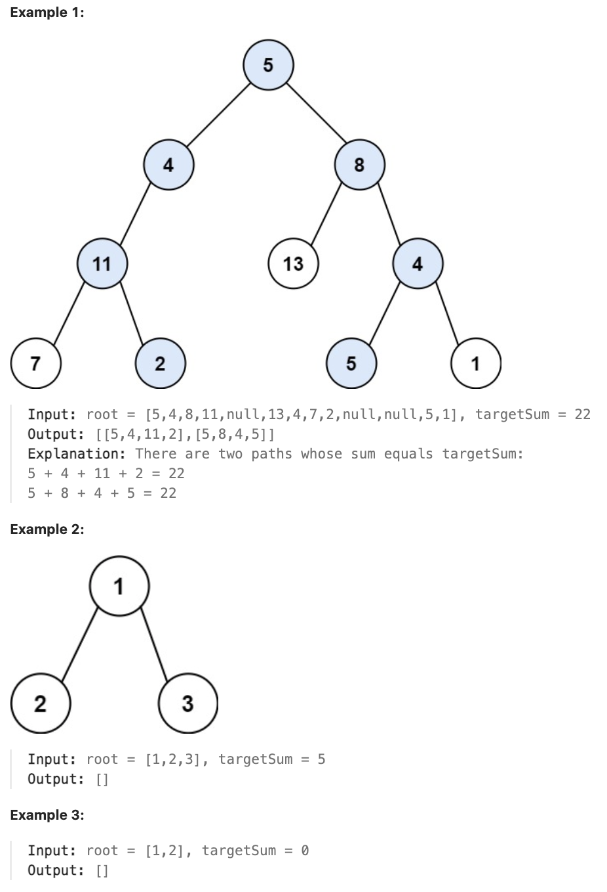

# 113.Path Sum II

## LeetCode 题目链接

[113.路径总和 II](https://leetcode.cn/problems/path-sum-ii/)

## 题目大意

给二叉树的根节点 `root` 和一个整数目标和 `targetSum`，找出所有`从根节点到叶子节点`路径总和等于给定目标和的路径

叶子节点是指没有子节点的节点



限制：
- The number of nodes in the tree is in the range [0, 5000].
- -1000 <= Node.val <= 1000
- -1000 <= targetSum <= 1000
  
## 解题

```js
// 写法 1
var pathSum = function(root, targetSum) {
    let res = [], path = [];
    if (root == null) return res;
    const traverse = function(root, targetSum) {
        if (root == null) return;
        let remain = targetSum - root.val;
        if (root.left == null && root.right == null) {
            if (remain == 0) {
                // 找到一条路径
                path.push(root.val);
                res.push([...path]);
                path.pop();
            }
            return;
        }
        // 维护路径列表
        path.push(root.val);
        traverse(root.left, remain, path);
        path.pop();

        path.push(root.val);
        traverse(root.right, remain, path);
        path.pop();
    };
    traverse(root, targetSum);
    return res;
};

// 写法 2
var pathSum = function(root, targetSum) {
    let res = [], path = [];
     const dfs = function(root, targetSum) {
        if (root == null) return;
        path.push(root.val)
        targetSum -= root.val;
        if (root.left == null && root.right == null && targetSum == 0) {
            res.push([...path]);
        }
        dfs(root.left, targetSum);
        dfs(root.right, targetSum);
        path.pop();
    };
    dfs(root, targetSum);
    return res;
};
```
```python
# 写法 1
class Solution:
    def pathSum(self, root: Optional[TreeNode], targetSum: int) -> List[List[int]]:
        self.res = []
        self.path = []
        if not root:
            return self.res
        
        self.traverse(root, targetSum)
        return self.res
    
    def traverse(self, root, targetSum):
        if not root:
            return 

        remain = targetSum - root.val
        if not root.left and not root.right:
            if remain == 0:
                self.path.append(root.val)
                self.res.append(self.path[:])
                self.path.pop()
            return
        
        # 维护路径列表
        self.path.append(root.val)
        self.traverse(root.left, remain)
        self.path.pop()

        self.path.append(root.val)
        self.traverse(root.right, remain)
        self.path.pop()

# 写法 2
class Solution:
    def pathSum(self, root: Optional[TreeNode], targetSum: int) -> List[List[int]]:
        res = []
        path = []
        def dfs(root, targetSum):
            if not root:
                return
            path.append(root.val)
            targetSum -= root.val
            if not root.left and not root.right and targetSum == 0:
                res.append(path[:])
            # 调用递归函数分别对当前节点的左子树和右子树进行深度优先搜索
            # 对于每一个子树，递归时传递更新后的 targetSum，因为已经扣除了当前节点的值
            dfs(root.left, targetSum)
            dfs(root.right, targetSum)
            # 当递归函数返回时，需要将当前节点从路径 path 中移除，以回溯到上一层
            # 因为在递归遍历过程中共用一个 path 列表，必须在退出当前节点时将其从路径中删除，确保路径只包含当前递归路径上的节点
            # 保证状态在递归的不同分支中不相互干扰
            path.pop()
            
        dfs(root, targetSum)
        return res
```

- 时间复杂度：每个节点会被访问一次，因此时间复杂度为 `O(n)`，`n` 是二叉树中的节点总数
- 空间复杂度：最坏情况下，递归调用的最大深度等于二叉树的高度，空间复杂度为 `O(h)`，`h` 是二叉树的高度。在最坏情况下，对于一棵高度为 `n` 的二叉树（如链状结构的树），空间复杂度为 `O(n)`