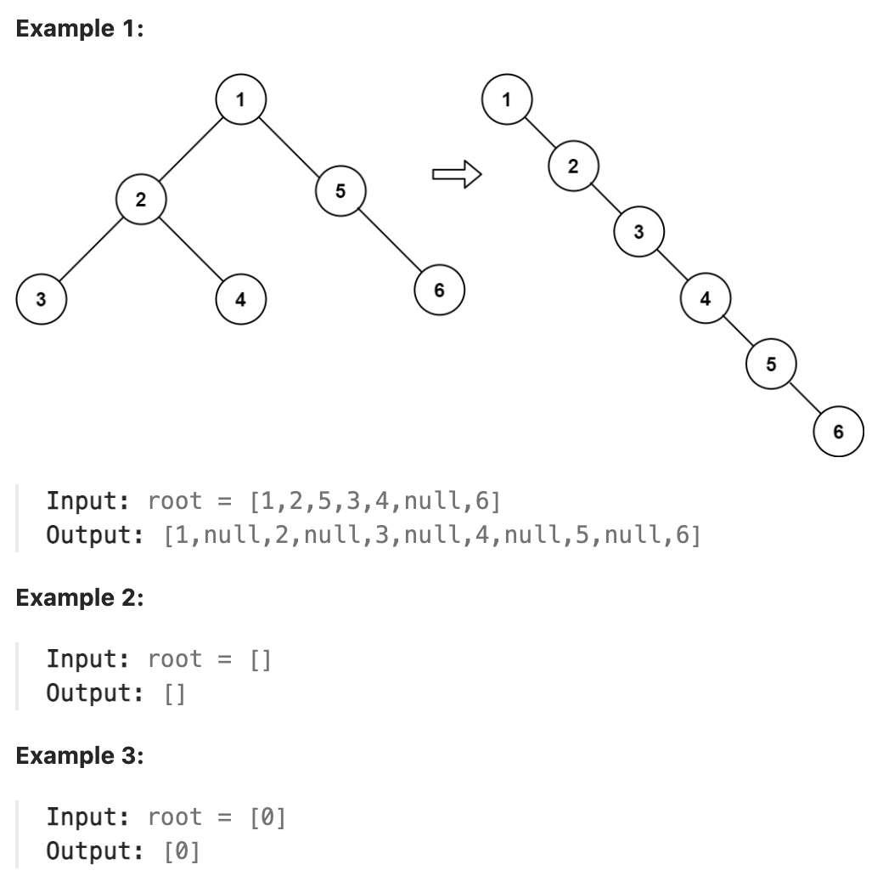

# 114.Flatten Binary Tree to Linked List

## LeetCode 题目链接

[114.二叉树展开为链表](https://leetcode.cn/problems/flatten-binary-tree-to-linked-list/)

## 题目大意

给你二叉树的根结点 `root`，请将它展开为一个单链表：
- 展开后的单链表应该同样使用 `TreeNode`，其中 `right` 子指针指向链表中下一个结点，而左子指针始终为 `null` 
- 展开后的单链表应该与二叉树 先序遍历 顺序相同



限制：
- The number of nodes in the tree is in the range [0, 2000].
- -100 <= Node.val <= 100

## 解题

### 思路 1: 递归

```js
var flatten = function(root) {
    // 定义：将以 root 为根的树拉平为链表
    const flattenTree = function(root) {
        if (root == null) return;
        // 先递归拉平左右子树
        flattenTree(root.left);
        flattenTree(root.right);

        // 左右子树已经被拉平成一条链表
        let left = root.left, right = root.right;

        // 将左子树作为右子树
        root.left = null;
        root.right = left;

        // 将原先的右子树接到当前右子树的末端
        let p = root;
        while (p.right != null) {
            p = p.right;
        }
        p.right = right;
    };

    flattenTree(root);
};
```
```python
class Solution:
    def flatten(self, root: Optional[TreeNode]) -> None:
        # base case
        if root is None:
            return
        
        # 先递归拉平左右子树
        self.flatten(root.left)
        self.flatten(root.right)

        # ***后序遍历位置***
        # 左右子树已经被拉平成一条链表
        left = root.left
        right = root.right

        # 将左子树作为右子树
        root.left = None
        root.right = left

        # 将原先的右子树接到当前右子树的末端
        p = root
        while p.right is not None:
            p = p.right
        p.right = right
```

- 时间复杂度：`O(n)`，因为每个节点被访问一次
  - 递归部分：对于每个节点，递归调用会访问它的左右子树各一次，因此每个节点被访问一次。由于树有 `n` 个节点，所以递归遍历的时间复杂度是 `O(n)`
  - 找到右子树末端的操作：
    - 在将左子树移到右边之后，用 `p = root` 找到当前右子树的末端并接上原来的右子树
    - 虽然这个操作在代码中使用了一个 while 循环来寻找末端，但在每个节点上，这个操作总共不会重复访问所有节点多次。实际上，由于每个节点在最终的展开结构中只有一个右节点连接，因此所有这些“找到末端”的操作加在一起仍然是 `O(n)` 级别
- 空间复杂度：`O(h)`，其中 `h` 是树的高度，因为递归调用会占用栈空间，栈的深度取决于树的高度
  - 对于平衡树，空间复杂度为 `O(logn)`
  - 而对于退化为链表的树，空间复杂度为 `O(n)`

### 思路 2: 原地修改

采用原地修改的方法，避免创建新的节点，只需调整每个节点的指针，使得每个节点的右指针指向先序遍历的下一个节点

```js
var flatten = function(root) {
    if (!root) return;
    let cur = root;
    while (cur) {
        if (cur.left) {
            // 找到左子树的最右节点
            let rightMost = cur.left;
            while (rightMost.right) {
                rightMost = rightMost.right;
            }
            // 将当前节点的右子树接到左子树的最右节点
            rightMost.right = cur.right;
            // 将左子树移到右边，置左子树为空
            cur.right = cur.left;
            cur.left = null;
        }
        // 移动到下一个右节点
        cur = cur.right;
    }
};
```
```python
class Solution:
    def flatten(self, root: Optional[TreeNode]) -> None:
        # 使用一个指针 cur 指向根节点 root，以便从根节点开始遍历
        cur = root
        # 使用 while cur 循环，只要 cur 不是 None，就会继续遍历树的节点
        while cur:
            if cur.left:
                # 找到左子树的最右节点
                right_most = cur.left
                # 通过一个while循环，不断向右移动 right_most，直到找到左子树的最右节点
                # 这是因为在先序遍历的展平结构中，左子树的最后一个节点应该连接到原右子树的第一个节点
                while right_most.right:
                    right_most = right_most.right
                # 将当前节点 cur 的右子树（cur.right）连接到 right_most.right 上，使得左子树的最后一个节点接上原来的右子树
                right_most.right = cur.right
                # 将当前节点的左子树（cur.left）移动到右边，这样当前节点的右子树就是展开后的先序顺序的下一个节点
                cur.right = cur.left
                # 将 cur.left 置为 None，因为左子树已经被移动到右边，不再需要左指针
                cur.left = None
```

- 时间复杂度：`O(n)`，其中 `n` 是二叉树的节点数，因为每个节点只访问一次，用于调整指针
- 空间复杂度：`O(1)`，因为是原地修改，没有使用额外的存储空间。但如果使用递归方法，考虑到递归调用的栈空间，空间复杂度将是 `O(h)`，其中 `h` 是二叉树的高度
